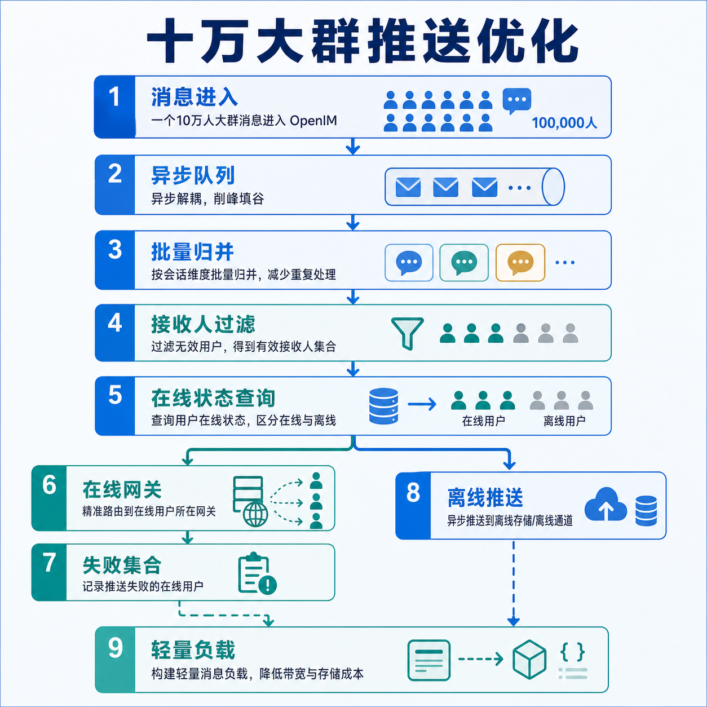

# 十万大群的推送优化

十万人大群里，消息推送的难点并不是“把一条消息发给十万人”这么简单。

真正的压力来自连续放大的链路：一条群消息进入系统后，要写入消息链路，要找到应该触达的成员，要判断哪些用户在线，要把在线用户路由到对应长连接网关，还要把未在线或在线推送失败的用户交给离线推送。任何一步如果按“全量、同步、逐个处理”的方式实现，都会在大群里被迅速放大。

OpenIM 的推送优化思路不是把某个函数写得更快，而是把整条链路拆开：消息转发、在线推送、离线推送、网关触达、第三方厂商推送各自解耦，再用批量、分片、过滤和兜底把压力控制在可预期范围内。

## 01. 推送链路先解耦，不能让一条消息拖住全链路

在普通群里，推送可以看起来像一个连续动作：消息来了，找到人，直接推过去。

但在十万人大群里，这种连续动作会变成风险。只要某个环节变慢，前面的消息写入、后面的在线触达、离线推送都会互相影响。OpenIM 的做法是把消息写入和推送执行拆成不同阶段：消息转发服务负责把消息进入存储和推送队列，推送服务再消费推送任务，在线推送和离线推送也分成不同入口处理。

这样做的价值很直接：

- 消息写入不会被第三方推送服务拖慢。
- 在线推送和离线推送可以按各自节奏扩容。
- 推送服务出现短时抖动时，消息主链路仍然可以继续前进。
- 后续排查问题时，可以区分是消息写入慢、在线网关慢，还是离线厂商推送慢。

对于大群来说，解耦不是架构上的“好看”，而是稳定性的前提。

## 02. 第一层优化：把单条推送收口成批量处理

大群消息最怕的不是单条消息，而是连续消息。

如果每条消息都独立完成一次解析、一次路由、一次网关调用、一次提交确认，那么高峰时系统会把大量时间花在重复动作上。OpenIM 会在消息转发阶段按消息队列的 key 做分片，把同一批到达的消息聚合到固定窗口里处理；进入推送服务后，再按会话和接收人范围继续做批量归并。

这让推送从“来一条处理一条”变成“按窗口处理一批”。收益主要有三点：

- 重复的解析、调度和队列处理减少了。
- 同一会话内连续消息可以合并进入同一次推送处理上下文。
- worker 的并发数量受控，不会因为瞬时消息峰值无限扩张。

这一步看起来只是批处理，但对十万大群很关键。因为大群里的压力通常不是平均压力，而是瞬时压力。批量窗口能把尖峰削平，让后面的在线路由和离线推送有稳定输入。

## 03. 第二层优化：按会话归并，而不是按消息散打

推送服务消费到消息后，不是直接把每条消息独立发出去，而是按会话和接收人范围组织批量。对于没有自定义推送选项的连续群消息，系统会把它们合并到同一批次里处理。

这对大群尤其重要。十万人大群里的多条消息，本质上属于同一个群会话。如果每条消息都重新走一遍完整成员查找、在线状态判断和网关分发，很多工作会重复。按会话归并后，系统可以把同一会话内的一批消息放在同一次处理上下文里，减少重复调度。

同时，单聊、通知会话和大群会话会进入不同处理路径。普通用户消息更关注接收方和发送方多端同步；大群消息更关注群成员范围、在线状态、离线过滤和网关批量触达。把路径分开后，每类会话都可以使用最适合自己的推送策略。

## 04. 第三层优化：先缩小接收人范围

十万人大群不是每条消息都真的需要推给十万人。

OpenIM 在进入实际推送前，会先尽量缩小接收人范围。群推送前回调可以让业务系统调整接收人；消息自身也可以指定只推给部分用户，或者在默认群成员之外补充额外用户。没有特殊规则时，系统才从群成员 ID 缓存中取出群成员列表作为默认推送范围。

这层设计给业务留下了很大空间：

- 普通群消息可以走默认群成员范围。
- 定向提醒可以只推给被影响的成员。
- 运营或系统消息可以通过回调做业务侧过滤。
- 特殊消息可以补充额外接收人，但不破坏默认链路。

大群优化的核心不是每次都推得更多，而是先判断哪些人真的应该进入本轮推送。

## 05. 第四层优化：在线用户只推到对应网关

在分布式 IM 系统里，用户长连接分散在多个网关节点上。

最粗暴的做法是把同一条群消息广播给所有网关，让每个网关自己判断有没有目标用户。但十万人大群下，这会让网关之间产生大量无效调用。OpenIM 的在线推送会先查询用户在线状态，并按网关维度整理在线用户：哪些用户在哪个网关上，就把消息推到哪个网关。

这样一来，在线推送的目标从“所有网关”缩小为“真正持有目标用户连接的网关”。这会明显减少无效 RPC、降低网关压力，也让推送结果更容易回收。

系统也保留了兜底路径：当在线状态不可用、网关映射不可信，或者单机部署场景下无法精确路由时，可以退回到全网关推送。也就是说，精确路由是优先路径，全量广播是安全兜底。

## 06. 第五层优化：在线失败后才进入离线推送

离线推送是移动端体验的关键，但它不应该替代在线推送。

OpenIM 的顺序是先尝试在线触达，再根据网关返回结果计算哪些用户没有成功收到在线推送。只有这些用户才会进入离线推送候选集合。发送者、多端已经在线成功的用户、关闭离线推送的用户，都不会继续进入离线推送。

对于群消息，系统还会再做一次会话级过滤。比如用户对某个会话设置了免打扰，或者业务上不需要该会话的离线提醒，就可以在进入第三方厂商推送前被过滤掉。

这层过滤非常重要。因为第三方推送通常有配额、限速、厂商策略和成本问题。十万大群里如果不先过滤，而是把所有未确认对象直接丢给厂商通道，很容易把离线推送打成新的瓶颈。

## 07. 第六层优化：离线推送再次异步化

在线推送失败并不意味着当前推送 worker 要立刻调用第三方厂商。

OpenIM 会把需要离线触达的用户重新写入离线推送队列，由离线推送消费者异步处理。离线推送任务还会按用户集合切块，避免一次任务携带过大的用户列表。

这个设计把在线链路和厂商链路隔离开来：

- 在线推送可以尽快完成本轮处理。
- 离线推送可以独立消费、独立失败重试、独立扩容。
- 厂商接口慢或抖动时，不会反向拖住在线推送。
- 大批离线用户会被拆成可控批次，而不是一次性压到单个请求里。

对大群而言，这相当于把“在线实时触达”和“离线补偿触达”拆成两条节奏不同的流水线。

## 08. 推送内容也要轻量化

推送链路里还有一个容易被忽略的点：不是所有内部字段都应该带到网关和离线通道。

OpenIM 在进入推送和离线队列前，会清理只服务于内部逻辑的消息选项，只保留真正需要触达客户端或厂商的内容。离线推送展示内容也会优先使用业务传入的推送标题、描述和扩展字段；没有传入时，再根据消息类型生成默认展示文案。

这能带来两个好处：

- 推送载荷更轻，减少网络和序列化成本。
- 内部控制字段不会泄漏到客户端或第三方厂商通道。

十万大群里，任何单条消息多带一点无效字段，都会在大规模扇出时被放大。

## 09. 特殊消息走特殊策略

大群里不只有普通文本消息，还会有音视频信令、系统通知、成员变化通知等特殊消息。

OpenIM 对这些消息没有简单地“一视同仁”。例如音视频信令类消息，离线推送时会尽量只推给真正相关的邀请对象；对于需要覆盖或撤销的信令提醒，也会结合支持该能力的厂商通道做更精细的处理，避免用户收到过期通知。

这类优化的意义不是提升吞吐，而是减少噪音。大群规模越大，错误或多余的通知越容易变成体验问题。只把特殊消息推给真正需要的人，和提升系统性能同样重要。

## 10. 这套优化最终解决了什么

把这些策略合在一起，OpenIM 的十万大群推送链路可以概括为六个判断：

| 问题 | 处理方式 |
| --- | --- |
| 消息要不要阻塞主链路 | 推送与存储、在线与离线解耦 |
| 当前要处理多少消息 | 批量窗口和 worker 并发控制 |
| 这批消息属于哪个会话 | 按会话聚合，再选择单聊或群聊路径 |
| 应该推给哪些人 | 回调、消息选项和群成员缓存共同收口 |
| 在线用户在哪里 | 通过在线状态路由到对应网关 |
| 谁还需要离线提醒 | 在线失败集合再经过会话级过滤后异步离线推送 |

它不是单点优化，而是一套分层削峰机制。

## 结语

十万人大群的推送优化，本质上不是追求“更快地广播给所有人”，而是避免每一步都默认全量。

OpenIM 把推送拆成消息队列、批量处理、会话归并、在线路由、失败回收、离线过滤和厂商推送多个阶段。每一层都在减少不必要的工作：少阻塞、少重复、少广播、少离线、少无效载荷。

这也是为什么在大群压测场景下，系统可以面对十万在线用户和高频群消息仍保持稳定触达。真正支撑大群的，不是某个“超大并发发送”技巧，而是整条链路都在持续做减法。
