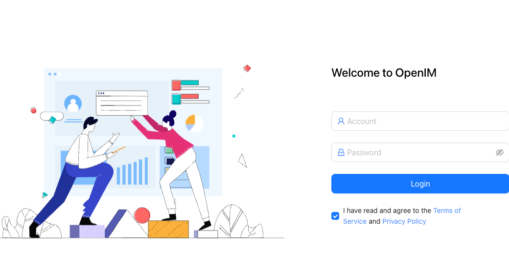
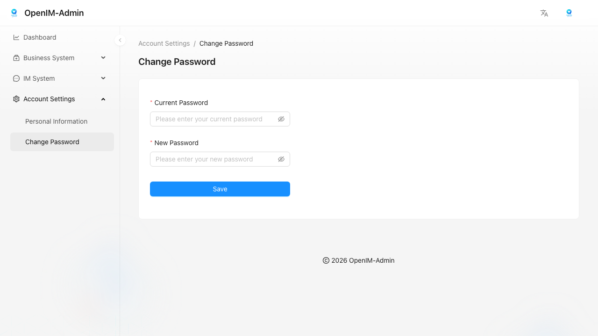
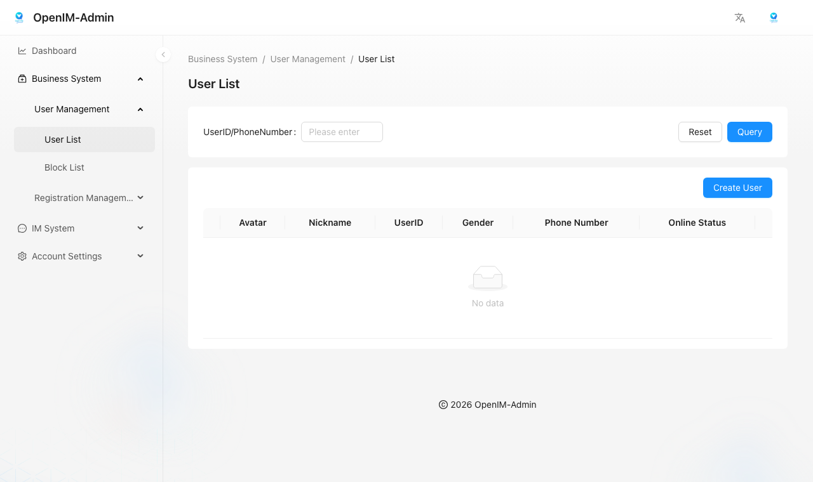
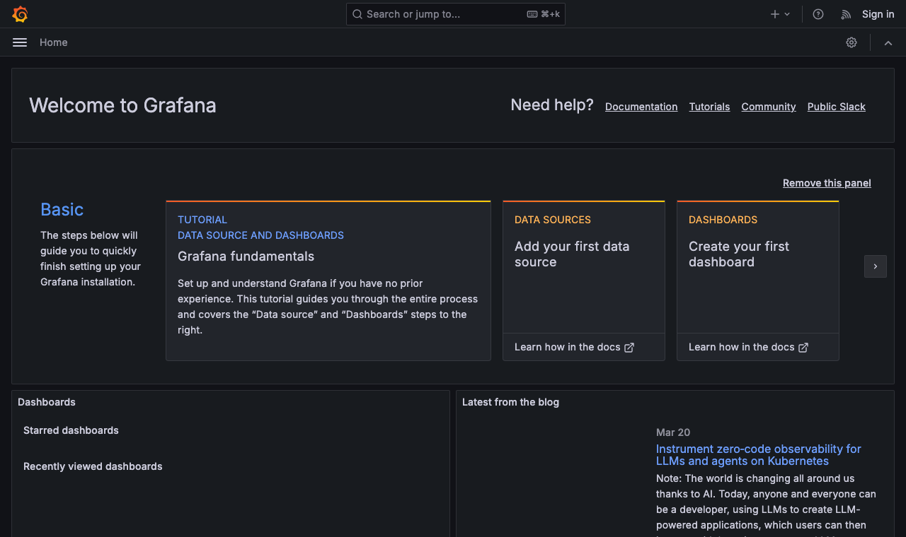

## 📌 一、访问地址

管理后台默认地址为 `http://your_server_ip:11002`，其中 `your_server_ip` 为部署管理后台前端页面的服务器 IP。

:::tip
`11002` 属于可选开放端口。仅在需要通过浏览器访问管理后台时，才需要对外放行该端口。
:::

## 📌 二、登录后台

1. 在浏览器中访问 `http://your_server_ip:11002`；
2. 确认页面已正常展示 `账号`、`密码` 输入框，以及协议勾选项；
3. 默认部署下，可先使用账号 `chatAdmin`、密码 `chatAdmin` 登录；如果你已经修改过配置，请以实际部署值为准。

> 如果 `chatAdmin / chatAdmin` 无法登录，优先回查你自己的部署是否已经修改了默认管理后台凭据。

> `imAdmin` 是 OpenIM 内置的 APP 管理员 `userID`，主要用于获取管理员 token 并调用管理类 REST API；不要直接把它理解为管理后台页面的默认登录密码。

## 📌 三、首次登录后立即修改密码

建议在首次登录后，立即执行以下操作：

1. 打开左侧 `账号设置 -> 修改密码`；
2. 在 `当前密码` 中填写默认密码 `chatAdmin`；
3. 在 `新密码` 中填写新的强密码；
4. 点击 `保存`；
5. 根据页面提示重新登录。

> 如果你已经修改成功，后续文档中的 `chatAdmin / chatAdmin` 只可作为默认部署下的首次登录参考，不应继续用于长期使用。

## 📌 四、登录后可见的主要页面入口

按当前 `http://localhost:11002/` 实际登录结果，成功登录后会进入 `业务系统 -> 用户管理 -> 用户列表` 页面。左侧导航可见以下模块：

- 数据监控；
- 业务系统：
    - 用户管理：`用户列表`、`封禁列表`
    - 注册管理：`默认好友`、`默认群组`
- IM 系统：
    - 用户管理：`用户列表`
    - 群组管理：`群组列表`
    - 消息管理：`用户消息`、`群组消息`
    - 日志管理：`日志列表`（客户端上传日志后，可在这个条目中查看对应记录）
    - 通知管理：`通知账号`、`发送通知`
- 账号设置：`个人信息`、`修改密码`

> 上图为实际登录后的页面截图。当前环境下，默认会落到 `用户列表`，页面提供按 `用户ID/手机号` 查询，以及 `创建新用户` 入口。

## 📌 五、监控仪表板

管理后台中的 `数据监控` 依赖 `Grafana` 提供监控面板，用于监控 OpenIMServer 与 ChatServer 的运行状态、数据库状态、注册量、消息量等指标。

具体部署请参考：[数据监控](./monitoring)

## 📌 六、联动服务检查

如果登录页可以打开，但登录后页面为空白、列表加载失败，或通知/群组/消息等页面无法使用，优先检查以下三项：

1. `11002` 管理后台前端端口是否可达；
2. `10009` APP 管理员接口是否正常；
3. ChatServer 的 `admin-api`、`admin-rpc` 是否运行正常；
4. 如果只有 `数据监控` 页面异常，再额外检查 `Grafana` 直连访问、`GRAFANA_URL` 配置，以及浏览器侧跨域 / 嵌入访问限制。

可结合以下文档继续排查：

- [端口开放](./ports)
- [快速验证](./quickTestServer)
- [生产环境](./production)

## 📌 七、需要直接调用管理接口时

如果你当前只需要获取管理员 token，或单独调试管理类 REST API，也可以暂时不依赖管理后台页面，直接参考以下文档：

- [获取管理员 token](../../restapi/apis/authenticationManagement/getAdminToken)

当你通过管理员 token 调通接口后，再回到管理后台页面验证对应功能，会更容易定位是前端访问问题，还是后端服务问题。
