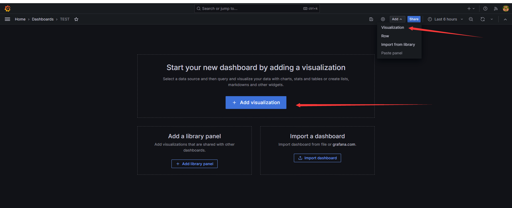
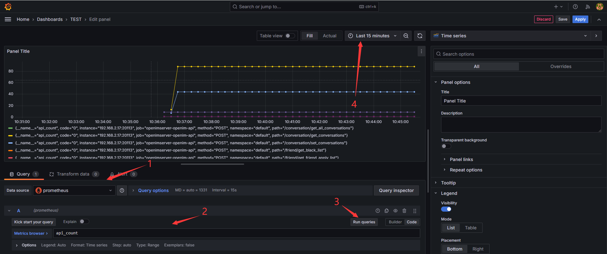

## 组件说明
docker compose部署时，会自动部署如下组件，如使用源码部署，需手动开启docker-compose.yaml中的相关组件。

| 组件名称       | 组件说明                                      | 部署说明                                    |
|-------------|-----------------------------------------|--------------------------------------|
| prometheus  | 用于收集和存储指标数据的监控系统组件                     | 需手动启用                 |
| alertmanager | 管理和发送告警的组件                               | 需手动启用                 |
| grafana     | 用于展示监控数据的仪表板组件                         | 需手动启用         |
| node-exporter | 用于采集节点（如服务器）指标信息 | 需手动启用         |

## 启动方式

目前`OpenIM`使用的监控告警组件为`prometheus`、`alertmanager`、`grafana`、`node_exporter`。在使用`docker compose up -d`启动组件时，默认**不会**启动监控组件。如需启动监控组件，需要使用命令为：

```sh
docker compose --profile m up -d
```

> 注意：以上方式不适用于windows系统。如果需要在windows系统中启用监控组件，需要自行修改docker-compose.yml中监控组件的网络模式，并映射相应的端口，最后将prometheus.yml中的`127.0.0.1`替换为内网ip地址。

## 配置文件和告警说明


| 文件名称  | 文件说明                    | 修改项                       |
|--------|-----------------------|--------------------------------------------|
| 各个openim服务配置| openIM服务配置 | prometheus.enable: true表示启用|
| config/prometheus.yml| prometheus配置  | 无需修改 |
| config/instance-down-rules.yml| 告警规则  | 默认配置两条规则(instance_down, database_insert_failure_alerts)|
| config/alertmanager.yml| 告警管理配置  |  需配置发送者和接收者邮箱信息 |
| config/email.tmpl| 邮件告警模版 | 默认邮件模版，可自行修改 |
| config/grefana-template/Demo.json| 自定义dashboard | 无需修改 |

1. prometheus.yml 文件说明：主要用来配置告警规则文件路径，告警管理服务地址，抓取监控数据ip地址。
   ```yaml
   # Alertmanager configuration
   global:
     scrape_interval:     15s # prometheus抓取指标数据间隔时间
     evaluation_interval: 15s # prometheus评估规则间隔时间
     
   alerting:
     alertmanagers:
       - static_configs:
           - targets: [127.0.0.1:19093]  # alertmanager 组件地址
           
   rule_files:
     - instance-down-rules.yml # 告警规则配置地址
     
   scrape_configs:
     # The job name is added as a label "job=job_name" to any timeseries scraped from this config.
     # Monitored information captured by prometheus
   
     # prometheus fetches application services
     - job_name: node_exporter
       static_configs:
         - targets: [ 127.0.0.1:20500 ]  # node_exporter地址
   
     - job_name: openimserver-openim-api
       http_sd_configs:
         - url: "http://127.0.0.1:10002/prometheus_discovery/api"  # api数据抓取地址
   
   ...
   ```
   
   如果需要添加告警文件，需要在`rule_files`下添加。默认告警文件为`instance-down-rules.yml`。
   
3. 邮件告警架构说明图：Prometheus组件加载告警规则instance-down-rules.yml文件，将符合条件的告警信息发送到alertmanager组件，alertmanager组件加载alertmanager.yml和email.tmpl文件，通过配置的告警邮箱信息和邮件模版发送邮件

   

4. 告警规则instance-down-rules.yaml文件说明：默认实现了两条(instance_down,database_insert_failure_alerts)邮件告警规则，如果增加告警规则可以在instance-down-rules.yml文件中添加规则。

   ```yaml
   groups:
     - name: instance_down  #报警规则一:监控模块宕机超过一分钟就触发告警
       rules:
         - alert: InstanceDown
           expr: up == 0
           for: 1m
           labels:
             severity: critical
           annotations:
             summary: "Instance {{ $labels.instance }} down"
             description: "{{ $labels.instance }} of job {{ $labels.job }} has been down for more than 1 minutes."
   
     - name: database_insert_failure_alerts #报警规则二:监控指标msg_insert_redis_failed_total和msg_insert_mongo_failed_total有增长就触发报警
       rules:
         - alert: DatabaseInsertFailed
           expr: (increase(msg_insert_redis_failed_total[5m]) > 0) or (increase(msg_insert_mongo_failed_total[5m]) > 0)
           for: 1m
           labels:
             severity: critical
           annotations:
             summary: "Increase in MsgInsertRedisFailedCounter or MsgInsertMongoFailedCounter detected"
             description: "Either MsgInsertRedisFailedCounter or MsgInsertMongoFailedCounter has increased in the last 5 minutes, indicating failures in message insert operations to Redis or MongoDB,maybe the redis or mongodb is crash."
   ```

5. 告警管理alertmanager.yml文件说明：修改发送者和接收者邮箱配置信息，即可接收告警信息，如果想实现钉钉，企业微信等方式的告警通知，需要自行改写alertmanager.yml，可以参阅告警管理模块官方文档：https://prometheus.io/docs/alerting/latest/alertmanager/

   ```yaml
   global:
     resolve_timeout: 5m
     smtp_from: alert@openim.io #告警信息发送邮箱
     smtp_smarthost: smtp.163.com:465 #发送邮箱smtp地址
     smtp_auth_username: alert@openim.io #发送邮箱授权用户名，一般和smtp_from邮箱相同
     smtp_auth_password: YOURAUTHPASSWORD #发送邮箱授权码
     smtp_require_tls: false
     smtp_hello: openim alert
   
   templates:
     - /etc/alertmanager/email.tmpl #邮件模版
   
   route:
     group_by: ['alertname']  # 告警分组的标签，具有相同标签值的告警会被合并到同一个通知中
     group_wait: 5s  # 在发送第一个告警通知之前的等待时间
     group_interval: 5s  # 在发送分组通知之间的间隔时间
     repeat_interval: 5m  # 重复发送相同告警的通知之间的间隔时间。用于定期提醒接收者仍然存在的告警。
     receiver: email  # 默认的接收器名称
   receivers:
     - name: email  # # 接收器名称
       email_configs:
         - to: 'alert@example.com' #接收告警邮箱
           html: '{{ template "email.to.html" . }}'
           headers: { Subject: "[OPENIM-SERVER]Alarm" }#邮件标题
           send_resolved: true  # 告警解决时是否发送通知
   ```

6. 邮件模版文件email.tmpl说明：此文件是html格式，告警管理模块会填充里面的变量信息，然后渲染成html格式文件，进行邮件的发送，可根据需求自行改写:

   ```tmpl
   {{ define "email.to.html" }}
   {{ if eq .Status "firing" }}
       {{ range .Alerts }}
       <!-- Begin of OpenIM Alert -->
       <div style="border:1px solid #ccc; padding:10px; margin-bottom:10px;">
           <h3>OpenIM Alert</h3>
           <p><strong>Alert Status:</strong> firing</p>
           <p><strong>Alert Program:</strong> Prometheus Alert</p>
           <p><strong>Severity Level:</strong> {{ .Labels.severity }}</p>
           <p><strong>Alert Type:</strong> {{ .Labels.alertname }}</p>
           <p><strong>Affected Host:</strong> {{ .Labels.instance }}</p>
           <p><strong>Affected Service:</strong> {{ .Labels.job }}</p>
           <p><strong>Alert Subject:</strong> {{ .Annotations.summary }}</p>
           <p><strong>Trigger Time:</strong> {{ .StartsAt.Format "2006-01-02 15:04:05" }}</p>
       </div>
       {{ end }}
   
   
   {{ else if eq .Status "resolved" }}
       {{ range .Alerts }}
       <!-- Begin of OpenIM Alert -->
       <div style="border:1px solid #ccc; padding:10px; margin-bottom:10px;">
           <h3>OpenIM Alert</h3>
           <p><strong>Alert Status:</strong> resolved</p>
           <p><strong>Alert Program:</strong> Prometheus Alert</p>
           <p><strong>Severity Level:</strong> {{ .Labels.severity }}</p>
           <p><strong>Alert Type:</strong> {{ .Labels.alertname }}</p>
           <p><strong>Affected Host:</strong> {{ .Labels.instance }}</p>
           <p><strong>Affected Service:</strong> {{ .Labels.job }}</p>
           <p><strong>Alert Subject:</strong> {{ .Annotations.summary }}</p>
           <p><strong>Trigger Time:</strong> {{ .StartsAt.Format "2006-01-02 15:04:05" }}</p>
       </div>
       {{ end }}
   <!-- End of OpenIM Alert -->
   {{ end }}
   {{ end }}
   
   ```


## 登录管理后台

在浏览器中输入 `http://ip:11002` 来访问管理后台。此 IP 为服务端 OPENIM_IP，确保您的浏览器能访问。默认账号和密码均为 chatAdmin

import Image4 from './assets/admin.jpg';


## 登录grafana

先登录管理后台，再点击左侧数据监控菜单，输入默认用户名(admin)和密码(admin)登入grafana.

也可以直接访问`your_ip:13000`进行访问，将`youre_ip`改为部署机器的ip地址。


## 添加Prometheus数据源
如下图，输入Prometheus数据源的URL: http://your_ip:19090 (19090为Prometheus默认端口)  点击"Save and Test"保存.


## **导入dashboard**

点击下图的import按钮，导入仪表盘 


拷贝 https://github.com/openimsdk/open-im-server/tree/main/config/grafana-template/Demo.json 内容到下图区域，接着点击load按钮


选择你的 Data Source和job ， 即可导入指标信息，如下图


## **自定义dashboard**

如下图创建一个新的dashboard（或者修改已经导入的dashboard），点击`Add visualization`创建新的panel。



选择指定的数据源，输入`promQL`语句，点击`Run queries`，选择相应的时间范围，即可查询到相关的数据。



若要修改指标名称，可点击`Options`，点击`Legend`选择`Custom`，输入对应的表达式


右侧可以修改panel的标题、描述、图标类型等信息，可根据需要自行选择。

修改完毕后，点击右上角**Apply**，即可保存panel。dashboard编辑完毕后，点击保存即可。


## 导入node-export的dashboard

填入1860再导入，或在官网( https://grafana.com/grafana/dashboards/ )寻找其他的node-exporter dashboard视图


node-exporter指标信息，如下图


## 告警体验

可手动触发instancedown告警规则，如果是源码部署openim方式，执行 `make stop`命令停止openim-server服务，等待5m分钟以上，即可收到告警邮件，内容如下：


## 日志系统
如果是在k8s环境通过helm chart方式部署的OpenIM服务，即通过grafana查看OpenIM所有服务的日志信息。
目前二进制和docker部署没有集成loki日志收集组件，想体验loki日志收集功能，请采用helm chart部署，
详情请查阅链接https://github.com/openimsdk/helm-charts/blob/main/docs/user-guide-zh.md

## **自定义prometheus指标配置**

在源码中`pkg/common/prommetrics`中初始化相应类型指标，调用`Init()`函数进行注册。

```go
const commonPath = "/metrics"
var rpcCounter = prometheus.NewCounterVec(
    prometheus.CounterOpts{
        Name: "rpc_count",
        Help: "Total number of RPC calls",
    },
    []string{"name", "path", "code"},
)

func RpcInit(cs []prometheus.Collector, prometheusPort int) error {
	reg := prometheus.NewRegistry()
	cs = append(append(
		baseCollector,
		rpcCounter,
	), cs...)
	return Init(reg, prometheusPort, commonPath, promhttp.HandlerFor(reg, promhttp.HandlerOpts{Registry: reg}), cs...)
}
```

在程序启动过程中需要在**一个独立的协程**中启动初始化，初始化后会运行服务暴露数据采集端口。

在代码中相应的位置对指标进行维护：

```go
rpcCounter.With(prometheus.Labels{"name": name, "path": path, "code": strconv.Itoa(code)}).Inc()
```

在`prometheus`或者`grafana`中，输入`promQL`语句进行查询：

```promQL
rpc_count
```

即可查询到指标信息。
