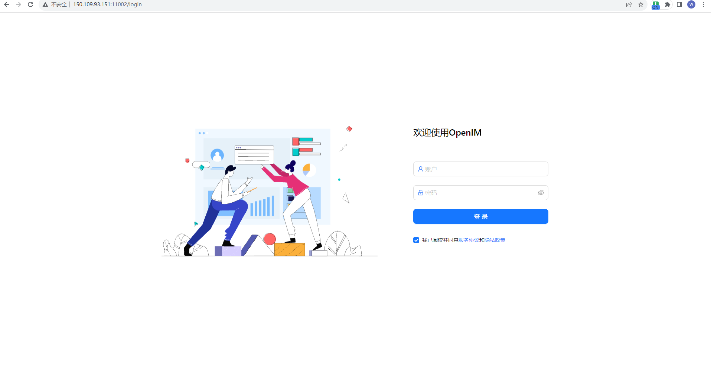
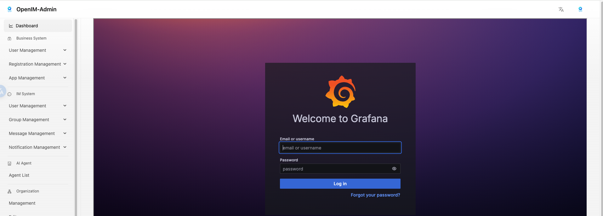
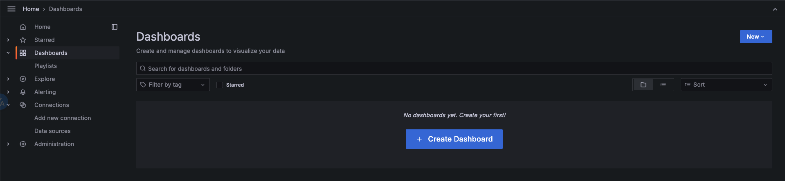
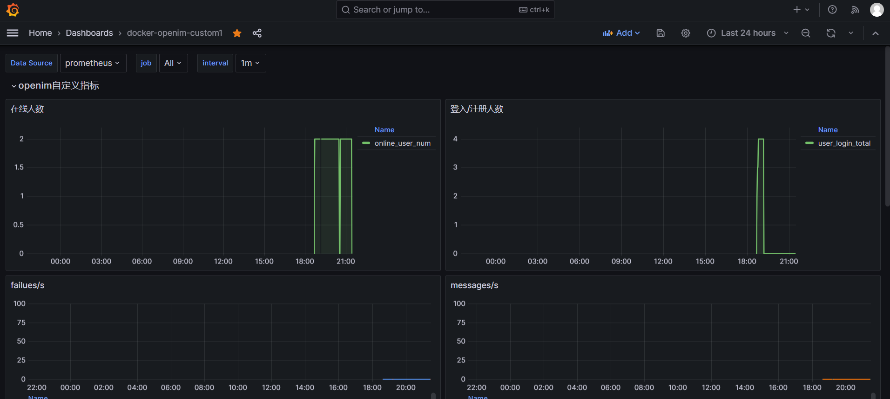
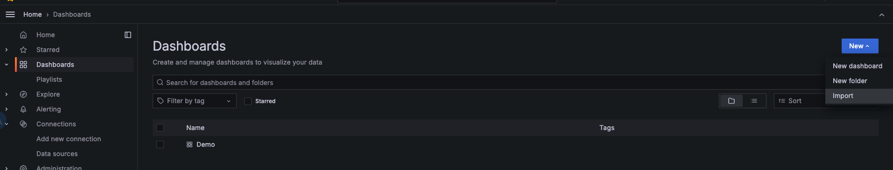
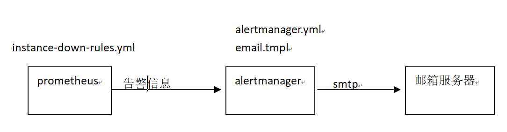
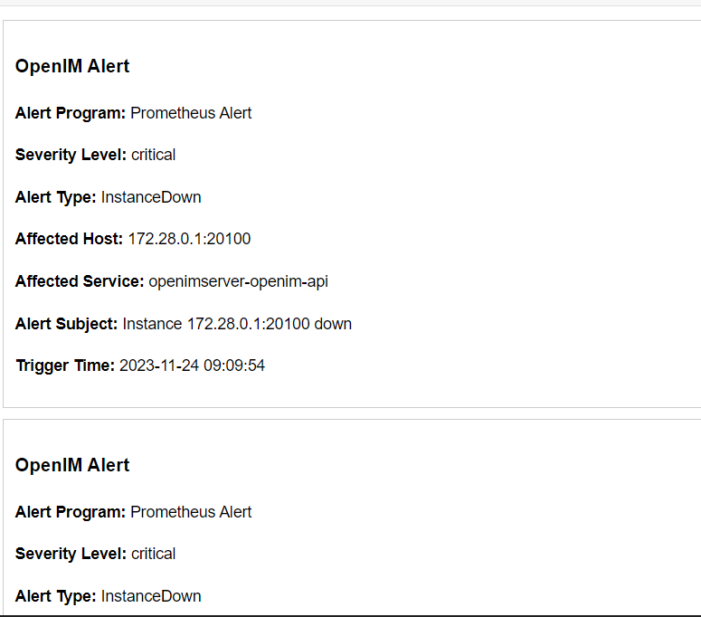

# 管理后台及监控系统 🖥️
### 🟢 管理后台开放端口

| TCP 端口  | 说明                    | 操作 ⚙️                                      |
|:--------:|:-----------------------:|:--------------------------------------------:|
| TCP:11002| `http://ip:11002` 访问管理后台 | 端口放行或 nginx 反向代理，并关闭防火墙 |

## 📌 访问管理后台

:::tip
在浏览器中输入 `http://ip:11002` 来访问管理后台。此 ip 为服务端 ip ，且确保您的浏览器能访问。默认账号和密码均为admin1
:::



## 监控&告警系统部署
我们提供两种监控&告警系统的部署，docker-compose方式和k8s helm chart方式。
本文档介绍docker-compose方式部署openim的Prometheus监控和告警功能的部署和使用,
k8s方式部署openim的监控&告警使用请查阅链接文档:https://github.com/openimsdk/helm-charts/blob/main/docs/user-guide-zh.md
源码和docker-compose部署openim的docker-compose.yml文件中各组件说明:

| 组件名称  | 组件说明                    | 开启监控&告警功能是否必须                       |
|:--------:|:-----------------------:|:--------------------------------------------:|
| openim-admin| openim管理后台,通过管理后台页面进入监控页面 | 必须 |
| prometheus| prometheus组件 | 必须 |
| alertmanager| 告警管理组件 | 必须 |
| grafana| grafana组件 | 必须 |
| node-exporter| node-exporter组件,用于prometheus组件拉取node指标信息 | 可选 |

监控&告警使用的配置文件配置说明:

| 文件名称  | 文件说明                    | 修改项                       |
|:--------:|:-----------------------:|:--------------------------------------------:|
| config/config.yaml| openim服务的配置文件 | 需设置prometheus.enable: true,默认无需修改 |
| config/prometheus.yml| prometheus组件配置文件 | 配置Prometheus组件信息,请查阅Prometheus文档说明按需修改，默认无需修改 |
| config/instance-down-rules.yml| 告警规则文件 | 默认配置两条规则(instance_down,database_insert_failure_alerts),请查阅Prometheus文档说明按需增加 |
| config/alertmanager.yml| 告警管理配置文件 | 默认配置了邮件告警方式,需要配置你的发送和接收邮箱信息，如不修改将不能收到告警信息 |
| config/email.tmpl| 邮件告警模版 | 默认邮件模版比较简单，请按需配置你的邮件模版 |
| config/templates/prometheus-dashboard.yaml| openim自定义dashboard | 无需修改 |

> 在源码和docker-compose方式部署openim时候，请确认使用的docker-compose.yml文件中对应的监控&告警组件可用，
并确认相应的配置文件按需修改好，体验阶段可无需修改配置文件.

## 监控体验
1. 通过openim管理后台网页的链接入口访问,管理后台网页地址:http://ip:11002/

2. 管理后台默认用户名和密码 (admin1:admin1),点击如图链接，将打开监控的grafana网页.


3. 点击右上角sign in按钮,登入grafana使用默认用户名和密码(admin:admin).



4. 添加Prometheus数据源，如下图，输入Prometheus数据源的url:http://172.28.0.1:19090  点击"Save and Test"进行数据源保存.


5. 导入docker版本openim自定义dashboard仪表盘.
点击下图的import按钮,进入仪表盘导入页面



拷贝 https://github.com/openimsdk/open-im-server/tree/main/config/templates/prometheus-dashboard.yaml 内容 到下图区域,接着点击load按钮


选择你的 Data Source和job ,你将要查看到自定义指标信息，如下图


6.导入node-export的官网dashboard，直接官网(https://grafana.com/grafana/dashboards/  )寻找你满意的node-exporter dashboard试图，
然后导入，比如 1860(Node Exporter Full)




你将要查看到node-exporter指标信息，如下图

> 能查看到node-exporter指标信息，你需要在docker-compose.yml使node-exporter组件可用.


## 告警配置文件说明

1,邮件告警架构说明图,Prometheus组件加载告警规则instance-down-rules.yml文件，将符合条件的告警信息发送到alertmanager组件，
alertmanager组件加载alertmanager.yml和email.tmpl文件，通过配置的告警邮箱信息和邮件模版发送邮件


2,prometheus.yml 文件说明,主要用来配置告警规则文件路径，主要用来配置告警规则文件路径，告警管理服务地址，抓取监控数据ip地址。默认不需要修改。
```

# Alertmanager configuration
alerting:
alertmanagers:
- static_configs:
- targets: ['172.28.0.1:19093']

# Load rules once and periodically evaluate them according to the global 'evaluation_interval'.
rule_files:
  - "instance-down-rules.yml"

```
3，告警规则instance-down-rules.yaml文件说明，默认实现了两条(instance_down,database_insert_failure_alerts)邮件告警规则,
如果增加告警规则可以在instance-down-rules.yml文件中添加规则:
```
groups:
  - name: instance_down  #报警规则一:监控模块宕机超过一分钟就触发告警
    rules:
      - alert: InstanceDown
        expr: up == 0
        for: 1m
        labels:
          severity: critical
        annotations:
          summary: "Instance {{ $labels.instance }} down"
          description: "{{ $labels.instance }} of job {{ $labels.job }} has been down for more than 1 minutes."

  - name: database_insert_failure_alerts #报警规则二:监控指标msg_insert_redis_failed_total和msg_insert_mongo_failed_total有增长就触发报警
    rules:
      - alert: DatabaseInsertFailed
        expr: (increase(msg_insert_redis_failed_total[5m]) > 0) or (increase(msg_insert_mongo_failed_total[5m]) > 0)
        for: 1m
        labels:
          severity: critical
        annotations:
          summary: "Increase in MsgInsertRedisFailedCounter or MsgInsertMongoFailedCounter detected"
          description: "Either MsgInsertRedisFailedCounter or MsgInsertMongoFailedCounter has increased in the last 5 minutes, indicating failures in message insert operations to Redis or MongoDB,maybe the redis or mongodb is crash."
```

4，告警管理alertmanager.yml文件说明,请修改成你真实的发送邮箱和接收邮箱配置信息，即可接收告警信息,
如果想实现钉钉，企业微信等方式的告警通知，需要自行改写alertmanager.yml，
可以参阅告警管理模块官方文档：https://prometheus.io/docs/alerting/latest/alertmanager/
```
global:
  resolve_timeout: 5m
  smtp_from: alert@openim.io #告警信息发送邮箱
  smtp_smarthost: smtp.163.com:465 #发送邮箱smtp地址
  smtp_auth_username: alert@openim.io #发送邮箱授权用户名，一般和游戏地址相同
  smtp_auth_password: YOURAUTHPASSWORD #发送邮箱授权码
  smtp_require_tls: false
  smtp_hello: openim alert

templates:
  - /etc/alertmanager/email.tmpl #邮件模版

route:
  group_by: ['alertname']
  group_wait: 5s
  group_interval: 5s
  repeat_interval: 5m
  receiver: email
receivers:
  - name: email
    email_configs:
      - to: 'alert@example.com' #接收告警邮箱
        html: '{{ template "email.to.html" . }}'
        headers: { Subject: "[OPENIM-SERVER]Alarm" }#邮件标题
        send_resolved: true
```
5，邮件模版文件email.tmpl说明，此文件是html格式，告警管理模块会填充里面的变量信息，然后渲染成html格式文件，进行邮件的发送，
你可以跟着自己的需要进行模版文件的改写:
```
{{ define "email.to.html" }}
{{ range .Alerts }}
<!-- Begin of OpenIM Alert -->
<div style="border:1px solid #ccc; padding:10px; margin-bottom:10px;">
    <h3>OpenIM Alert</h3>
    <p><strong>Alert Program:</strong> Prometheus Alert</p>
    <p><strong>Severity Level:</strong> {{ .Labels.severity }}</p>
    <p><strong>Alert Type:</strong> {{ .Labels.alertname }}</p>
    <p><strong>Affected Host:</strong> {{ .Labels.instance }}</p>
    <p><strong>Affected Service:</strong> {{ .Labels.job }}</p>
    <p><strong>Alert Subject:</strong> {{ .Annotations.summary }}</p>
    <p><strong>Trigger Time:</strong> {{ .StartsAt.Format "2006-01-02 15:04:05" }}</p>
</div>
<!-- End of OpenIM Alert -->
{{ end }}
{{ end }}
```


## 告警体验
可手动触发instancedown告警规则，如果是源码部署openim方式，执行 `make stop`命令停止openim-server服务，等待5m分钟以上，即可收到告警邮件，内容如下：



# 日志系统
如果是在k8s环境通过helm chart方式部署的openim服务，可以通过grafana查看loki日志，即通过grafana查看openim所有服务的日志信息。
目前二进制和docker部署没有集成loki日志收集组件，想体验loki日志收集功能，请采用helm chart部署，
详情请查阅链接https://github.com/openimsdk/helm-charts/blob/main/docs/user-guide-zh.md