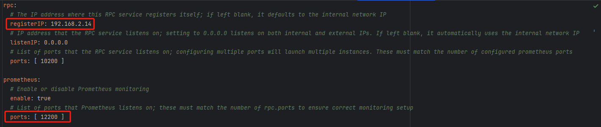
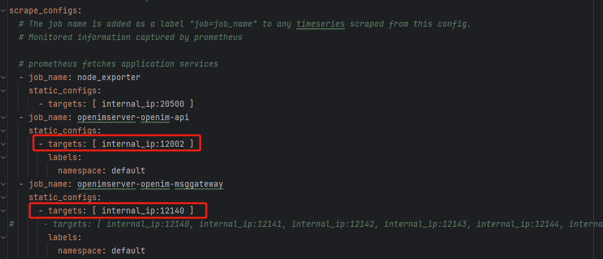

## IMServer源码集群部署指南

本指南将指导您在两台机器（A 和 B，内网 IP 分别为 `IP_A` 和 `IP_B`）上集群部署 `open-im-server` 和 `nginx`，并在机器 A 上部署监控组件（Prometheus、Grafana、Alertmanager）。
此文档中假设您已部署 Redis 集群、MongoDB 分片集群、Kafka 集群及 Etcd 集群，具体地址如下：

- **Redis 集群地址**: `redisAddr1`, `redisAddr2`, `redisAddr3`
- **MongoDB 集群地址**: `mongoAddr1`, `mongoAddr2`, `mongoAddr3`
- **Kafka 集群地址**: `kafkaAddr1`, `kafkaAddr2`, `kafkaAddr3`
- **Etcd 集群地址**: `etcdAddr1`, `etcdAddr2`, `etcdAddr3`

本文假设以上组件都部署在三台机器上，实际上不限于三台，**您可根据需求自行选择多台或者一台**。

此外，MinIO 的内部服务访问地址配置为 `your_minio_internal_address`，外部访问地址配置为 `your_minio_external_address`。
A 和 B 两台机器以及组件集群内网互通，且A、B两台机器都有外网IP。

### 目录结构

1. [前提条件](#前提条件)
2. [克隆仓库](#1-克隆仓库)
3. [配置修改](#2-配置修改)
4. [配置 nginx](#3-配置-nginx)
5. [设置 DNS](#4-设置-dns)
6. [启动服务](#5-启动服务)
7. [修改客户端 SDK 初始化参数](#6-修改客户端-sdk-初始化参数)

### 前提条件

确保以下组件已正确部署并运行：

- **Redis 集群**
- **MongoDB 分片集群**
- **Kafka 集群**
- **Etcd 集群**
- **MinIO 服务**

### 1. 克隆仓库

在两台机器（A 和 B）上分别执行以下命令以克隆 `open-im-server` 仓库：

```bash
git clone https://github.com/openimsdk/open-im-server
cd open-im-server
```

### 2. 配置修改

在机器 A 和 B 上，按照以下步骤修改配置文件，确保各组件正确连接。所有地址字段均采用单行列表格式 `address: [addr1, addr2, addr3]`。

#### 2.1 Kafka 配置

编辑 `open-im-server/config/kafka.yml` 文件，设置 `address` 字段为 Kafka 集群地址列表：

```yaml
address: [kafkaAddr1, kafkaAddr2, kafkaAddr3]
```

#### 2.2 MinIO 配置

编辑 `open-im-server/config/minio.yml` 文件，设置 `internalAddress` 和 `externalAddress`：

```yaml
internalAddress: your_minio_internal_address
externalAddress: your_minio_external_address
```

#### 2.3 MongoDB 配置

编辑 `open-im-server/config/mongodb.yml` 文件，设置 `address` 字段为 MongoDB 集群地址列表：

```yaml
address: [mongoAddr1, mongoAddr2, mongoAddr3]
```

#### 2.4 Etcd 配置

编辑 `open-im-server/config/discovery.yml` 文件，设置 `etcd.address` 字段为 Etcd 集群地址列表：

```yaml
etcd:
  address: [etcdAddr1, etcdAddr2, etcdAddr3]
```

#### 2.5 Redis 配置

编辑 `open-im-server/config/redis.yml` 文件，设置 `address` 字段为 Redis 集群地址列表，并启用集群模式：

```yaml
address: [redisAddr1, redisAddr2, redisAddr3]
clusterMode: true
```

### 3. 配置 nginx

在机器 A 、B上部署 `nginx`，参考以下配置。请确保替换为您的实际域名、SSL 证书路径和 SSL 密钥路径。

> 🚀 **提示**: 确保替换成您的实际域名、SSL 证书路径和 SSL 密钥。

```nginx
events {
    worker_connections 1024;
}

http {
    # open-im-server
    upstream msg_gateway {
        server IP_A:10001;
        server IP_B:10001;
    }

    upstream im_api {
        # IM API 服务器地址，可根据部署情况指定多个
        server IP_A:10002;
        server IP_B:10002;
    }

    server {
        listen       443 ssl;
        server_name  your_domain.com;  # 替换为您的域名

        ssl_certificate     /usr/local/nginx/conf/ssl/your_domain_bundle.pem;  # 替换为您的证书路径
        ssl_certificate_key /usr/local/nginx/conf/ssl/your_domain.key;        # 替换为您的证书密钥路径

        location ^~/api/ {
            proxy_http_version 1.1;
            proxy_set_header Upgrade $http_upgrade;
            proxy_set_header Connection "Upgrade";
            proxy_set_header X-Real-IP $remote_addr;
            proxy_set_header X-Forwarded-For $remote_addr;
            proxy_set_header X-Request-Api $scheme://$host/api;
            proxy_pass http://im_api/;
        }

        location /msg_gateway/ {
            proxy_http_version 1.1;
            proxy_set_header Upgrade $http_upgrade;
            proxy_set_header Connection "Upgrade";
            proxy_set_header X-Real-IP $remote_addr;
            proxy_set_header X-Forwarded-For $remote_addr;
            proxy_pass http://msg_gateway/;
        }
    }

    # 可选: HTTP 重定向到 HTTPS
    server {
        listen 80;
        server_name your_domain.com;  # 替换为您的域名

        return 301 https://$host$request_uri;
    }
}
```

将此配置添加到 `nginx` 的配置文件中， 并reload使配置生效：

### 4. 设置 DNS

将您的域名 `your_domain.com` 指向机器A、B的外网 IP 地址。

### 5. 启动服务

在两台机器（A 和 B）的 `open-im-server` 目录下执行以下命令以编译和启动服务：

中国境内建议设置go代理
```
$ go env -w GO111MODULE=on
$ go env -w GOPROXY=https://goproxy.cn,direct
```

#### 5.1 编译
```bash
mage
```

#### 5.2 启动服务

```bash
mage start
```


### 6. 修改客户端 SDK 初始化参数

在客户端 SDK 中，配置初始化参数如下：

- `apiAddr`: `https://your_domain.com/api`
- `wsAddr`: `wss://your_domain.com/msg_gateway`

## Chat源码集群部署指南

本部分将指导您在两台机器（A 和 B，内网 IP 分别为 `IP_A` 和 `IP_B`）上集群部署 `chat` 和 `nginx`，。
此文档中假设您已部署 Redis 集群、MongoDB 分片集群及 Etcd 集群，具体地址如下：

- **Redis 集群地址**: `redisAddr1`, `redisAddr2`, `redisAddr3`
- **MongoDB 集群地址**: `mongoAddr1`, `mongoAddr2`, `mongoAddr3`
- **Etcd 集群地址**: `etcdAddr1`, `etcdAddr2`, `etcdAddr3`

本文假设以上组件都部署在三台机器上，实际上不限于三台，**您可根据需求自行选择多台或者一台**。

A 和 B 两台机器以及组件集群内网互通，且A、B两台机器都有外网IP。

### 目录结构

1. [前提条件](#前提条件)
2. [克隆仓库](#1-克隆仓库)
3. [配置修改](#2-配置修改)
4. [配置 nginx](#3-配置-nginx)
5. [启动服务](#5-启动服务)

### 前提条件

确保以下组件已正确部署并运行：

- **Redis 集群**
- **MongoDB 分片集群**
- **Etcd 集群**
- **MinIO 服务**

### 1. 克隆仓库

在两台机器（A 和 B）上分别执行以下命令以克隆 `chat` 仓库：

```bash
git clone https://github.com/openimsdk/chat
cd chat
```

### 2. 配置修改

在机器 A 和 B 上，按照以下步骤修改配置文件，确保各组件正确连接。所有地址字段均采用单行列表格式 `address: [addr1, addr2, addr3]`。

#### 2.1 MongoDB 配置

编辑 `chat/config/mongodb.yml` 文件，设置 `address` 字段为 MongoDB 集群地址列表：

```yaml
address: [mongoAddr1, mongoAddr2, mongoAddr3]
```

#### 2.2 Etcd 配置

编辑 `open-im-server/config/discovery.yml` 文件，设置 `etcd.address` 字段为 Etcd 集群地址列表：

```yaml
etcd:
  address: [etcdAddr1, etcdAddr2, etcdAddr3]
```

#### 2.3 Redis 配置

编辑 `open-im-server/config/redis.yml` 文件，设置 `address` 字段为 Redis 集群地址列表，并启用集群模式：

```yaml
address: [redisAddr1, redisAddr2, redisAddr3]
clusterMode: true
```

### 3. 配置 nginx

在机器 A 、B上部署 `nginx`，参考以下配置。请确保替换为您的实际域名、SSL 证书路径和 SSL 密钥路径。

> 🚀 **提示**: 确保替换成您的实际域名、SSL 证书路径和 SSL 密钥。

```nginx
events {
    worker_connections 1024;
}

http {
    upstream chat_admin_api {
        # Chat Admin API (管理员模块api) 服务器地址，可根据部署情况指定多个
        server IP_A:10009;
        server IP_B:10009;
    }
    
    upstream chat_chat_api {
        # Chat Chat API (chat服务模块) 服务器地址，可根据部署情况指定多个
        server IP_A:10008;
        server IP_B:10008;
    }
    
    upstream chat_bot_api {
        # Chat Bot API (智能体模块) 服务器地址，可根据部署情况指定0个或多个
        server IP_A:10010;
        server IP_B:10010;
    }

    server {
        listen       443 ssl;
        server_name  your_chat_domain.com;  # 替换为您的域名

        ssl_certificate     /usr/local/nginx/conf/ssl/your_domain_bundle.pem;  # 替换为您的证书路径
        ssl_certificate_key /usr/local/nginx/conf/ssl/your_domain.key;        # 替换为您的证书密钥路径

        location ^~/chat_admin_api/ {
            proxy_http_version 1.1;
            proxy_set_header Upgrade $http_upgrade;
            proxy_set_header Connection "Upgrade";
            proxy_set_header X-Real-IP $remote_addr;
            proxy_set_header X-Forwarded-For $remote_addr;
            proxy_set_header X-Request-Api $scheme://$host/api;
            proxy_pass http://chat_admin_api/;
        }

        location ^~/chat_chat_api/ {
            proxy_http_version 1.1;
            proxy_set_header Upgrade $http_upgrade;
            proxy_set_header Connection "Upgrade";
            proxy_set_header X-Real-IP $remote_addr;
            proxy_set_header X-Forwarded-For $remote_addr;
            proxy_set_header X-Request-Api $scheme://$host/api;
            proxy_pass http://chat_chat_api/;
        }
        
        location ^~/chat_bot_api/ {
            proxy_http_version 1.1;
            proxy_set_header Upgrade $http_upgrade;
            proxy_set_header Connection "Upgrade";
            proxy_set_header X-Real-IP $remote_addr;
            proxy_set_header X-Forwarded-For $remote_addr;
            proxy_set_header X-Request-Api $scheme://$host/api;
            proxy_pass http://chat_bot_api/;
        }
    }

    # 可选: HTTP 重定向到 HTTPS
    server {
        listen 80;
        server_name your_chat_domain.com;  # 替换为您的域名

        return 301 https://$host$request_uri;
    }
}
```

将此配置添加到 `nginx` 的配置文件中， 并reload使配置生效：

### 4. 设置 DNS

将您的域名 `your_chat_domain.com` 指向机器A、B的外网 IP 地址。

### 5. 启动服务

在两台机器（A 和 B）的 `chat` 目录下执行以下命令以编译和启动服务：

中国境内建议设置go代理
```
$ go env -w GO111MODULE=on
$ go env -w GOPROXY=https://goproxy.cn,direct
```

#### 5.1 编译

```bash
mage
```

#### 5.2 启动服务

```bash
mage start
```


## **常见问题/注意事项**

1. 部署`kafka`时，需要修改`kafka`广播的端口。如果使用`open-im-server`中的`docker-compose.yml`部署，修改`service.kafka.environment.KAFKA_CFG_ADVERTISED_LISTENERS`中的`EXTERNAL`为访问`kafka`组件的地址。其他部署方式请自行修改。
   例如：`KAFKA_CFG_ADVERTISED_LISTENERS: PLAINTEXT://kafka:9092,EXTERNAL://192.168.2.36:19094`。
2. 多台机器部署需要保证时钟一致，服务才可正常运行。例如`token`的签发允许各个机器的时钟误差在`5s`以内。
3. 组件端口无法访问：通过回环地址检测组件启动是否正常，若回环地址可访问，则检查是否被防火墙规则过滤。
4. 如果集群机器**不在内网中**，需要将`autoSetPorts`设置为`false`，并修改各个`rpc`组件的`registerIP`为设置部署`etcd`的服务器可访问的`ip`地址，**并保证各个端口可被访问**。如需启用`prometheus`，还需要保证各个组件的`prometheus.port`端口可被访问。
   拥有`autoSetPorts`配置的组件如下：

   - `openim-api.yml:prometheus.autoSetPorts`
   - `openim-msggateway.yml:rpc.autoSetPorts`
   - `openim-msgtransfer.yml:prometheus.autoSetPorts`
   - `openim-push.yml:rpc.autoSetPorts`
   - `openim-rpc-auth.yml:rpc.autoSetPorts`
   - `openim-rpc-conversation.yml:rpc.autoSetPorts`
   - `openim-rpc-friend.yml:rpc.autoSetPorts`
   - `openim-rpc-group.yml:rpc.autoSetPorts`
   - `openim-rpc-msg.yml:rpc.autoSetPorts`
   - `openim-rpc-third.yml:rpc.autoSetPorts`
   - `openim-rpc-user.yml:rpc.autoSetPorts`

   

   此外，机器A还需要修改`prometheus.yml`，将其中的所有`http_sd_configs`配置项及其子配置项去掉，加上`static_configs`配置项，并将其中的`targets`改为对应的服务的端口。
   例如：`openimserver-openim-api`表示`api`组件的`prometheus`数据抓取，则其`target`中的端口地址应和`openim-api.yml`中的`prometheus.ports`一致。

   
