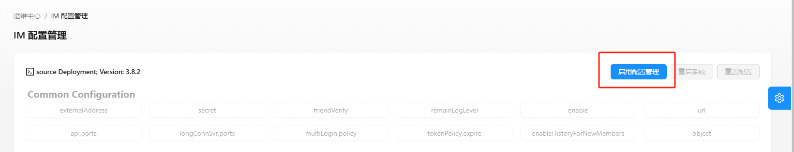
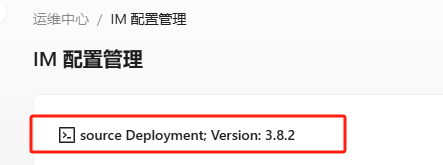
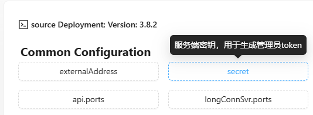
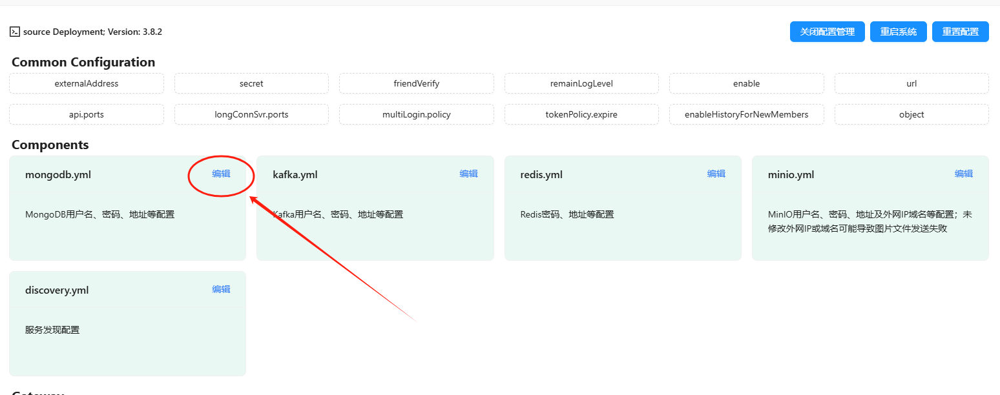
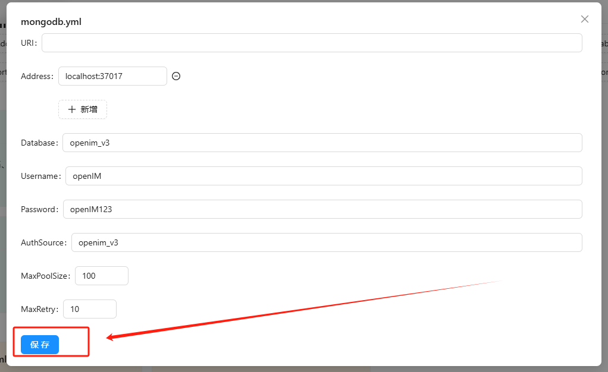

# OpenIM配置中心说明

## 介绍

配置中心是`OpenIM`的配置可视化功能模块，能够让用户在可视化界面中便捷、友好地对`open-im-server`的配置进行修改，并能够根据新的配置自动重启相应的服务以应用新的配置。

## 使用说明

### 访问界面

在通过`docker compose up -d`启动管理后台组件后，在浏览器中输入 `http://your_server_ip:11002` 来访问管理后台。`your_server_ip` 为服务端部署机器`ip`地址，确保您的浏览器能访问。默认账号和密码均为 `chatAdmin`。

在左侧的菜单栏中选择“运维中心”，选择“IM配置管理”，即可进入配置中心页面。

配置中心功能默认不启用，第一次进入配置中心页面需要点击“启用配置管理”开启配置中心功能。

### 查看配置

点击“IM配置管理”后，界面左上角会显示部署方式以及版本。如下图所示为源码部署、3.8.2版本：

`Common Configuration`表示常用的配置，下方展示了常用的配置字段，鼠标悬浮于字段上方可查看字段含义，如下图所示：

### 编辑配置

鼠标点击`Common Configuration`下的配置字段或者点击下方各个配置文件右上角的“编辑”按钮，即可对配置文件进行修改。修改后，点击“保存”，即可更新配置，并自动重启相关的服务。如下图所示：

### 重启系统/重置配置

配置中心右上角有“重启系统”和“重置配置两个按钮”。

如果在某些极端情况下，修改了配置之后系统没有正确应用，可点击“重启系统”保证配置被正确加载。

“重置配置”表示系统将重新从`config`目录下的配置文件中加载配置，覆盖在配置中心进行的修改。

### 关闭配置中心

点击上方“关闭配置管理”按钮，可关闭配置中心。

## 注意事项

1. 配置中心启用时，**会导致在`config`目录下配置文件的修改失效**，只能通过配置中心进行配置的修改。
1. 配置中心一旦关闭，会丢失在开启过程中进行的配置（服务重启不会丢失）。
