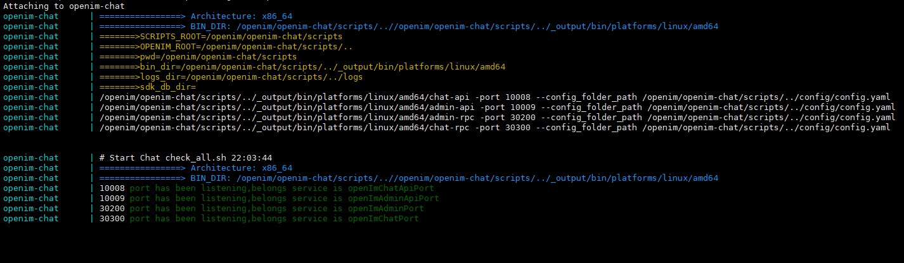
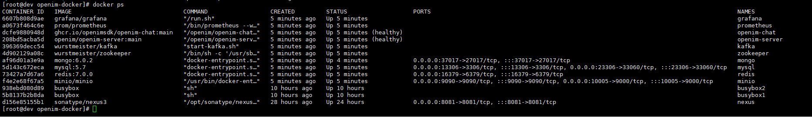
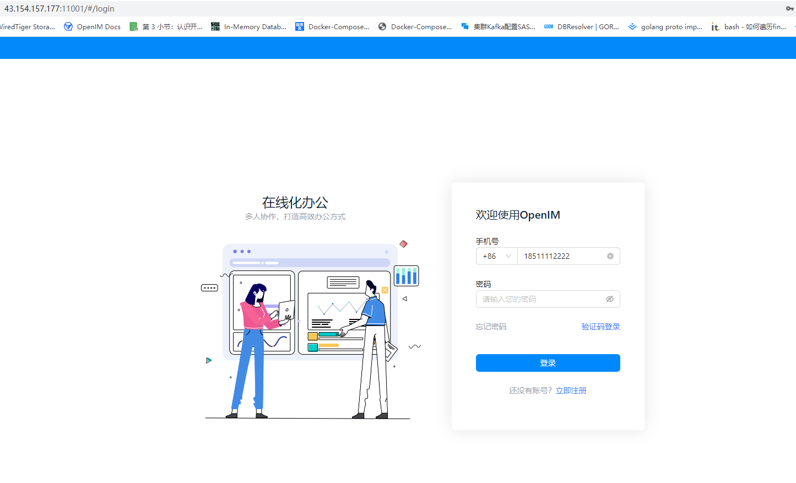

# docker部署

## 环境及系统要求

| 注意事项 | 详细说明                                                     |
| -------- | ------------------------------------------------------------ |
| 操作系统 | linux系统即可， Ubuntu 22.04最优，root用户    |
| 硬件资源 | 可用内存2G以上，用户量小于10万，可用单机部署，8C 16G 10Mb 1T普通磁盘即可 |
| golang   | 1.18及以上                                                   |
| docker   | Docker version 24.0.5, build ced0996及以上                                                 |
| git      | 2.17.1及以上                                                 |

## 存储组件

| 存储组件  | 建议版本    |
| --------- | ----------- |
| mongodb   | 6.0.2及以上 |
| redis     | 7.0.0及以上 |
| zookeeper | latest      |
| kafka     | latest      |
| mysql     | 5.7及以上   |
| minio     | latest      |


1.设置环境变量
```bash
# 一般情况下只需要设置mysql/mongodb/redis/minio组件密码PASSWORD，如未设置，则为默认密码openIM123
# export PASSWORD="openIM123" # 设置mysql/mongodb/redis/minio组件密码，至少8位，不能包含特殊字符，默认是openIM123 
# 选择 chat 版本 和 server 版本https://github.com/OpenIMSDK/Open-IM-Server/blob/main/docs/conversions/images.md, eg: main, release-v*.* 仅支持3.3/1.3之后的版本，暂时不用设置
# export CHAT_BRANCH="main"   # 设置 chat 版本，默认是 release-v1.3 
# export SERVER_BRANCH="main" # 设置 server 版本，默认是 release-v3.3
# export USER="root" # 设置mysql/mongodb/redis/minio用户名，目前只支持root
# export API_URL="http://127.0.0.1:10002" #内网环境下，需设置 OpenIM Server API 提供服务的地址，外网环境下会自动获取
# export DATA_DIR="./" #设置组件挂载的数据卷目录，默认为./
#更多环境变量可直接修改scripts/install/environment.sh  注意：export优先级高于脚本中的变量
```

2.拉镜像启动

```bash
git clone https://github.com/openim-sigs/openim-docker openim/openim-docker && export openim=$(pwd)/openim && cd $openim/openim-docker  && make init && docker compose up -d
```


3.查看日志

```bash
docker compose logs openim-server
docker compose logs openim-chat
```




更多日志
openim-server/分支/logs/ 
openim-chat/分支/logs 


4.查看健康状态-healthy

```bash
docker ps
```




5.pc web体验
浏览器访问http://ip:11001


### 其它问题

1. 如想使用某些外部组件，该如何修改

```bash
举例说明，如想使用外部的mysql，操作步骤如下：
1.编辑docker-compose.yaml 在此文件中注释掉mysql相关配置项
2.编辑scripts/install/environment.sh 修改mysql的ip port及密码等配置项
3.make init使配置生效
4.docker compose up -d启动
```

2. 健康状态starting

```bash
在第一次健康检查完成之前，Docker 默认会将容器的健康状态设置为 starting。目前是5分钟检测一次，正常情况下5分钟后会变成healthy状态
```

3. 端口映射

```bash
Docker networks自定义 ，端口可以正常映射

```

4. docker版本

```bash
 新版docker已经整合docker dompose作为其核心功能的一部分，不需单独安装docker-compose
 如果您的docker版本过低，建议升级到新版本，官方使用的是23.0.1版本
```


## 开放端口

开放 IM 端口

| TCP 端口  | 说明                                                  | 操作                                    |
| --------- | ----------------------------------------------------- | --------------------------------------- |
| TCP:10001 | ws 协议，消息端口，如消息发送、推送等，用于客户端 SDK | 端口放行或 nginx 反向代理，并关闭防火墙 |
| TCP:10002 | api 端口，如用户、好友、群组、消息等接口。            | 端口放行或 nginx 反向代理，并关闭防火墙 |
| TCP:10005 | 选择 minio 存储时需要(openIM 默认使用 minio 存储)     | 端口放行或 nginx 反向代理，并关闭防火墙 |

开放 Chat 端口

| TCP 端口  | 说明                     | 操作                                    |
| --------- | ------------------------ | --------------------------------------- |
| TCP:10008 | 业务系统，如注册、登录等 | 端口放行或 nginx 反向代理，并关闭防火墙 |
| TCP:10009 | 管理后台，如统计、封号等 | 端口放行或 nginx 反向代理，并关闭防火墙 |

开放 pc web 端口

| TCP 端口  | 说明                     | 操作                                    |
| --------- | ------------------------ | --------------------------------------- |
| TCP:11001 |http://ip:11001 访问pc web| 端口放行或 nginx 反向代理，并关闭防火墙 |


## 体验pc web

:::tip

浏览器输入 http://ip:11001 访问pc web，注意此ip为服务器ip，确保pc端能访问
先通过手机号注册，验证码默认为 666666

:::



