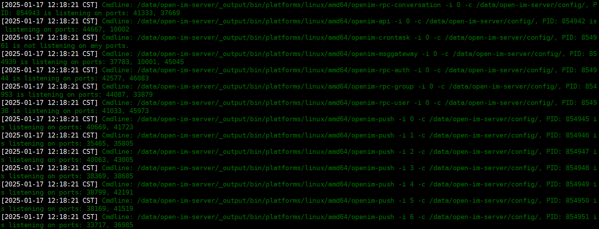
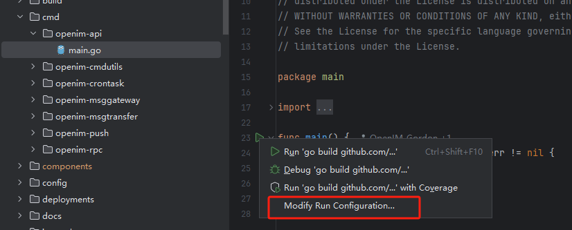
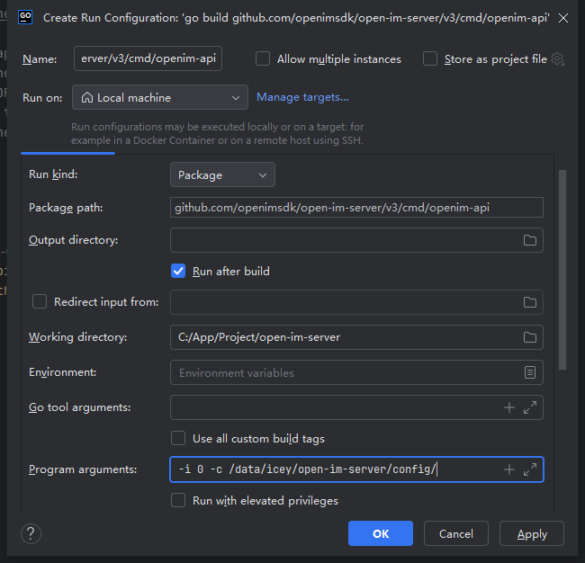
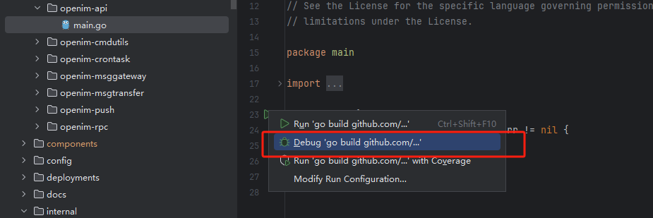
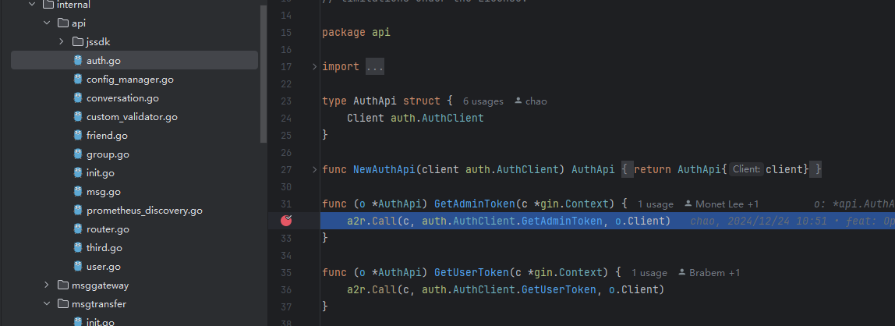

## 一、如何升级

在同一大版本内，不同小版本之间的数据是兼容的。例如，版本 **3.8.0** 的数据可以在升级到 **3.8.2** 后正常运行。本文将重点介绍这种升级情况的具体操作步骤。

### Docker 部署

1. **进入已有的 `openim-docker` 目录：**
    ```bash
    cd openim-docker
    ```

2. **编辑 `.env` 文件，修改相应的镜像标签（tag）。例如，将：**
    ```env
    OPENIM_SERVER_IMAGE=openim/openim-server:release-v3.8.0
    ```
    **修改为：**
    ```env
    OPENIM_SERVER_IMAGE=openim/openim-server:release-v3.8.2
    ```

3. **停止现有的 Docker 服务：**
    ```bash
    docker compose down
    ```

4. **启动更新后的 Docker 服务：**
    ```bash
    docker compose up -d
    ```

### 源码部署

1. **进入已有的 `open-im-server` 目录：**
   
    ```bash
    cd open-im-server
    ```
    
2. **停止当前服务：**
    ```bash
    mage stop
    ```

3. **切换分支并更新代码：**
    ```bash
    git pull
    ```

4. **编译并启动服务：**
    ```bash
    mage
    mage start
    ```


---
## 二、 如何迁移数据

在使用`docker compose up -d`命令启动`OpenIM`依赖的各个组件之后，`open-im-server`根目录下会生成一个`components`的文件夹，`open-im-server`运行后产生的数据（如用户、群聊、消息等等）都保存在这个文件夹中。如果需要迁移数据，需要先关闭服务和组件：

`docker`部署：

```sh
docker compose down
```

源码部署：

```sh
mage stop  # 关闭服务
docker compose down  # 关闭组件
```

然后移动整个文件夹到新的位置，再启动服务和组件：

`docker`部署：

```sh
docker compose up -d  # 启动组
```

源码部署：

```sh
docker compose up -d  # 启动组件
mage start  # 启动服务
```

---
## 三、 如何清除数据

如需要清除数据，需要先关闭服务和组件：

`docker`部署：

```sh
docker compose down
```

源码部署：

```sh
mage stop  # 关闭服务
docker compose down  # 关闭组件
```

然后删除`open-im-server`下的`components`文件夹。

客户端方面需要重新卸载重装`app`。

---
## 四、 发送文本消息正常，但发送图片失败

一般发送图片失败是由于没有配置第三方存储的原因。默认使用的第三方存储为`minio`，需要修改`open-im-server`下的`config/minio.yml`文件，将其中`externalAddress`字段中的`external_ip`替换为机器的外网`ip`，然后重新启动服务即可。

---

## 五、 减少Mongo、Kafka内存占用

如果是是使用`docker`部署的各个组件，可以通过在`docker-compose.yml`文件中限制`mongo`和`kafka`的内存的方式来减小内存的占用。

`mongo`：

```yml
  mongodb:
    environment:
    - wiredTigerCacheSizeGB=0.5  # 修改为适当的值，单位GB
```

`kafka`：

```yml
  kafka:
    environment:
      KAFKA_HEAP_OPTS: "-Xms256m -Xmx256m"  # 添加该限制
```

---

## 六、 如何单步调试

这一部分介绍在源码部署场景下，以单步调试`open-im-server`的`openim-api`服务为例，如何进行单步调试。

1. 运行`docker compose up -d`和`mage start`启动服务。

2. 查看控制台输出，如下所示：
   

   找到需要单步调试的服务，查看其`PID`，并使用命令停止服务。
   从图中可看到`openim-api`服务的`PID`为`854942`，可以使用如下命令停止：

   ```sh
   kill -9 854942  # 类Unix系统
   taskkill /PID 854942 /F  # windows系统
   ```

3. 找到相应的服务启动入口，统一在`open-im-server/cmd`目录下，在编辑器中使用`Debug`模式启动服务，`openim-api`服务的启动入口文件为`open-im-server/cmd/openim-api/main.go`。

4. 设置启动参数。以`Goland`编辑器为例，点击启动箭头，点击`Modify Run Configuration`，如下所示：
   

5. 在控制台的输出找到`openim-api`服务的启动参数。从输出中提取到`openim-api`的启动命令为：`/data/open-im-server/_output/bin/platforms/linux/amd64/openim-msggateway -i 0 -c /data/open-im-server/config/`，其中`-i 0 -c /data/icey/open-im-server/config/`就是启动参数，将其复制并粘贴到`Program arguments`，并点击`OK`，如下：

   

6. 在需要测试的代码段中打上断点。

7. 使用`debug`模式启动，如下：
   

8. 此时代码运行到断点处会停止，即可进行单步调试，如下：
   
