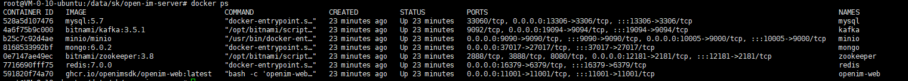

# 源码部署

## 环境及系统要求

| 注意事项 | 详细说明                                                     |
| -------- | ------------------------------------------------------------ |
| 操作系统 | linux系统即可， Ubuntu 7.5.0-3ubuntu1~18.04最优，root用户    |
| 硬件资源 | 可用内存2G以上，用户量小于10万，可用单机部署，8C 16G 10Mb 1T普通磁盘即可 |
| golang   | 1.18及以上                                                   |
| docker   | Docker version 24.0.5, build ced0996及以上                                                 |
| git      | 2.17.1及以上                                                 |

## 存储组件

| 存储组件  | 建议版本    |
| --------- | ----------- |
| mongodb   | 6.0.2及以上 |
| redis     | 7.0.0及以上 |
| zookeeper | latest      |
| kafka     | latest      |
| mysql     | 5.7及以上   |
| minio     | latest      |


OpenIMServer 本身不包含账号注册和登录服务。为方便大家二次开发，我们开源了包括登录注册功能的 AppServer （chat），同时部署 OpenIMServer 和 AppServer （chat），即可搭建一个完整的聊天产品。


## 一、先部署组件

### 1. clone仓库并切换发布分支（release-v3.3及之后的版本）

```bash
git clone https://github.com/openimsdk/open-im-server && cd open-im-server 
```

### 2. 设置常用环境变量


**PASSWORD**
  - **描述**：用于 mysql/mongodb/redis/minio 组件的密码
  - **默认值**：`openIM123`
  - **注意事项**：
    - 密码长度应至少为8个字符。
    - 不能包含任何特殊字符。
	```bash
    export PASSWORD="openIM123"
    ```
	
**USER**
  - **描述**：用于 mysql/mongodb/redis/minio 组件的用户名
  - **默认值**：`root`
  
    ```bash
    export USER="root"
    ```
	
**API_URL**
  - **描述**：API的地址
  - **说明**：如服务器有外网ip，则会自动获取，不需要设置此环境变量；如果本机是内网环境，需要设置此环境变量为对内服务的ip。
  
    ```bash
    export API_URL="http://ip:10002"
    ```

**DATA_DIR**
  - **描述**：组件挂载的数据卷目录
  - **默认值**：`./`
  
    ```bash
    export DATA_DIR="./"
    ```

---

### 更多环境变量

要了解更多关于环境变量的详细信息，请参考 [此文档](https://github.com/openimsdk/open-im-server/blob/main/docs/contrib/environment.md)。

> **注意**：使用 `export` 设置的环境变量优先级高于脚本中的变量。

---


### 3. 部署组件

```bash
make init && docker compose up -d
```


### 4. 查看组件状态

```bash
docker ps
```



## 二、OpenIMServer

1. 编译

```bash
./scripts/build-all-service.sh
```

  2.启动

```bash
./scripts/start-all.sh
```

3. 检测

```bash
./scripts/check-all.sh
```


4. 停止

```bash
./scripts/stop-all.sh
```

### 常见问题

#### 1. 如何使用外部组件？
如果您想使用某些外部组件（例如，外部的 MySQL），您可以按照以下步骤操作：
- 编辑 `docker-compose.yml` 文件，并在此文件中注释掉 MySQL 相关配置项。
- 编辑 `scripts/install/environment.sh` 文件，并修改 MySQL 的 IP、port 及密码等配置项。
- 执行 `make init` 命令以使配置生效。
- 执行 `docker-compose up -d` 命令以启动组件。

#### 2. 启动顺序
请按照 **组件 -> open-im-server -> chat** 的顺序启动。

#### 3. Docker 版本
新版 Docker 已经整合 docker-compose 作为其核心功能的一部分，因此不需要单独安装 docker-compose。如果您的 Docker 版本过低，我们建议您升级到新版本。我们官方使用的是 `23.0.1` 版本。

#### 4. 升级问题
如果组件账号密码不做修改，则可以直接升级。但是，请在升级前确保所有进程都已被停止。

#### 5. 修改组件密码
如果您在组件启动后想要修改组件密码：
- 首先停止组件 docker。
- 如果数据不重要，可以删除整个 `components` 目录。
- 设置新密码：`export PASSWORD=newpassword`。
- 启动组件 docker 以使密码生效。

#### 6. 更多配置项
请不要直接修改 `config/config.yaml` 文件。我们建议您编辑 `scripts/install/environment.sh` 文件，并执行 `make init` 命令以使配置生效。

#### 7. 日志查看
- 运行时日志位置：`logs/OpenIM.log.all.*`。
- 启动日志位置：`_output/logs/openim_20230909.log`。


## 三、AppServer(chat)


1. clone仓库并切换发布分支（release-v1.3及之后的版本）

```bash
#先回到上一级目录
cd .. 
git clone https://github.com/openimsdk/chat.git && cd chat
```

2.编译

```bash
./scripts/build_all_service.sh
```

3.启动

```bash
./scripts/start_all.sh
```

4.检测

```bash
./scripts/check_all.sh --print-screen
```


5.停止

```bash
./scripts/stop_all.sh
```


### 其它问题

1. 如果zk连接失败

```bash
	确认zookeeper的ip端口是否正确。如果组件部署时修改过zookeeper相关配置，则需要修改config/config.yaml文件中的zookeeper配置项
```

2. 如果用户注册失败

```bash
	确认openIMUrl的ip端口是否正确，如果组件部署时修改过open-im-server的ip和端口，则需要修改config/config.yaml文件中的openIMUrl配置项，确保chat能访问open-im-server的api端口
```

3. 日志查看

```bash
	logs目录下
	openIM.log：记录启动日志
	chat.log.*：记录运行时日志
```


## 四、开放端口

开放 IM 端口

| TCP 端口  | 说明                                                  | 操作                                    |
| --------- | ----------------------------------------------------- | --------------------------------------- |
| TCP:10001 | ws 协议，消息端口，如消息发送、推送等，用于客户端 SDK | 端口放行或 nginx 反向代理，并关闭防火墙 |
| TCP:10002 | api 端口，如用户、好友、群组、消息等接口。            | 端口放行或 nginx 反向代理，并关闭防火墙 |
| TCP:10005 | 选择 minio 存储时需要(openIM 默认使用 minio 存储)     | 端口放行或 nginx 反向代理，并关闭防火墙 |

开放 Chat 端口

| TCP 端口  | 说明                     | 操作                                    |
| --------- | ------------------------ | --------------------------------------- |
| TCP:10008 | 业务系统，如注册、登录等 | 端口放行或 nginx 反向代理，并关闭防火墙 |
| TCP:10009 | 管理后台，如统计、封号等 | 端口放行或 nginx 反向代理，并关闭防火墙 |


开放 pc web 端口

| TCP 端口  | 说明                     | 操作                                    |
| --------- | ------------------------ | --------------------------------------- |
| TCP:11001 |http://ip:11001 访问pc web| 端口放行或 nginx 反向代理，并关闭防火墙 |


## 体验pc web
浏览器输入 http://ip:11001 访问pc web，注意此ip为服务器ip，确保pc端能访问
先通过手机号注册，验证码默认为 666666


