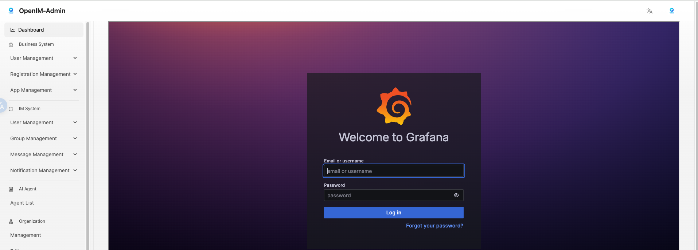
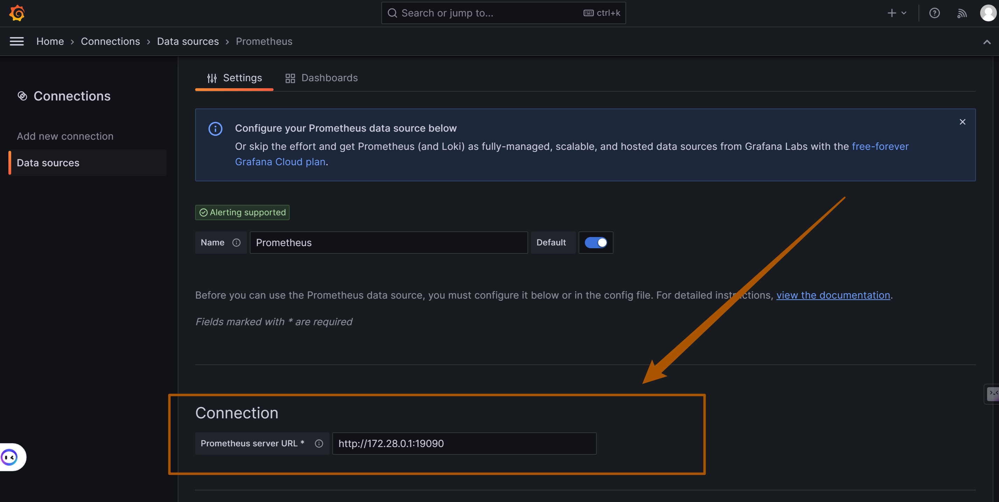
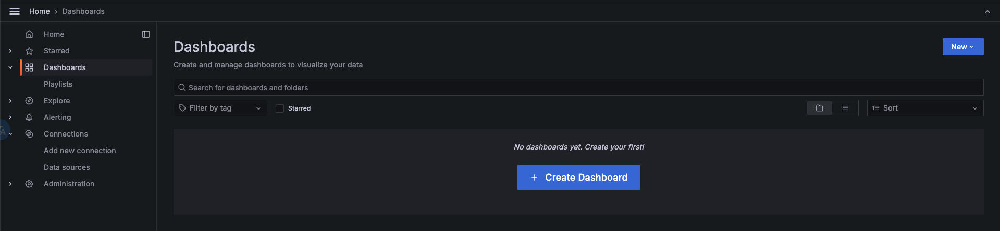
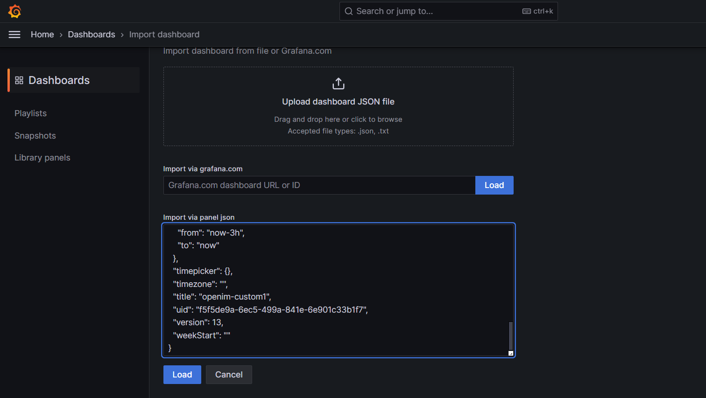
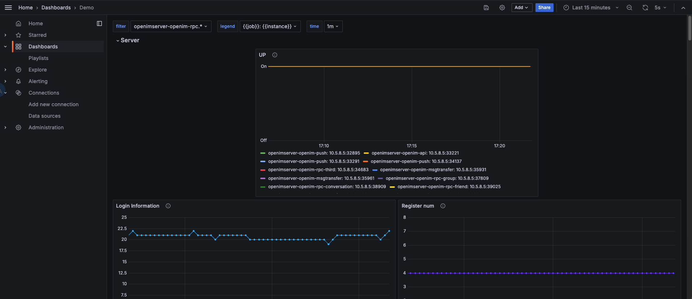
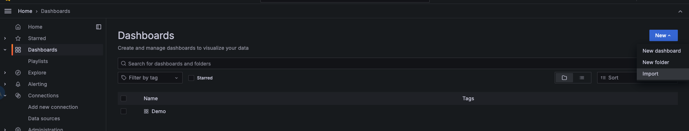
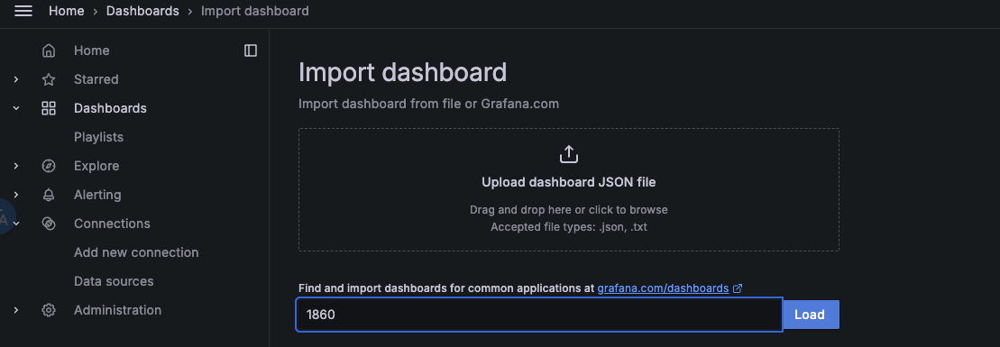
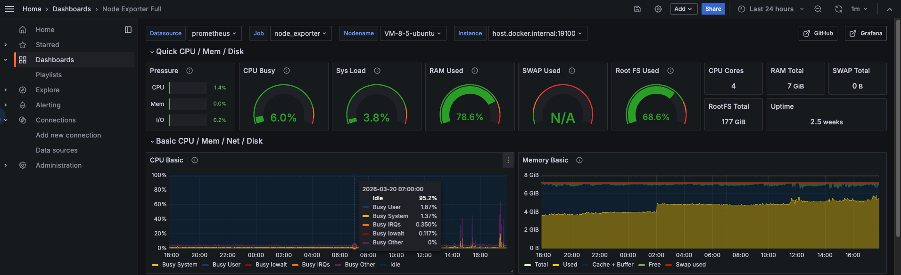

## 📌 一、本文说明

本文用于说明如何在快速部署场景下启用 `OpenIM` 的监控告警能力，并完成 `Grafana` 仪表板初始化。

完成本文后，你可以：

- 启动 `Prometheus`、`Alertmanager`、`Grafana`、`node-exporter`；
- 登录 `Grafana`；
- 导入 `OpenIM` 主要指标仪表板；
- 导入 `node-exporter` 节点监控仪表板。

## 📌 二、启动监控

### 1. 启动组件

目前 `OpenIM` 使用的监控告警组件为 `prometheus`、`alertmanager`、`grafana`、`node_exporter`。

在使用 `docker compose up -d` 启动组件时，默认**不会**启动监控组件。如需启动监控组件，需要使用以下命令：

```sh
docker compose --profile m up -d
```

> 注意：以上方式不适用于 Windows 系统。如果需要在 Windows 系统中启用监控组件，需要自行修改 `docker-compose.yml` 中监控组件的网络模式，并映射相应的端口，最后将 `prometheus.yml` 中的 `127.0.0.1` 替换为内网 IP 地址。

## 📌 三、登录 Grafana

先登录管理后台，再点击左侧数据监控菜单，输入默认用户名 (`admin`) 和密码 (`admin`) 登录 `Grafana`。

也可以直接访问 `your_ip:13000`，将 `your_ip` 改为部署机器的 IP 地址。



## 📌 四、Grafana 导入 OpenIM 主要指标数据

### 1. 添加 Prometheus 数据源

如下图，在左侧菜单栏找到 `Connections/Add new connection`，在输入框内输入 `prometheus` 添加数据源，并输入 Prometheus 数据源的 URL：`http://your_ip:19090`（`19090` 为 Prometheus 默认端口），点击 “Save and Test” 保存。




### 2. 导入 Dashboard

在左侧菜单栏选择 `Dashboards`，点击 `Create Dashboard` 按钮，再点击 `Import dashboard` 导入仪表盘。



有两种方式导入 `OpenIM` 默认的仪表盘：

1. 拷贝 `https://github.com/openimsdk/open-im-server/tree/main/config/grafana-template/Demo.json` 内容到 `Import via dashboard JSON model` 区域。
2. 点击 `Upload dashboard JSON file`，上传 `open-im-server/config/grafana-template/Demo.json` 文件。

接着点击 `Load` 按钮。



选择刚刚添加的 Data Source，再点击 `Import` 即可导入指标信息，如下图。



至此，`OpenIM` 的主要监控指标配置完毕。

## 📌 五、Grafana 导入 node exporter 指标数据

点击左侧菜单栏的 `Dashboards`，选择右侧 `New` 下拉框中的 `Import`。



在 `Grafana.com dashboard URL or ID` 输入框中填入 `1860`，点击右边的 `Load`，再点击 `Import`。



node-exporter 指标信息，如下图。



## 📌 六、组件说明

| 组件名称      | 组件说明                             | 部署说明   |
| ------------- | ------------------------------------ | ---------- |
| prometheus    | 用于收集和存储指标数据的监控系统组件 | 需手动启用 |
| alertmanager  | 管理和发送告警的组件                 | 需手动启用 |
| grafana       | 用于展示监控数据的仪表板组件         | 需手动启用 |
| node-exporter | 用于采集节点（如服务器）指标信息     | 需手动启用 |
