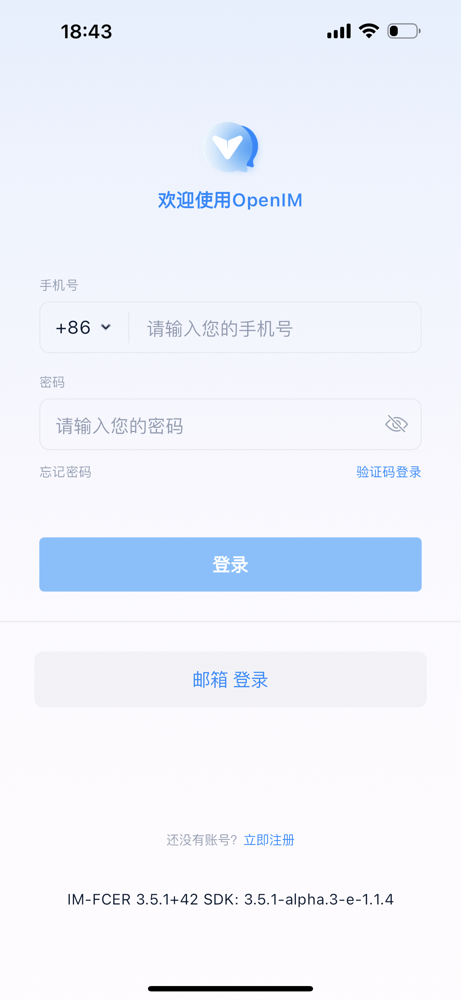
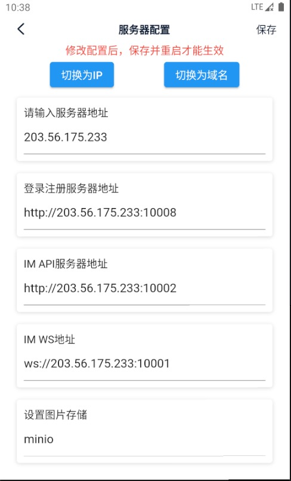

# 移动端快速验证

## 一、部署服务端

参考 docker-compose 部署文档 [docker-compose 部署](./dockerCompose)

## 二、**下载官方 app**

> 扫码或者点击这里[前往下载](https://www.pgyer.com/OpenIM-Flutter)

## 三、**修改服务器地址**

:::tip

支持 ip 和域名，注意开放相关端口，并重启 app。通过手机号注册，验证码默认为 666666

:::

