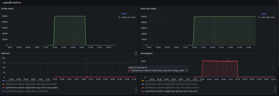
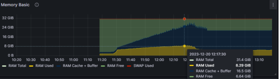
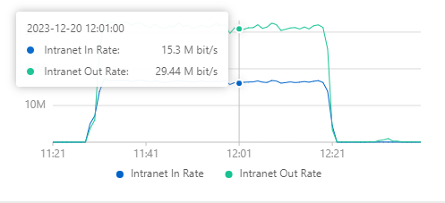
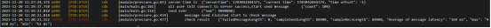
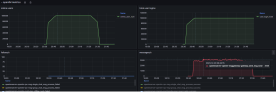
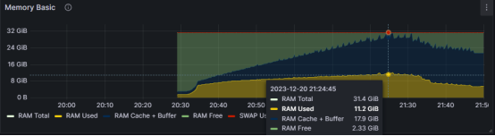
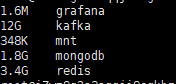

## 测试目的

- 全面评估OpenIM在高并发场景下的消息模块性能表现及稳定性，通过模拟实际用户发送消息的过程，得到系统在处理大量消息交互时的响应能力，同时详细监测了系统的关键资源消耗，包括CPU使用率、内存占用、磁盘I/O以及网络带宽利用情况。此外，测试客户端中还统计了消息发送失败率，消息发送和接收时延，以提供对系统实时通讯性能的全面洞察。

## 测试方案
> OpenIM的测试方案可以分为API压测和长连接网关发消息两种方式，本文主要介绍长连接发消息的测试方案，对于API测试方案，建议采用固定发送用户数，固定接收用户数，发送者于接收者之间发送一定数量消息的方式进行测试，如果以随机的发送者和接收者发送消息进行测试验证，例如1w用户*1w用户的测试，由于每一次的消息都会产生新的会话，会话的数量会随着消息的发送而不断增加，会话的创建是mongodb的随机写，会导致消息的消费成为瓶颈，造成消息有较大的时延，无法正常接收，而且在线上真实的场景下，大多是在已有的会话内部重复聊天，所以并不会一直产生大量的会话，因此建议采用固定用户之间发送大量消息进行测试。

- OpenIM的测试方案主要集中在通过长连接网关发送消息，通过编写相应的压测程序内网下和服务器连接模拟一定数量用户在线，采用抽样出固定发送者，随机定量接收者，模拟用户收发消息，使用等距抽样检测方法获取发送者和接者累计发送与收到的消息，以此统计客户端的关键数据，通过监控系统获取服务器的性能指标，评估系统的稳定性和性能，主要步骤如下：

| 步骤 | 描述  | 备注 |
| ---- | ---- |  -------- |
| 1    | 搭建测试服务器作为OpenIM Server端 | 可根据系统资源，增加push模块的的数量，OpenIM压测使用kafka分区与消费者呈2:1的比例。|
| 2    | 配置系统长连接网关，设定最大连接参数，设置日志系统级别为3，设置系统进程最大连接FD数量  | 注：目前日志模块是同步写入，磁盘iO会成为系统瓶颈，所以建议测试线上都开启3为Warn级别，OpenIM网关默认设置的最大连接数为10w，可以通过环境变量设置修改；打开Prometheus监控开关 。|
| 3    | 搭建模拟客户端的OpenIM Client端，修改本地系统内核连接参数本地端口范围  | 本地端口范围建议设置为5000-65535，因为ipv4协议端口协议限制，客户端目前无法通过设置指定虚拟IP连接，单机模拟用户有限，建议单机最大模拟5w用户左右。 |
| 4   | 根据压测程序执行消息发送操作，监控系统性能。  | 观察客户端资源消耗情况，有无明显的消息发送错误信息，获得最终的客户端抽样检测数据结果；通过linux命令和openIM Prometheus Metrics获取服务器关键性能指标。 |
| 5    | 分析测试结果，确认系统稳定性和性能。  | 根据测试结果得到系统当前指标数据，分析系统潜在瓶颈以及后期可优化关键点。 |

## 测试资源

| 资源类型 | 描述 | 版本/规格 | 数量 | 备注 |
| -------- | ---- | --------- | ---- |---- |
| 服务器 | 用于部署OpenIM的服务器。 | Ubuntu 18.04, 16Core, 32GB RAM, 100GB SSD, 2M EBW(bit/s) | 1台|提供隔离的测试环境 |
| 客户端 | 用于模拟客户端连接OpenIM服务器。 | Ubuntu 18.04, 8Core, 16GB RAM, 40GB SSD, 2M EBW(bit/s) | 2台|保证和上面的服务器同属一个内网或者一个区域能够内网互通 |

## 测试场景

### 场景1

- 模拟5w客户端同时在线的情况。在这个场景中，记录并观察CPU使用率、内存消耗、以及网络带宽的使用情况。此外，将注意观察系统日志以识别任何可能的错误或警告消息。预期的结果是服务器能够稳定运行，资源使用保持在可接受的范围内，无明显的性能瓶颈。
    - **客户端命令**：`nohup ./main -o 50000 -u true >> openIM.log 2>&1 &`
### 场景2

- 模拟5w客户端同时在线的情况，随机300人作为发送者，300人作为接收者，每人发送100条消息，（单聊合计发送900w条消息）每条消息发送间隔1ms，并行发送，在这个场景中，记录并观察各个程序模块以及组件模块CPU使用率、内存消耗、以及网关带宽的使用情况，服务器QPS，硬盘占用情况等，此外，将注意观察系统日志以识别任何可能的错误或警告消息。预期的结果是服务器能够长时间稳定运行，发送所有的消息，得到单机可承载最大的QPS值，客户端的消息延迟在可接收范围内。
    - **客户端命令**：`nohup ./main -o 50000 -rs 300 -rr 300 -c 100 -i 1 -r true >> openIM.log 2>&1`
### 场景3
- 模拟10w客户端同时在线的情况(分为AB两个客户端连接服务器)。在这个场景中，记录并观察CPU使用率、内存消耗、以及网络带宽的使用情况。此外，将注意观察系统日志以识别任何可能的错误或警告消息。预期的结果是服务器能够稳定运行，资源使用保持在可接受的范围内，无明显的性能瓶颈。
    - **A客户端命令**：`nohup ./main -o 50000 -u true >> openIM.log 2>&1 &`
    - **B客户端命令**：`nohup ./main -s  50000 -e 100000  -u true >> openIM.log 2>&1 &`
### 场景4

- 模拟10w客户端同时在线的情况(分为AB两个客户端连接服务器并发送消息)，随机300人作为发送者，300人作为接收者，每人发送56条消息，（合计发送1008w条消息）每条消息发送间隔1ms，并行发送，在这个场景中，记录并观察各个程序模块以及组件模块CPU使用率、内存消耗、以及网关带宽的使用情况，服务器QPS，硬盘占用情况等，此外，将注意观察系统日志以识别任何可能的错误或警告消息。预期的结果是服务器能够长时间稳定运行，发送所有的消息，得到单机可承载最大的QPS值，客户端的消息延迟在可接收范围内。
    - **A客户端命令**：`nohup ./main -o 50000 -rs 300 -rr 300 -c 56 -i 1 -r true >> openIM.log 2>&1`
    - **B客户端命令**：`nohup ./main -s 50000 -e 100000 -rs 300 -rr 300 -c 56  -i 1 -r true  >> openIM.log 2>&1`
### 场景5
- 群聊测试方案...（待补充）

## 测试结果

>其中的带宽消耗为内网环境下统计所得

### 场景1
- 服务器：Ubuntu 18.04, 16Core, 32GB RAM, 100GB SSD, 2M EBW(bit/s)

| 采样时间  | 在线用户数 | 上行带宽  | 下行带宽 | 网关CPU占比 | 网关内存使用量 |
| ---- | ---- | ----- | ------ | ------ |---- |
| 10 min | 5w | 3.03Mb/s | 2.23Mb/s | 26.7% core | 1.378GB |

### 场景2
- 服务器：Ubuntu 18.04, 16Core, 32GB RAM, 100GB SSD, 2M EBW(bit/s)

| 采样时间  | 在线用户数 | 消息平均QPS  | 上行带宽 | 下行带宽 |CPU总占比|内存使用量|
| ---- | ---- | ----- | ------ | ---- | ------ | ---- |
| 50 min | 5w | 约3100/s | 15.3Mb/s| 29.44Mb/s |约88%|约8.5GB

import fivewonline from './assets/cpu-usage-5wonline.png'

- 组件占用硬盘情况：（900w条消息）

| 组件名称  | 占用空间大小 | 说明  | 
| ---- | ---- | ----- | 
| kafka | 11GB | 目前kafka有三个topic都会处理消息，可以理解为存储了三次，后期可以将mongo和push的消费者合并消费一个topic，减小存储量并批量消费推送 | 
| mongodb | 1.5GB| 除开基础启动占用的300MB空间后，经过mongodb的压缩处理后，900w条消息实际占用mongo空间约为1.2GB | 
| redis | 2.7GB| 因为OpenIM开启了AOF，导致有appendonly的追加日志文件，实际存储值大约为1GB(注：目前OpenIM使用redis中拥有会话级别的seq信息，不可随意清除，否则会造成seq回退，用户无法正常收到消息)| 

- 客户端：Ubuntu 18.04, 8Core, 16GB RAM, 40GB SSD, 2M EBW(bit/s)

| 采样时间  | 在线用户数 | 消息发送数 | 成功发送消息数 | 发送失败率 |抽样发送消息|抽样接收消息|接收失败率|消息接收平均时延|消息接收最大时延|消息接收最小时延|
| ------ | ----- | ------ | ------- | ----- | ------ | ----- | ------ | ------- | ----- |----- |
| 50 min  | 5w | 900w | 900w   | 0.0%  | 88900| 88900| 0.0% | 369 ms |4650 ms | 52ms |
### 场景3
- 服务器：Ubuntu 18.04, 16Core, 32GB RAM, 100GB SSD, 2M EBW(bit/s)

| 采样时间  | 在线用户数 | 上行带宽  | 下行带宽 | 网关CPU占比 | 网关内存使用量 |
| ---- | ---- | ----- | ------ | ------ |---- |
| 10 min | 10w | 6.08Mb/s | 4.46Mb/s | 38.5% core | 2.682GB |

### 场景4
- 服务器：Ubuntu 18.04, 16Core, 32GB RAM, 100GB SSD, 2M EBW(bit/s)

| 采样时间  | 在线用户数 | 消息平均QPS  | 上行带宽 | 下行带宽 |CPU总占比|内存使用量|
| ---- | ---- | ----- | ------ | ---- | ------ | ---- |
| 1 h | 10w | 约3000/s | 20.02Mb/s| 34.02Mb/s |约93%|约11.2GB

import tenwonline from './assets/cpu-usage-10wonline.png'

- 组件占用硬盘情况：（1008w条消息）

| 组件名称  | 占用空间大小 | 说明  | 
| ---- | ---- | ----- | 
| kafka | 12GB | 目前kafka有三个topic都会处理消息，可以理解为存储了三次，后期可以将mongo和push的消费者合并消费一个topic，减小存储量并批量消费推送 | 
| mongodb | 1.8GB| 除开基础启动占用的300MB空间后，经过mongodb的压缩处理后，1008w条消息实际占用mongo空间约为1.5GB | 
| redis | 3.4GB| 因为OpenIM开启了AOF，导致有appendonly的追加写日志文件，实际存储值大约为1.3GB(注：目前OpenIM使用redis中拥有会话级别的sequence信息，不可随意清除，否则会造成sequence回退，用户无法正常收到消息)| 

- 客户端A：Ubuntu 18.04, 8Core, 16GB RAM, 40GB SSD, 2M EBW(bit/s)

| 采样时间  | 在线用户数 | 消息发送数 | 成功发送消息数 | 发送失败率 |抽样发送消息|抽样接收消息|接收失败率|消息接收平均时延|消息接收最大时延|消息接收最小时延|
| ------ | ----- | ------ | ------- | ----- | ------ | ----- | ------ | ------- | ----- |----- |
| 1 h  | 5w | 504w | 504w   | 0.0%  | 50736| 50736| 0.0% | 847 ms |5564 ms | 84ms |
- 客户端B：Ubuntu 18.04, 8Core, 16GB RAM, 40GB SSD, 2M EBW(bit/s)

| 采样时间  | 在线用户数 | 消息发送数 | 成功发送消息数 | 发送失败率 |抽样发送消息|抽样接收消息|接收失败率|消息接收平均时延|消息接收最大时延|消息接收最小时延|
| ------ | ----- | ------ | ------- | ----- | ------ | ----- | ------ | ------- | ----- |----- |
| 1 h  | 5w | 504w | 504w   | 0.0%  | 46816| 46816| 0.0% | 922 ms |5910 ms | 73ms |

## 结果分析
本次压力测试的目的是评估OpenIM在高并发场景下的性能和稳定性。通过模拟用户发送消息，测试结果揭示了消息系统在极端条件下的资源使用情况以及具体表现。

### 场景1和场景3的分析
场景1和场景3测试表明，服务器能够处理5万和10万客户端的同时在线，且资源使用情况保持在合理范围内。CPU使用率和内存使用量并不高，表明服务器有足够的处理能力来处理更多的客户端请求；目前OpenIM网关使用的用户单协程模式，所以内存占比不高，心跳策略目前是固定心跳，所以带宽的消耗在2-6M，后期可以逐步优化心跳策略减少流量消耗。

### 场景2和场景4的分析
场景2和场景4进一步推动了服务器的性能极限，模拟了消息发送和接收的场景。在两个场景中，服务器的CPU和内存资源占用率增加，两个场景下的CPU占用率接近饱和，表明服务器在处理大量消息时可能会遇到性能瓶颈；尽管如此，消息延迟仍然保持在可接受的范围内，没有发送失败的消息，这表明OpenIM能够有效地处理高负载下的消息传递；在测试场景中，OpenIM模块与组件都部署在同一台服务器上，因此CPU的调度和内存的分配都是在同一台服务器上进行的，这可能会导致资源的争用，影响系统的性能。在实际的生产环境中，建议将OpenIM的模块和组件部署在不同的服务器上，以减少资源争用的影响，可以进一步提高系统的性能，关于性能瓶颈，在当前场景下测试的是单聊发送，因为单聊发送消息的时候，会进行黑名单，免打扰，好友关系等的判断，所以会有一定的性能损耗(测试下大约占用2.5Core)，后期可以考虑通过本地缓存等手段优化这部分的性能，虽然测试场景下关闭了日志，但是由于目前的日志开关是在内部ZAP进行控制，即数据组装的CPU消耗仍然存在，只是降低了磁盘的IO，但是这块的CPU消耗仍然是一个优化点，而且后期可以考虑日志异步写入，减少磁盘IO，提高性能，目前push模块的消费对于离线消息的三方推送是一个瓶颈，可以优化成异步推送，批量进行离线推送。

硬盘占用情况显示，kafka和mongodb存储了大量消息数据，这可能随着消息数量的增加而成为一个瓶颈。特别是kafka存储了消息的多个副本，需要优化存储策略以节省空间并提高效率，redis中会随着用户量的增加以及会话的增加，会占用更多的内存，目前OpenIM使用redis中拥有会话级别的seq信息（无过期时间），开了了AOF，不可随意清除，否则会造成seq回退，用户无法正常收到消息，后期可以考虑构建独立的seq处理模块将seq信息存储到mongo中或者使用双策略redis管理，减少redis的内存占用。

## 结论
根据以上分析，可以得出以下结论：

>（测试结果只是统计了消息模块的性能极限，实际的线上环境由于涉及到API的调用，数据的同步等，所以应该预留足够的资源，以保证系统的稳定性和性能）

OpenIM在处理高并发用户连接和消息传递方面表现良好。系统的稳定性良好，即使在极端压力测试下也没有出现服务中断或明显的错误。系统在高负载情况下通过合理拆分与扩容能够降低压力提升系统性能，系统架构能够良好地扩展。
系统的性能指标，如消息时延和QPS，都在可接受的范围内，符合实时通信系统的预期。
同时硬盘占用和CPU使用率的增加以及带宽的消耗量指出了潜在的优化方向。在后期的优化中考虑使用更高效的日志系统和数据库存储策略以及更高效紧凑的数据通信协议，以能够应对更大规模的用户负载。

## 测试数据展示

以下为压力测试中采集的部分关键数据图，提供参考。

### 场景2

### 场景4

