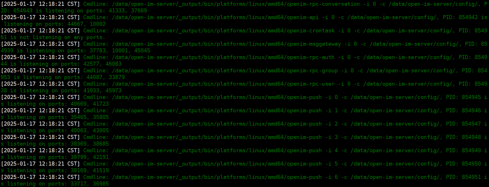
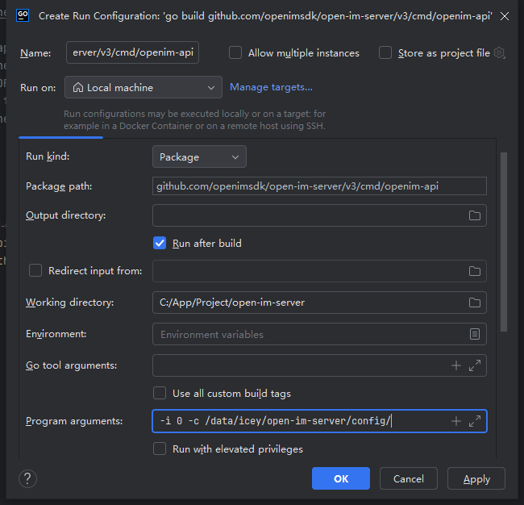
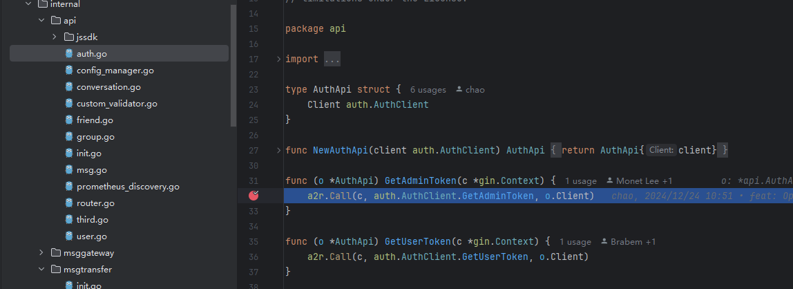

# 如何单步调试

这一部分介绍在源码部署场景下，以单步调试`IMServer`的`openim-api`服务为例，如何进行单步调试。

1. 运行`docker compose up -d`和`mage start`启动服务。

2. 查看控制台输出，如下所示：



找到需要单步调试的服务，查看其`PID`，并使用命令停止服务。
从图中可看到`openim-api`服务的`PID`为`854942`，可以使用如下命令停止：

```sh
kill -9 854942  # 类Unix系统
taskkill /PID 854942 /F  # windows系统
   ```

3. 找到相应的服务启动入口，统一在`open-im-server/cmd`目录下，在编辑器中使用`Debug`模式启动服务，`openim-api`服务的启动入口文件为`open-im-server/cmd/openim-api/main.go`。

4. 设置启动参数。以`Goland`编辑器为例，点击启动箭头，点击`Modify Run Configuration`，如下所示：


5. 在控制台的输出找到`openim-api`服务的启动参数。从输出中提取到`openim-api`的启动命令为：`/data/open-im-server/_output/bin/platforms/linux/amd64/openim-msggateway -i 0 -c /data/open-im-server/config/`，其中`-i 0 -c /data/icey/open-im-server/config/`就是启动参数，将其复制并粘贴到`Program arguments`，并点击`OK`，如下：



6. 在需要测试的代码段中打上断点。

7. 使用`debug`模式启动，如下：


8. 此时代码运行到断点处会停止，即可进行单步调试，如下：

