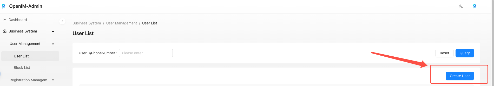
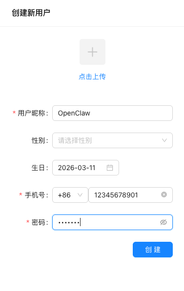
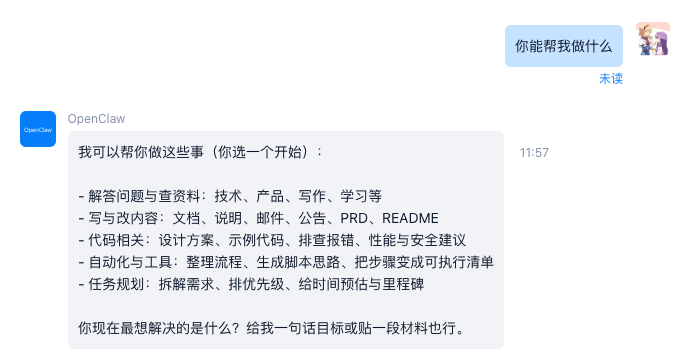

# 如何接入OpenClaw

本文面向使用 OpenIMSDK 的用户，说明如何通过 OpenClaw Gateway 接入 OpenIMServer，并完成“发送第一条消息”的验证。

## 1. 前置条件

- 你已经[部署了OpenIMServer 和 ChatServer](../gettingStarted/dockerCompose.md)，已部署并启动 OpenClaw Gateway，并能在运行 Gateway 的机器上执行 `openclaw` 命令。

## 2. 注册OpenClaw用户

### 1.注册用户

登陆管理后台，默认地址为`http://server_ip:11002`，`server_ip`为`open-im-server`部署地址ip。

选择 用户管理->用户列表，点击右边**创建新用户**：


输入账号相关信息：




### 获取管理员token

参考 [获取管理员 Token](../../restapi/apis/authenticationManagement/getAdminToken) 文档获取管理员 token。

### 获取用户token

拿到管理员 token 后，参考 [获取用户 Token](../../restapi/apis/authenticationManagement/getUserToken) 文档为指定用户签发登录 token。userID填写刚刚注册的用户的userID，platformID填写12（表示bot）。

## 3. 安装 OpenIM Channel 插件

```bash
openclaw plugins install @openim/openclaw-channel
```

插件地址：https://www.npmjs.com/package/@openim/openclaw-channel

## 4. 启用插件并配置 OpenIM Channel

### 方式 A：交互式配置（推荐）

```bash
openclaw openim setup
```

按提示填入 `token`、`wsAddr`、`apiAddr` 等信息。

### 方式 B：直接编辑配置文件

编辑：`~/.openclaw/openclaw.json`

示例：

```json
{
  "channels": {
    "openim": {
      "accounts": {
        "default": {
          "enabled": true,
          "token": "your_token",
          "wsAddr": "ws://127.0.0.1:10001",
          "apiAddr": "http://127.0.0.1:10002"
        }
      }
    }
  }
}
```

## 5. 验证：发送第一条消息

使用 OpenIM 通过userID搜索对应的机器人账号，对机器人账号发送一条消息，验证是否能够自动回复。

若对方成功收到消息，则说明 OpenClaw 已完成 OpenIM 接入。



## 6. 常见问题

- **提示 OpenIM is not connected**：通常由 `token`、`wsAddr`、`apiAddr` 配置错误或网络不可达导致。请先核对配置，然后结合 OpenClaw Gateway 日志定位原因。
