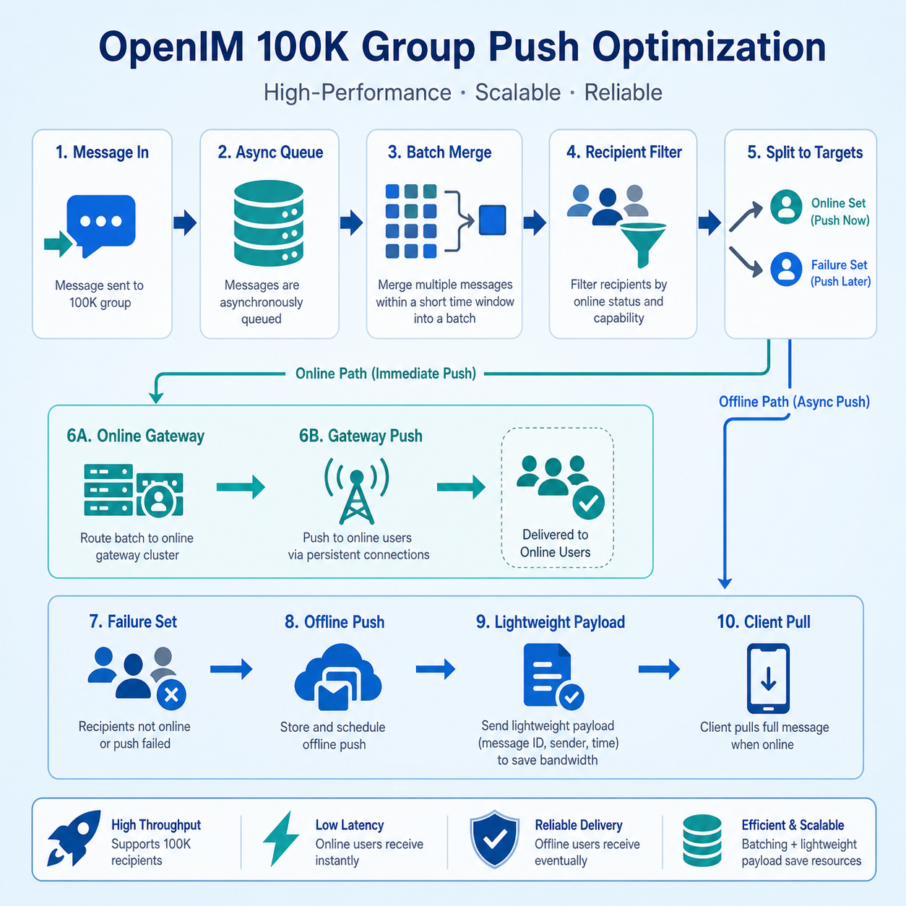

# Push Optimization for 100,000-Member Groups

In a 100,000-member group, push delivery is not simply about sending one message to 100,000 people.

The real pressure comes from a chain reaction. After a group message enters the system, it must pass through the message path, find the users that should be reached, determine who is online, route online users to the correct long-connection gateways, and then hand users who are offline or missed by online push to the offline push path. If any step is implemented as a full, synchronous, one-by-one operation, the cost expands rapidly in large groups.

OpenIM does not optimize this by making one function faster. It separates the whole path: message transfer, online push, offline push, gateway delivery, and third-party vendor push are decoupled, then controlled with batching, sharding, filtering, and fallback paths.

## 01. Decouple the Push Path First

In a normal group, push delivery may look like one continuous action: a message arrives, recipients are found, and the message is sent.

In a 100,000-member group, that continuous action becomes risky. If one step slows down, message writes, online delivery, and offline push can block each other. OpenIM separates message write and push execution into different stages: the message transfer service writes messages into storage and push queues, the push service consumes push tasks, and online push and offline push are handled by different entries.

This has direct value:

- Message writes are not slowed down by third-party push providers.
- Online push and offline push can scale at their own pace.
- Short push-service jitter does not immediately stop the main message path.
- Troubleshooting can distinguish message-write latency, online-gateway latency, and offline-provider latency.

For large groups, decoupling is not just architectural neatness. It is the foundation for stability.

## 02. First Optimization: Batch Single Push Tasks

The biggest risk in large-group messaging is not one message. It is continuous messages.

If every message independently goes through parsing, routing, gateway calls, and queue acknowledgment, peak traffic wastes a lot of time on repeated work. OpenIM first shards messages by message-queue key in the message transfer stage and groups messages that arrive in the same window. After they enter the push service, it continues batching by conversation and recipient scope.

This changes push delivery from “handle every message immediately” to “handle a batch within a window.” The benefits are clear:

- Repeated parsing, scheduling, and queue handling are reduced.
- Consecutive messages in the same conversation can enter the same push-processing context.
- Worker concurrency stays bounded instead of expanding with instant traffic spikes.

This may look like ordinary batching, but it matters greatly for 100,000-member groups. Large-group pressure is usually not average pressure; it is burst pressure. A batch window smooths the spike and gives online routing and offline push a stable input shape.

## 03. Second Optimization: Merge by Conversation

After the push service consumes messages, it does not treat every message as a fully independent unit. It organizes batches by conversation and recipient scope. Consecutive group messages without custom push options can be merged into the same processing batch.

This is especially important for large groups. Multiple messages in a 100,000-member group belong to the same group conversation. If every message repeats the entire member lookup, online-state check, and gateway dispatch process, much of the work is duplicated. Grouping by conversation lets the system process a set of messages in one shared context and reduce repeated scheduling.

At the same time, one-to-one chats, notification conversations, and large-group conversations enter different paths. User messages focus on receiver and sender multi-device synchronization. Group messages focus on group-member scope, online state, offline filtering, and gateway batch delivery. Once the paths are separated, each conversation type can use the push strategy that fits it best.

## 04. Third Optimization: Narrow the Recipient Set First

A 100,000-member group does not mean every message truly needs to be pushed to 100,000 users.

Before actual delivery, OpenIM tries to narrow the recipient set. The before-group-online-push callback can let the business server adjust recipients. Message options can also specify only certain users or add extra users outside the default group-member range. Only when there are no special rules does the system use the group-member ID cache as the default push scope.

This gives business logic useful room:

- Normal group messages can use the default group-member scope.
- Targeted reminders can push only to affected members.
- Operational or system messages can be filtered by business callbacks.
- Special messages can add extra recipients without breaking the default path.

The core of large-group optimization is not always pushing to more people. It is first deciding who really belongs in this push round.

## 05. Fourth Optimization: Push Online Users Only to Their Gateways

In a distributed IM system, user long connections are spread across multiple gateway nodes.

The rough approach is to broadcast the same group message to every gateway and let each gateway check whether it owns any target users. In a 100,000-member group, that creates a lot of invalid calls between services. OpenIM first queries online state and groups online users by gateway: users connected to a gateway are pushed through that gateway.

As a result, the online push target shrinks from “all gateways” to “the gateways that actually hold target user connections.” This reduces invalid RPCs, lowers gateway pressure, and makes push results easier to collect.

OpenIM still keeps a fallback path. If online state is unavailable, gateway mapping cannot be trusted, or precise routing is not possible in standalone deployment, the system can fall back to all-gateway push. Precise routing is the preferred path; full broadcast is the safety net.

## 06. Fifth Optimization: Enter Offline Push Only After Online Failure

Offline push is critical for mobile experience, but it should not replace online push.

OpenIM first attempts online delivery, then calculates which users did not receive the message successfully from gateway results. Only those users become offline-push candidates. The sender, users that were already reached online, and users whose message options disable offline push do not continue into offline push.

For group messages, the system applies one more conversation-level filter. If a user has muted a conversation, or the business does not need offline reminders for that conversation, the user can be removed before the message reaches third-party provider channels.

This filter is important because third-party push usually has quotas, rate limits, provider policies, and cost. If a 100,000-member group sends every unconfirmed user directly to vendor push without filtering, offline push can become the new bottleneck.

## 07. Sixth Optimization: Make Offline Push Asynchronous Again

Online push failure does not mean the current push worker should immediately call a third-party provider.

OpenIM writes users that need offline delivery into a separate offline push queue, then lets offline-push consumers process them asynchronously. Offline tasks are also chunked by user set, so one task does not carry an oversized recipient list.

This separates the online path from the vendor path:

- Online push can finish the current round quickly.
- Offline push can consume, retry, and scale independently.
- Slow or unstable provider APIs do not drag online push backward.
- Large offline user sets are split into controlled batches instead of one oversized request.

For large groups, this creates two pipelines with different rhythms: real-time online delivery and compensating offline delivery.

## 08. Keep Push Payloads Lightweight

There is another easily overlooked point in the push path: not every internal field should travel to gateways or offline providers.

Before messages enter push delivery and offline queues, OpenIM clears message options that are only used for internal control. Offline push display content prefers the title, description, and extension fields supplied by business logic; if they are absent, the system generates default display text based on message type.

This brings two benefits:

- Push payloads are lighter, reducing network and serialization cost.
- Internal control fields are not leaked to clients or third-party provider channels.

In a 100,000-member group, even a small amount of useless data per message is magnified during fan-out.

## 09. Special Messages Need Special Strategies

Large groups contain more than normal text messages. They also carry audio/video signaling, system notifications, member-change notifications, and other special messages.

OpenIM does not treat all of them identically. For example, signaling messages can be pushed offline only to the actual invited users. For reminders that need overwrite or revoke behavior, OpenIM can use provider channels that support those capabilities more carefully so users do not receive stale notifications.

This kind of optimization is not only about throughput. It reduces noise. The larger the group, the easier incorrect or unnecessary notifications become a user-experience problem. Pushing special messages only to the people who need them is as important as improving system performance.

## 10. What This Solves

Together, these strategies turn large-group push into six decisions:

| Question | Handling |
| --- | --- |
| Should the message block the main path? | Decouple storage, push, online delivery, and offline delivery |
| How many messages should be processed now? | Use batch windows and bounded worker concurrency |
| Which conversation does this batch belong to? | Merge by conversation, then choose the one-to-one or group path |
| Who should receive it? | Narrow the scope with callbacks, message options, and group-member cache |
| Where are online users connected? | Route by online state to the corresponding gateways |
| Who still needs offline reminders? | Filter online-failed users again at conversation level, then push offline asynchronously |

This is not a single optimization. It is a layered peak-shaving mechanism.

## Conclusion

Push optimization for 100,000-member groups is not about broadcasting faster to everyone. It is about avoiding full work at every step.

OpenIM splits push delivery into message queues, batch processing, conversation merging, online routing, failure collection, offline filtering, and provider push. Each layer removes unnecessary work: less blocking, less repetition, less broadcasting, less offline push, and lighter payloads.

That is why OpenIM can remain stable under large-group benchmark scenarios with 100,000 online users and high-frequency group messages. What supports large groups is not one “massive concurrent send” trick, but a whole path that keeps reducing work at every stage.
