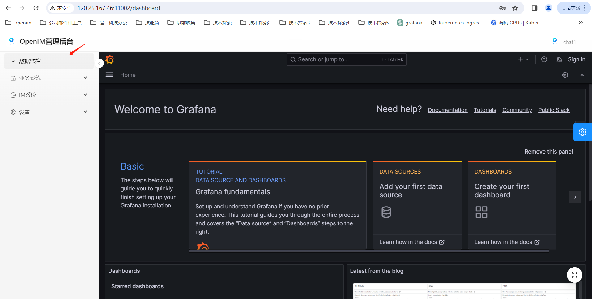
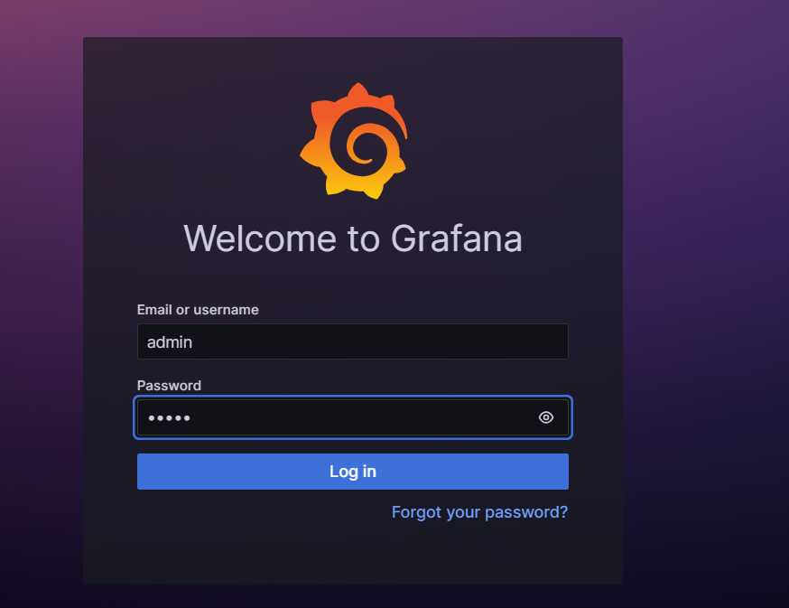
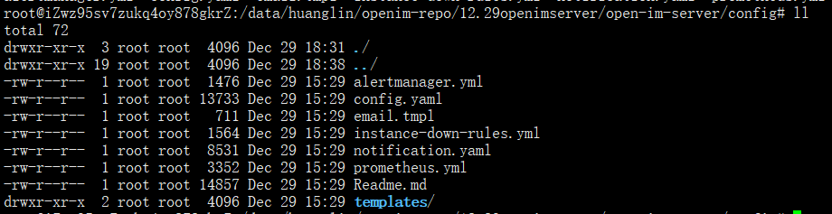
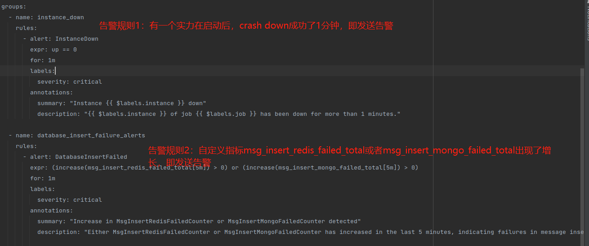
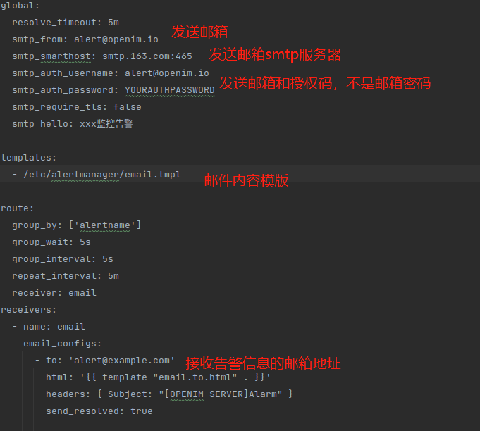
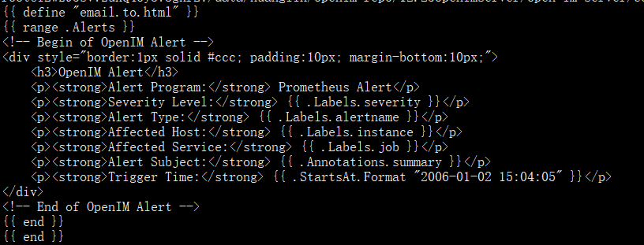

# Management Console 🖥️
### 🟢 Open Ports

| TCP Port  | Description              | Action ⚙️                                      |
|:---------:|:------------------------:|:----------------------------------------------:|
| TCP:11002 | `http://ip:11002` Access Management Console | Open the port or use nginx reverse proxy, and disable the firewall |

## 📌 Accessing the Management Console

:::tip
Enter `http://ip:11002` in your browser to access the management console. This IP is the server IP, and make sure your browser can access it. The default username and password are both admin1.
:::


# Monitoring System
This document introduces the deployment and usage of Prometheus monitoring and alerting functions for openim deployed in binary & Docker modes. For monitoring and alerting in openim deployed via k8s, please refer to the following document: https://github.com/openimsdk/helm-charts/blob/main/docs/user-guide-zh.md

## Binary Deployment of openim-server Monitoring
The following are the steps for deploying openim-server in binary mode:

Step 1: Clone the repository and switch to the release branch
```
git clone https://github.com/openimsdk/open-im-server && cd open-im-server
```

Step 2: Set common environment variables.

Step 3: Deploy components.
```
make init && docker compose up -d.
```
To enable monitoring, divide step 3 into three smaller steps: 3.1, 3.2, 3.3

Step 3.1: Execute the make init command, open the generated config/config.yaml file, and modify as follows: prometheus.enable: true

> To configure alerting functions, rewrite alertmanager.yml, email.tmpl, instance-down-rules.yml at this step. For convenience, you may skip rewriting these three files initially.


Step 3.2: Modify the docker-compose.yml file to enable the monitoring components required: prometheus, grafana, alertmanager, node-exporter (optional). Uncomment the respective modules as shown in the image.


Step 3.3: Execute docker compose up -d to install all monitoring components and the management console module.
> Since the openim-admin management console module uses the chat service module, you also need to install our additional chat module. Documentation for installing the chat module can be found in Quick Start>Source Code Deployment>AppServer(chat).

## Docker Deployment of openim-server Monitoring
The following are the steps for deploying openim-server using Docker:

Step 1: Set Common Environment Variables

Step 2: Pull and Launch Image
```
git clone https://github.com/openim-sigs/openim-docker openim/openim-docker && export openim=$(pwd)/openim && cd $openim/openim-docker && make init && docker compose up -d
```
To enable monitoring, divide step 2 into three smaller steps: 2.1, 2.2, 2.3

Step 2.1: Execute the following command
```
git clone https://github.com/openim-sigs/openim-docker openim/openim-docker && export openim=$(pwd)/openim && cd $openim/openim-docker && make init
```             
Open the generated config/config.yaml file and modify as follows: prometheus.enable: true.
> To configure alerting functions, rewrite alertmanager.yml, email.tmpl, instance-down-rules.yml at this step.


Step 2.2: Modify the docker-compose.yml file to enable the monitoring components required: prometheus, grafana, alertmanager, node-exporter (optional). Uncomment the respective modules as shown in the image.


Step 2.3: Execute docker compose up -d to install all monitoring components.

## k8s Deployment of openim-server
For deploying openim-server and enabling monitoring features in k8s, please refer to the document: https://github.com/openimsdk/helm-charts/blob/main/README-zh_CN.md

## Experience
1. Access the openim management console webpage via the link, with the address: https://ip:11002/
2. The default username and password for the management console are (admin1:admin1). Clicking the link below will open the grafana webpage.



3. Log into grafana using the default username and password (admin:admin).



4. Add Prometheus as a data source. In the image below, enter the URL of the Prometheus data source: http://172.28.0.1:19090  and click "Save and Test" to save the data source.


5. Import the custom dashboard for the Docker version of openim. Click the import button as shown in the image below.


Copy the contents of config/template/prometheus-dashboard.yaml into the area shown in the image below, then click the load button.


Select your Data Source and job, and you will see custom metric information as shown below.


6. Import the official node-exporter dashboard from the official website (https://grafana.com/grafana/dashboards/  ), find a node-exporter dashboard you like, and import it, for example, 1860 (Node Exporter Full).


You will see node-exporter metric information as shown below.


# Alert System
The system has implemented two default alert rules (instance_down, database_insert_failure_alerts) with email alerts. Simply modify the sending and receiving email configurations in the alertmanager.yml file in the config folder to receive system alert emails for the default rules.
> To implement alerts via DingTalk, WeChat Work, etc., you need to rewrite alertmanager.yml. You can refer to the official documentation of the alert management module: https://prometheus.io/docs/alerting/latest/alertmanager/

## Alert Configuration File Explanation
1. Three alert configuration files are involved: alertmanager.yml, email.tmpl, and instance-down-rules.yml, as shown below:


2. The email alert architecture is shown below. The Prometheus component loads the alert rule file instance-down-rules.yml and sends alert information that meets the conditions to the alertmanager component. The alertmanager component loads alertmanager.yml and email.tmpl files and sends emails using the configured alert email information and email template.


3. Explanation of the alert rule file instance-down-rules.yaml. To add alert rules, you can add them in the instance-down-rules.yml file:


4. Explanation of the alert management file alertmanager.yml. Modify it with your real sending and receiving email configuration information to receive alert messages:


5. Explanation of the email template file email.tmpl. This file is in HTML format. The alert management module fills in the variable information and renders it into an HTML format file for sending emails. You can rewrite the template file according to your needs:


## Alert Deployment
The alert module is deployed together with the monitoring module. There is no separate deployment for the alert module. Modify the alertmanager.yml, email.tmpl, instance-down-rules.yml files as needed during the deployment steps for monitoring.

(Monitoring System>Binary Deployment of openim-server Monitoring>Step 3.1; Monitoring System>Docker Deployment of openim-server Monitoring>Step 2.1)

For the experience phase, you only need to modify the sending and receiving email configurations in the alertmanager.yml file to receive system alert emails for the default rules quickly.

## Alert Experience
You can manually trigger the instancedown alert rule. Execute the make stop command to stop the openim-server service, wait for more than 5 minutes, and you will receive an alert email as shown below:


# Log System
If openim services are deployed in a k8s environment via helm chart, you can view loki logs through grafana, i.e., view logs of all openim services through grafana. Currently, binary and Docker deployments do not integrate the loki log collection component. To experience loki log collection, please deploy using helm chart. Details can be found at https://github.com/openimsdk/helm-charts/blob/main/docs/user-guide-zh.md