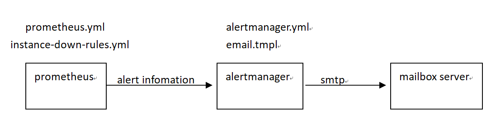
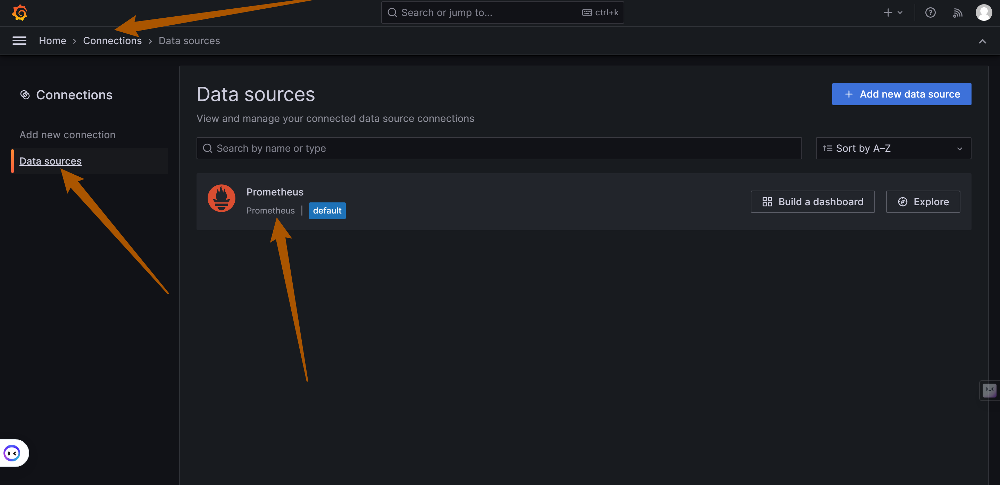
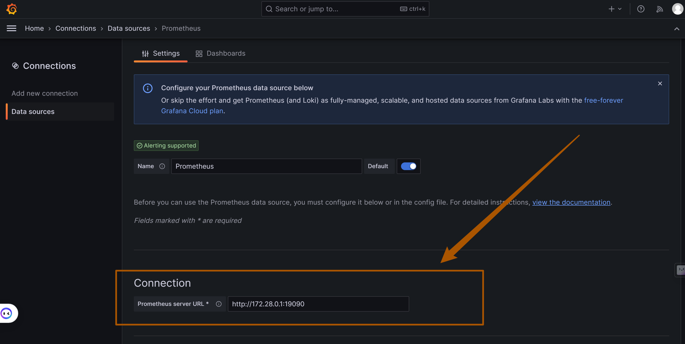
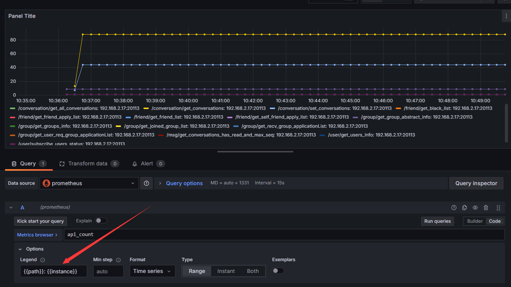
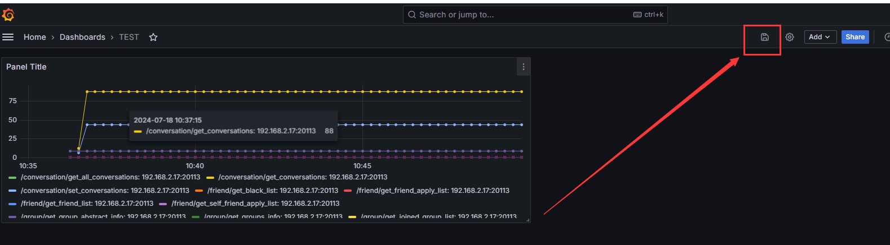
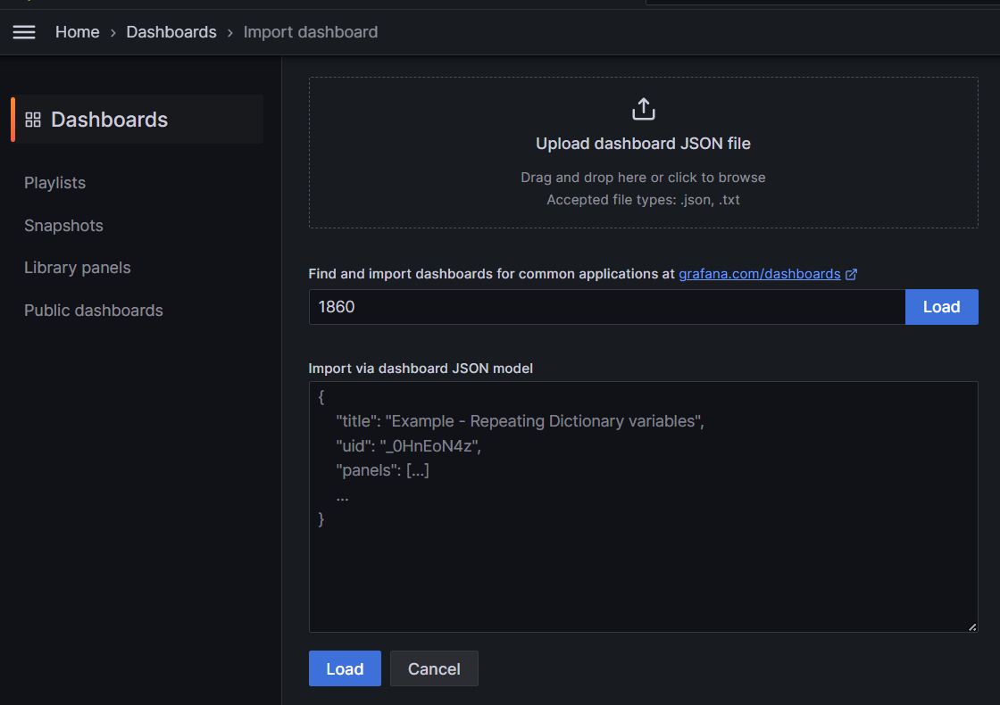
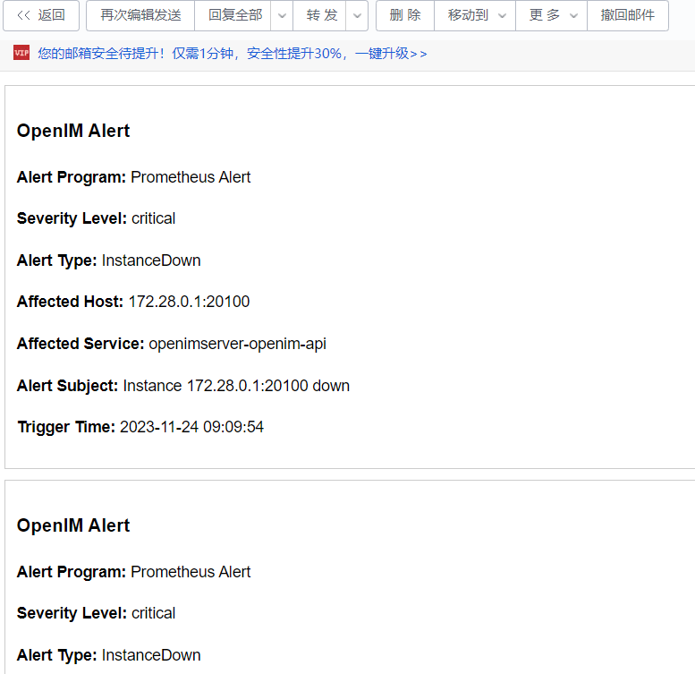

## Component Description

When deploying with Docker Compose, the following components will be automatically deployed. If deploying from source code, you will need to manually start the relevant components listed in `docker-compose.yaml`.

| Component Name | Component Description                                                   | Deployment Description                                                                              |
| -------------- | ----------------------------------------------------------------------- | --------------------------------------------------------------------------------------------------- |
| openim-admin   | Admin panel, provides monitoring page entry                             | Automatically enabled in both Docker and source code deployments                                    |
| prometheus     | Monitoring system component used for collecting and storing metric data | Automatically enabled in Docker deployments; manual activation required for source code deployments |
| alertmanager   | Component for managing and sending alerts                               | Automatically enabled in Docker deployments; manual activation required for source code deployments |
| grafana        | Dashboard component for displaying monitoring data                      | Automatically enabled in Docker deployments; manual activation required for source code deployments |
| node-exporter  | Component for collecting node (e.g., server) metric data                | Automatically enabled in Docker deployments; manual activation required for source code deployments |

## Configuration File Description

| File Name                                    | File Description               | Modifications Required                                               |
| -------------------------------------------- | ------------------------------ | -------------------------------------------------------------------- |
| `config/config.yaml`                         | openIM service configuration   | Set `prometheus.enable: true` to enable Prometheus                   |
| `config/prometheus.yml`                      | Prometheus configuration       | No modifications needed                                              |
| `config/instance-down-rules.yml`             | Alert rules                    | Two default rules: `instance_down`, `database_insert_failure_alerts` |
| `config/alertmanager.yml`                    | Alert management configuration | Configure sender and receiver email information                      |
| `config/email.tmpl`                          | Email alert template           | Default email template, can be customized                            |
| `config/templates/prometheus-dashboard.yaml` | Custom dashboard template      | No modifications needed                                              |

## Configuration Files and Alerts Description

1. **prometheus.yml File Description**: Primarily used to configure alert rules file paths, alert management service addresses, and IP addresses for collecting monitoring data. Replace all instances of `internal_ip` with your own private IP address, as shown below:

   ```yaml
   # Alertmanager configuration
   alerting:
     alertmanagers:
       - static_configs:
           - targets: ['192.168.0.1:19093']
   ```

   If you need to add alert files, do so under `rule_files`. The default alert file is `instance-down-rules.yml`.

2. **Email Alert Architecture Diagram**: The Prometheus component loads the alert rules from the `instance-down-rules.yml` file and sends alerts that meet the conditions to the alertmanager component. The alertmanager component loads the `alertmanager.yml` and `email.tmpl` files, and sends email alerts based on the configured email information and email template.

   

3. **instance-down-rules.yaml File Description**: By default, two email alert rules are implemented: `instance_down` and `database_insert_failure_alerts`. You can add more alert rules by editing the `instance-down-rules.yml` file.

   ```yaml
   groups:
     - name: instance_down # Rule 1: Trigger an alert if a monitored module is down for more than one minute
       rules:
         - alert: InstanceDown
           expr: up == 0
           for: 1m
           labels:
             severity: critical
           annotations:
             summary: 'Instance {{ $labels.instance }} down'
             description: '{{ $labels.instance }} of job {{ $labels.job }} has been down for more than 1 minute.'

     - name: database_insert_failure_alerts # Rule 2: Trigger an alert if `msg_insert_redis_failed_total` or `msg_insert_mongo_failed_total` increases
       rules:
         - alert: DatabaseInsertFailed
           expr: (increase(msg_insert_redis_failed_total[5m]) > 0) or (increase(msg_insert_mongo_failed_total[5m]) > 0)
           for: 1m
           labels:
             severity: critical
           annotations:
             summary: 'Increase in MsgInsertRedisFailedCounter or MsgInsertMongoFailedCounter detected'
             description: 'Either MsgInsertRedisFailedCounter or MsgInsertMongoFailedCounter has increased in the last 5 minutes, indicating failures in message insert operations to Redis or MongoDB, possibly due to a crash.'
   ```

4. **alertmanager.yml File Description**: Modify the sender and receiver email configurations to receive alert notifications. To set up alerts through DingTalk, WeChat, or other methods, you will need to modify the `alertmanager.yml` file. For more details, refer to the official documentation of the alert management module: [https://prometheus.io/docs/alerting/latest/alertmanager/](https://prometheus.io/docs/alerting/latest/alertmanager/)

   ```yaml
   global:
     resolve_timeout: 5m
     smtp_from: alert@openim.io # Sender email address for alerts
     smtp_smarthost: smtp.163.com:465 # SMTP server address
     smtp_auth_username: alert@openim.io # Email username, generally the same as the sender email
     smtp_auth_password: YOURAUTHPASSWORD # Authorization code for the sender email
     smtp_require_tls: false
     smtp_hello: openim alert

   templates:
     - /etc/alertmanager/email.tmpl # Email template

   route:
     group_by: ['alertname'] # Alert grouping labels. Alerts with the same label values will be combined into one notification
     group_wait: 5s # Wait time before sending the first alert notification
     group_interval: 5s # Interval between sending grouped notifications
     repeat_interval: 5m # Interval for resending notifications for the same alert. Used to periodically remind recipients of ongoing alerts.
     receiver: email # Default receiver name
   receivers:
     - name: email # Receiver name
       email_configs:
         - to: 'alert@example.com' # Recipient email address
           html: '{{ template "email.to.html" . }}'
           headers: { Subject: '[OPENIM-SERVER]Alarm' } # Email subject
           send_resolved: true # Whether to send a notification when the alert is resolved
   ```

5. **email.tmpl Template File Description**: This file is in HTML format. The alert management module will fill in the variable information and render it into an HTML file to send the email. You can modify it according to your needs:

  ```tmpl
   {{ define "email.to.html" }}
   {{ if eq .Status "firing" }}
       {{ range .Alerts }}
       <!-- Begin of OpenIM Alert -->
       <div style="border:1px solid #ccc; padding:10px; margin-bottom:10px;">
           <h3>OpenIM Alert</h3>
           <p><strong>Alert Status:</strong> firing</p>
           <p><strong>Alert Program:</strong> Prometheus Alert</p>
           <p><strong>Severity Level:</strong> {{ .Labels.severity }}</p>
           <p><strong>Alert Type:</strong> {{ .Labels.alertname }}</p>
           <p><strong>Affected Host:</strong> {{ .Labels.instance }}</p>
           <p><strong>Affected Service:</strong> {{ .Labels.job }}</p>
           <p><strong>Alert Subject:</strong> {{ .Annotations.summary }}</p>
           <p><strong>Trigger Time:</strong> {{ .StartsAt.Format "2006-01-02 15:04:05" }}</p>
       </div>
       {{ end }}
   {{ else if eq .Status "resolved" }}
       {{ range .Alerts }}
       <!-- Begin of OpenIM Alert -->
       <div style="border:1px solid #ccc; padding:10px; margin-bottom:10px;">
           <h3>OpenIM Alert</h3>
           <p><strong>Alert Status:</strong> resolved</p>
           <p><strong>Alert Program:</strong> Prometheus Alert</p>
           <p><strong>Severity Level:</strong> {{ .Labels.severity }}</p>
           <p><strong>Alert Type:</strong> {{ .Labels.alertname }}</p>
           <p><strong>Affected Host:</strong> {{ .Labels.instance }}</p>
           <p><strong>Affected Service:</strong> {{ .Labels.job }}</p>
           <p><strong>Alert Subject:</strong> {{ .Annotations.summary }}</p>
           <p><strong>Trigger Time:</strong> {{ .StartsAt.Format "2006-01-02 15:04:05" }}</p>
       </div>
       {{ end }}
       <!-- End of OpenIM Alert -->
   {{ end }}
   {{ end }}
   ```

## Accessing the Admin Panel

Open a browser and enter `http://ip:11002` to access the admin panel. The IP is the server's `OPENIM_IP`. Ensure your browser can access it. The default username and password are both `chatAdmin`.


## Accessing Grafana

First, log in to the admin panel, then click on the "Data Monitoring" menu on the left, and use the default username (`admin`) and password (`admin`) to log in to Grafana.


## Adding Prometheus Data Source

As shown below, enter the Prometheus data source URL: `http://172.28.0.1:19090` (19090 is the default Prometheus port) and click

"Save and Test" to save.





## Importing the Dashboard

Click the import button as shown below to import the dashboard.


Copy the content of `https://github.com/openimsdk/open-im-server/tree/main/config/grafana-template/Demo.json` into the area shown below, then click the "Load" button.


Select your data source and job, and you will be able to import the metrics information as shown below.


## Customizing the Dashboard

To create a new dashboard (or modify an existing one), click `Add visualization` to create a new panel.


Select the specified data source, enter the `promQL` statement, click `Run queries`, and choose the appropriate time range to query the related data.


If you want to modify the metric name, click `Options`, click `Legend`, choose `Custom`, and enter the corresponding expression.



On the right side, you can modify the panel's title, description, and chart type, and select the appropriate settings based on your needs.

After the modifications, click the **Apply** button in the upper-right corner to save the panel. Once the dashboard editing is complete, click Save.



## Importing the Node-Exporter Dashboard

Enter `1860` to import the node-exporter dashboard, or visit the official Grafana website (https://grafana.com/grafana/dashboards/) to find other node-exporter dashboard views.



Here is an example of node-exporter metric information:


## Alert Experience

You can manually trigger the `instance_down` alert rule. If you are deploying openIM from source code, execute the `make stop` command to stop the `openim-server` service, wait more than 5 minutes, and you will receive an alert email similar to the one below:



## Log System

If OpenIM services are deployed in a Kubernetes environment using Helm charts, you can view all OpenIM service logs through Grafana. Currently, the binary and Docker deployments do not include the Loki log collection component. To experience Loki log collection functionality, deploy using Helm charts. For more details, visit: https://github.com/openimsdk/helm-charts/blob/main/docs/user-guide-zh.md

## Custom Prometheus Metric Configuration

Initialize the corresponding type of metrics in the `pkg/common/prommetrics` directory of the source code and call the `Init()` function for registration.

```go
const commonPath = "/metrics"
var rpcCounter = prometheus.NewCounterVec(
    prometheus.CounterOpts{
        Name: "rpc_count",
        Help: "Total number of RPC calls",
    },
    []string{"name", "path", "code"},
)

func RpcInit(cs []prometheus.Collector, prometheusPort int) error {
	reg := prometheus.NewRegistry()
	cs = append(append(
		baseCollector,
		rpcCounter,
	), cs...)
	return Init(reg, prometheusPort, commonPath, promhttp.HandlerFor(reg, promhttp.HandlerOpts{Registry: reg}), cs...)
}
```

In the program startup process, initialization must be started in **a separate goroutine**, and after initialization, the service will run and expose the data collection port.

Maintain the metrics in the appropriate location within the code:

```go
rpcCounter.With(prometheus.Labels{"name": name, "path": path, "code": strconv.Itoa(code)}).Inc()
```

To query the metrics in `prometheus` or `grafana`, enter the following `promQL` query:

```promQL
rpc_count
```

This will allow you to view the metric information.

## Common Issues

1. After running `docker compose up -d`, the `prometheus` container keeps restarting.

   If the Prometheus container fails to start, it is usually due to two reasons:

   1. The private IP was not configured in `prometheus.yml`.
   2. There may be permission issues when starting the `prometheus` container for the first time. Run `chmod -R 777 components` in the `open-im-server` project directory and restart the container.
