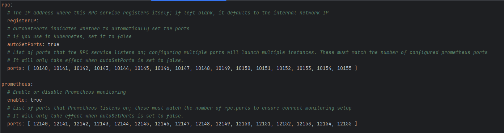
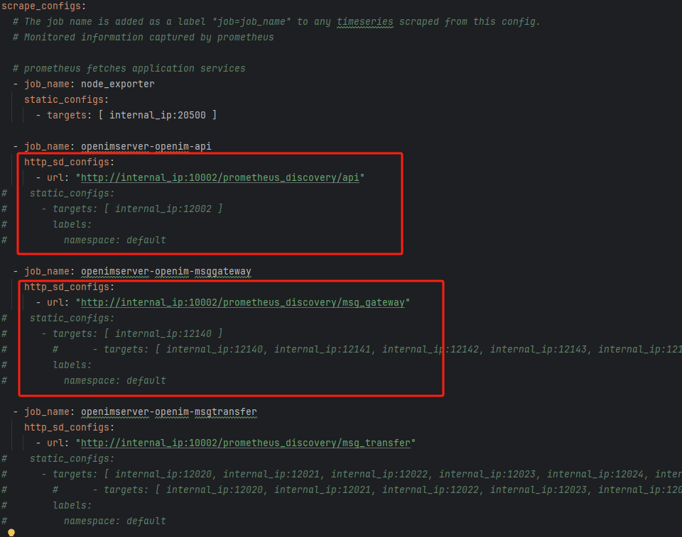

## Cluster Deployment Instructions

`open-im-server` supports cluster deployment. The following are the steps for cluster deployment:

1. Modify the addresses in `kafka`, `minio`, `mongodb`, `etcd(discovery.yml)`, and `redis`, configuring them to the correct component addresses. **Ensure that all ports of the connected components are accessible.**

2. Modify the `registerIP` of each `rpc` component to the IP address accessible by the server where `etcd` is deployed, **and ensure that all ports are accessible**. If you need to enable `prometheus`, also ensure that the `prometheus.port` of each component is accessible.

   

   The machine deploying `prometheus` needs to modify the `targets` in `prometheus.yml`.

   

3. You can modify the number of each component in `open-im-server/start-config.yml`.

4. Modify the port that `kafka` broadcasts to the host. If deploying using `docker-compose.yml` in `open-im-server`, change the `EXTERNAL` in `service.kafka.environment.KAFKA_CFG_ADVERTISED_LISTENERS` to the address accessing the `kafka` component.

   For example: `KAFKA_CFG_ADVERTISED_LISTENERS: PLAINTEXT://kafka:9092,EXTERNAL://192.168.2.36:19094`.

5. If deploying `redis` in cluster mode, set `clusterMode` in `redis.yml` to `true`.

6. Start the services.

## **Common Issues/Notes**

1. When deploying on multiple machines, ensure clock synchronization for the services to run properly. For example, the issuance of `tokens` allows each machine's clock to have a time difference within `5s`.

2. Component ports are inaccessible: Check whether the component starts normally via the loopback address. If the loopback address is accessible, then check if firewall rules are blocking access.
