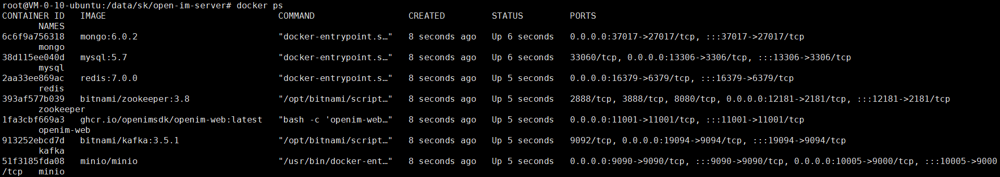
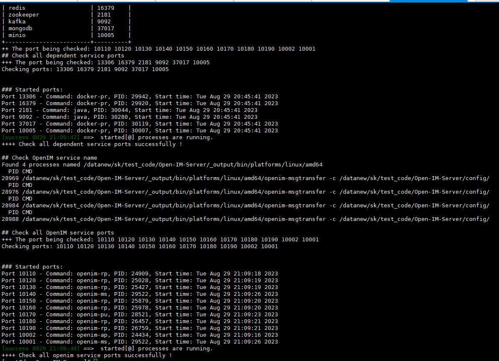
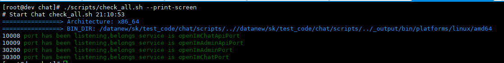

# 🛠 Source Code Deployment

## 🌟 System Requirements

| **Consideration** | **Details**                                                |
|------------------|----------------------------------------------------------|
| Operating System | Linux system, preferably Ubuntu 22.04, root user         |
| Hardware         | At least 4G of available memory, for user base <100,000 recommend single machine deployment (8C 16G 10Mb 1T) |
| Golang           | v1.19 or higher                                           |
| Docker           | v24.0.5 or higher                                         |
| Git              | v2.17.1 or higher                                         |

## 📦 Storage Component Requirements

| **Storage Component** | **Recommended Version**  |
|:---------------------:|:------------------------:|
| MongoDB               | v6.0.2+                  |
| Redis                 | v7.0.0+                  |
| Zookeeper             | v3.8                     |
| Kafka                 | 3.5.1                    |
| MySQL                 | v5.7+                    |
| MinIO                 | Latest version            |

---

> 🔍 **Note**: 
> 
> **OpenIMServer** itself does not include account registration and login services. To make development more convenient, we've open-sourced **AppServer (chat)**, which includes login and registration functionalities. Simply deploy **OpenIMServer** and **AppServer (chat)** to set up a complete chat product.

---

## 🟢 I. Component Deployment

### 📦 1. **Clone the repository and switch to the release branch**

```bash
git clone https://github.com/openimsdk/open-im-server && cd open-im-server 
```

### 🌐 2. Set common environment variables

---

- **PASSWORD**
    - **Description**: Password for mysql, mongodb, redis, and minio.
    - **Default**: `openIM123`
    - **Considerations**:
      - Password length should be at least 8 characters.
      - Special characters are not allowed.
    ```bash
    export PASSWORD="openIM123"
    ```

- **USER**
    - **Description**: Username for mysql, mongodb, redis, and minio.
    - **Default**: `root`
    ```bash
    export USER="root"
    ```

- **OPENIM_IP**
    - **Description**: API address.
    - **Note**: If the server has an external IP, it will be automatically detected. If it's an intranet, set this environment variable to the internal service IP.
    ```bash
    export OPENIM_IP="http://ip:10002"
    ```

- **DATA_DIR**
    - **Description**: Directory for mounting component data.
    - **Default**: `./`
    ```bash
    export DATA_DIR="./"
    ```

---

### 🔧 More environment variables

To understand more about environment variables, we recommend reading [this document](https://github.com/openimsdk/open-im-server/blob/main/docs/contrib/environment.md).

> 🚀 **Tip**: When you use the `export` command to set an environment variable, it will have higher priority than variables defined in scripts.

---

### 3. Deploy components

```bash
make init && docker compose up -d
```

### 4. Check component status

```bash
docker ps
```



## II. OpenIMServer

1. Compile

```bash
./scripts/build-all-service.sh
```

2. Start

```bash
./scripts/start-all.sh
```

3. Check

```bash
./scripts/check-all.sh
```



4. Stop

```bash
./scripts/stop-all.sh
```

### Frequently Asked Questions

#### 1. How to use external components?

To use certain external components, such as an external MySQL, follow these steps:

1. Edit the `docker-compose.yml` file and comment out MySQL-related configurations.
2. Edit the `scripts/install/environment.sh` file, then modify the IP, port, and password configurations for MySQL.
3. Run the `make init` command to apply changes.
4. Execute the `docker-compose up -d` command to start components.

#### 2. Start order

The startup order is as follows:

- Storage-related components
- open-im-server
- chat

#### 3. Docker version

The newer versions of Docker have integrated `docker-compose` as a core feature. Thus, there's no need for separate `docker-compose` installation. If your Docker version is outdated, consider upgrading. The recommended version is `23.0.1`.

#### 4. Upgrade issues

If the component credentials remain the same, you can upgrade directly. However, ensure all processes are stopped before upgrading.

#### 5. Modifying component passwords

To modify passwords after component launch:

1. Stop the component's docker.
2. If data isn't crucial, you can delete the entire `components` directory.
3. Set a new password: `export PASSWORD=newpassword`.
4. Start the component's docker to apply the new password.

#### 6. Additional configurations

Avoid directly editing the `config/config.yaml` file. For more details, we recommend reading [this document](https://github.com/openimsdk/open-im-server/blob/main/docs/contrib/environment.md).

#### 7. Viewing logs

The location for logs:

- Runtime logs: `logs/OpenIM.log.all.*`
- Startup logs: `_output/logs/openim_*.log`

## III. AppServer(chat)

1. Clone the repository and switch to the release branch (release-v1.3 and later versions)

```bash
cd .. 
git clone https://github.com/openimsdk/chat.git && cd chat
```

2. Compile

```bash
./scripts/build_all_service.sh
```

3. Start

```bash
./scripts/start_all.sh
```

4. Check

```bash
./scripts/check_all.sh --print-screen
```



5. Stop

```bash
./scripts/stop_all.sh
```

### Frequently Asked Questions

---

#### 1. If zk connection fails

Ensure the `zookeeper` IP and port are configured correctly. If you changed the `zookeeper` configuration during component deployment, modify the corresponding `zookeeper` configuration in the `config/config.yaml` file.

---

#### 2. If user registration fails

First, confirm that the `openIMUrl` IP and port are configured correctly. If you changed the IP or port of `OpenIMServer` during component deployment, then you should modify the `openIMUrl` configuration in the `config/config.yaml` file to ensure `chat` can access `OpenIMServer`.

---

#### 3. Viewing logs

All log files are stored in the `logs` directory:

- `openIM.log`: Logs startup details.
- `chat.log.*`: Logs runtime details.

---

## IV. Quick Verification

For a quick test, please refer to the [Quick Verification](./quickTestServer) documentation.
