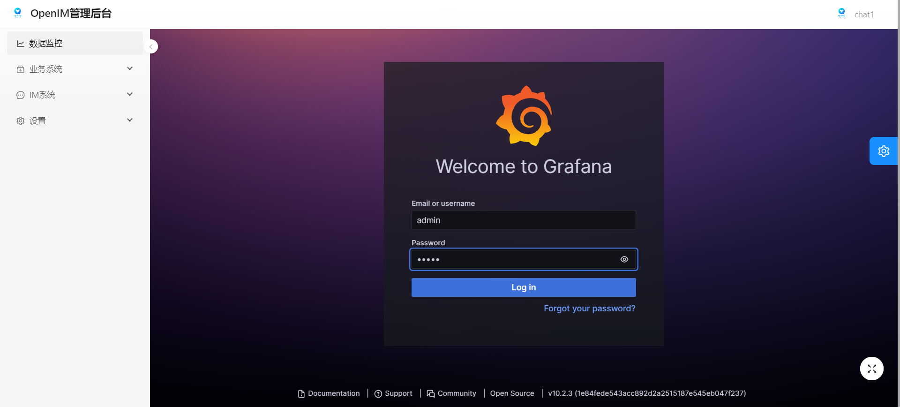
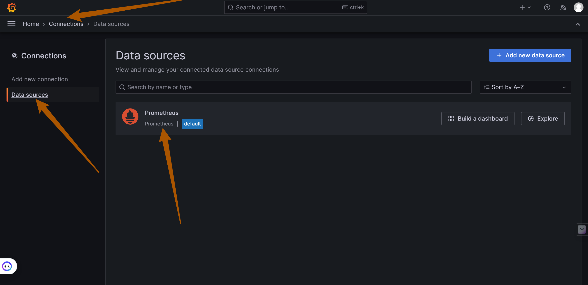
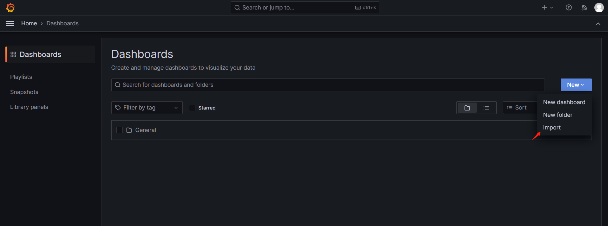
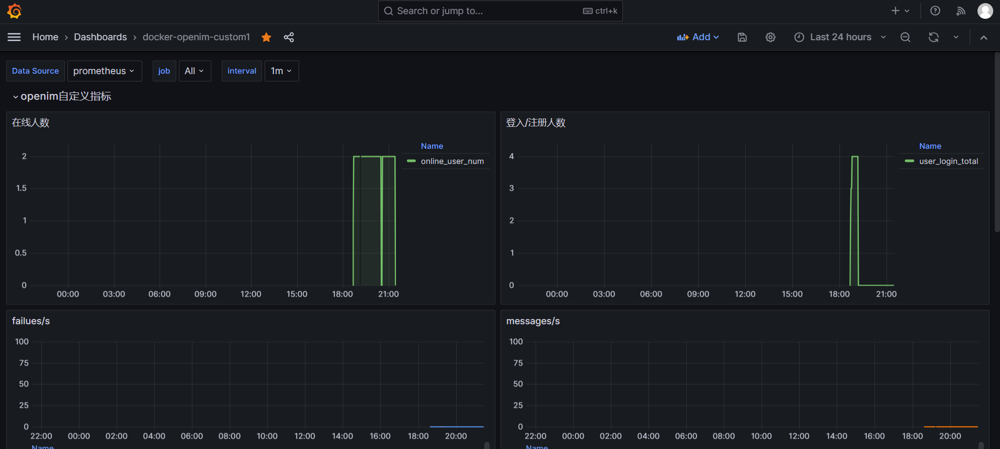
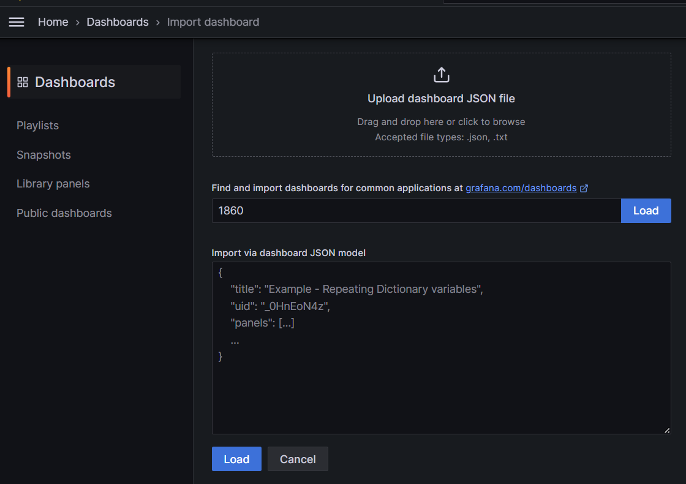
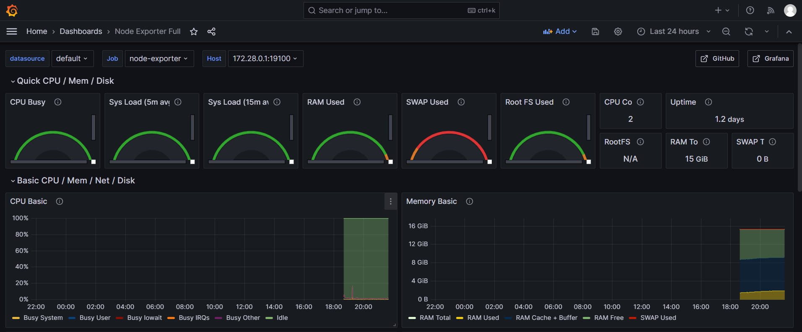
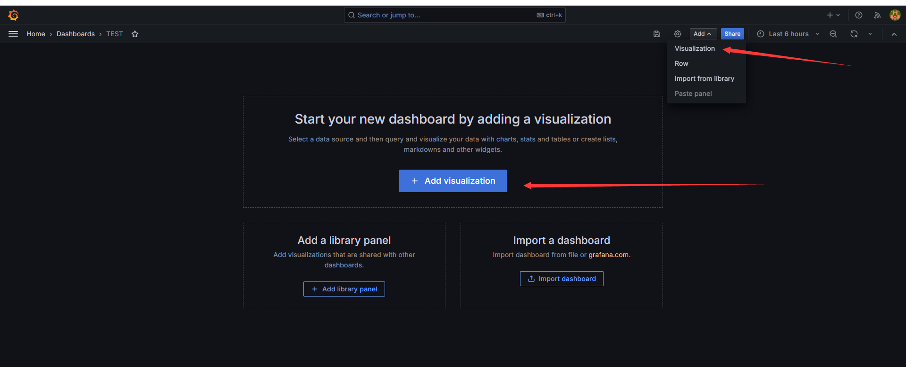

## 📌 1. What This Page Covers

This page explains how to enable `OpenIM` monitoring and alerting in a quick-deployment setup and complete the initial `Grafana` dashboard configuration.

After finishing this page, you will be able to:

- start `Prometheus`, `Alertmanager`, `Grafana`, and `node-exporter`
- sign in to `Grafana`
- import the main `OpenIM` metrics dashboard
- import the `node-exporter` host monitoring dashboard

## 📌 2. Start Monitoring

### 1. Start Components

The monitoring and alerting components used by `OpenIM` are `prometheus`, `alertmanager`, `grafana`, and `node_exporter`.

When you start components with `docker compose up -d`, the monitoring components are **not** started by default. To start the monitoring components, use:

```sh
docker compose --profile m up -d
```

> Note: This approach does not apply to Windows systems. If you need to enable the monitoring components on Windows, you must modify the network mode of the monitoring services in `docker-compose.yml`, map the corresponding ports, and then replace `127.0.0.1` in `prometheus.yml` with the internal IP address.

## 📌 3. Sign in to Grafana

First sign in to the admin console, then click the `Data Monitoring` menu on the left. Enter the default username (`admin`) and password (`admin`) to sign in to `Grafana`.

You can also access `your_ip:13000` directly. Replace `your_ip` with the IP address of the deployment machine.



## 📌 4. Import the Main OpenIM Metrics into Grafana

### 1. Add the Prometheus Data Source

As shown below, find `Connections/Add new connection` in the left navigation bar, enter `prometheus` in the input box to add the data source, and enter the Prometheus data source URL: `http://your_ip:19090` (`19090` is the default Prometheus port). Then click "Save and Test" to save it.




### 2. Import the Dashboard

In the left navigation bar, select `Dashboards`, click `Create Dashboard`, and then click `Import dashboard` to import the dashboard.



There are two ways to import the default `OpenIM` dashboard:

1. Copy the content of `https://github.com/openimsdk/open-im-server/tree/main/config/grafana-template/Demo.json` into the `Import via dashboard JSON model` area.
2. Click `Upload dashboard JSON file` and upload the `open-im-server/config/grafana-template/Demo.json` file.

Then click the `Load` button.


Select the Data Source you just added, then click `Import` to import the metrics information, as shown below.



At this point, the main monitoring metrics for `OpenIM` are configured.

## 📌 5. Import node exporter Metrics into Grafana

Click `Dashboards` in the left navigation bar, then select `Import` from the `New` dropdown on the right.



In the `Grafana.com dashboard URL or ID` input box, enter `1860`, click `Load` on the right, and then click `Import`.



The node-exporter metrics are shown below.



## 📌 6. Component Overview

| Component     | Description                                                        | Deployment               |
| ------------- | ------------------------------------------------------------------ | ------------------------ |
| prometheus    | Monitoring system component used to collect and store metrics data | Must be enabled manually |
| alertmanager  | Component used to manage and send alerts                           | Must be enabled manually |
| grafana       | Dashboard component used to display monitoring data                | Must be enabled manually |
| node-exporter | Component used to collect node metrics such as server metrics      | Must be enabled manually |
