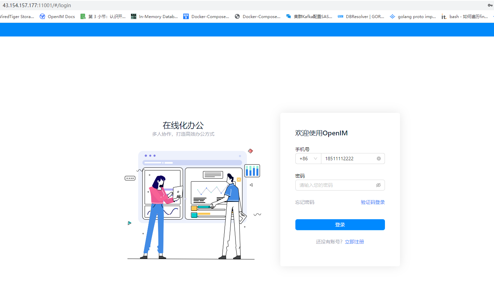

## 📌 1. Deploy the Server

Refer to [Docker Deployment](./dockerCompose) or [Source Code Deployment](./imSourceCodeDeployment).

---

## 📌 2. Open Ports

Refer to [Ports and Firewall](./ports).

## 📌 3. PC Web Verification

:::tip
Enter `http://your_server_ip:11001` in your browser to access PC Web. `your_server_ip` is the server IP where the frontend is deployed.
:::



## 📌 4. Service Process Verification

Confirm that OpenIMServer and ChatServer are running normally.

```bash
docker ps | grep -E 'openim-server|openim-chat'
```

> In the `docker deployment` scenario, `openim-server` and `openim-chat` may initially show `health: starting`. Wait `20-30s` until they become `healthy` before continuing with API verification.

If you use source deployment, run:

```bash
# Run in the open-im-server directory
mage check

# Run in the chat directory
mage check
```

## 📌 5. Domain and Gateway Verification

When using a domain name and SSL, call the real interfaces directly to verify the OpenIMServer and ChatServer (APP Business Server) gateway routes.

```bash
curl -sS -X POST "https://your_domain/api/auth/get_admin_token" \
  -H "Content-Type: application/json" \
  -H "operationID: verify-openim" \
  -d '{"secret":"your_openim_secret","userID":"imAdmin"}'
```

```bash
curl -sS -X POST "https://your_domain/chat/application/latest_version" \
  -H "Content-Type: application/json" \
  -H "operationID: verify-chat" \
  -d '{}'
```

> If the interface returns JSON with a business error, it usually still means the reverse-proxy path is already connected.

> If you have deployed only the backend services and not the frontend pages, the `11001` PC Web step does not apply. It is mainly for the `docker deployment` scenario where the frontend image is started by default, or for cases where you deployed the web frontend yourself.

To verify the WebSocket gateway, use any WebSocket client to test:

```text
wss://your_domain/msg_gateway
```

> In production, it is recommended to access everything through port `443`. OpenIMClientSDK should use:
> - `apiAddr`: `https://your_domain/api`
> - `wsAddr`: `wss://your_domain/msg_gateway`

## 📌 6. API Verification Without a Domain

If you have not configured a domain name or SSL yet, verify directly through the server IP and default ports:

```bash
curl -sS -X POST "http://your_server_ip:10002/auth/get_admin_token" \
  -H "Content-Type: application/json" \
  -H "operationID: verify-openim-local" \
  -d '{"secret":"your_openim_secret","userID":"imAdmin"}'
```

```bash
curl -sS -X POST "http://your_server_ip:10008/application/latest_version" \
  -H "Content-Type: application/json" \
  -H "operationID: verify-chat-local" \
  -d '{}'
```

> ChatServer (APP Business Server) POST APIs also require the `operationID` request header. Without it, the server returns a parameter error.
