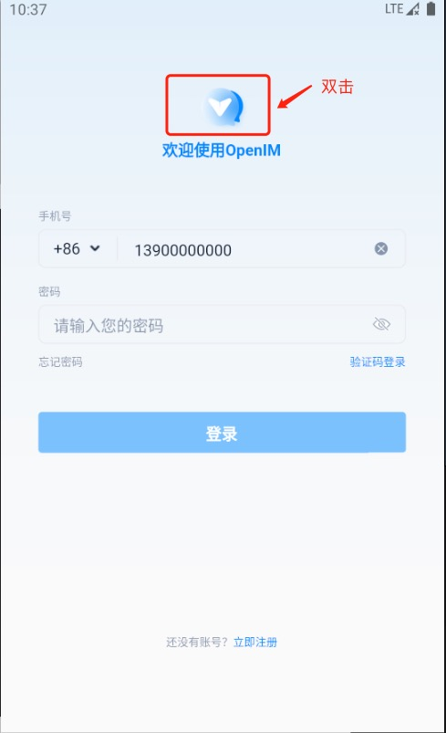

## 📌 1. Deploying the Server

Please refer to [docker deployment](./dockerCompose) or [source code deployment](./imSourceCodeDeployment) for deployment.

---

## 📌 2. Open Ports

### 🟢 IM Ports

| TCP Port  | Description                                          | Operation ⚙️                                     |
|:--------:|:-----------------------------------------------------:|:-----------------------------------------------:|
| TCP:10001| ws protocol, message port, for client SDK             | Open port or use nginx reverse proxy, and disable the firewall     |
| TCP:10002| api port, e.g. users, friends, groups, messages, etc. | Open port or use nginx reverse proxy, and disable the firewall     |
| TCP:10005| Required when choosing minio storage (openIM uses minio by default) | Open port or use nginx reverse proxy, and disable the firewall     |

### 🟢 Chat Ports

| TCP Port  | Description                   | Operation ⚙️                                     |
|:--------:|:-----------------------------:|:-----------------------------------------------:|
| TCP:10008| Business system, e.g., registration, login, etc. | Open port or use nginx reverse proxy, and disable the firewall     |
| TCP:10009| Management backend, e.g., statistics, account suspension, etc. | Open port or use nginx reverse proxy, and disable the firewall     |

### 🟢 PC Web Ports

| TCP Port  | Description                    | Operation ⚙️                                     |
|:--------:|:-----------------------------:|:-----------------------------------------------:|
| TCP:11001| Access PC Web via `http://ip:11001` | Open port or use nginx reverse proxy, and disable the firewall     |

---

## 📌 3. PC Web Verification

:::tip
Enter `http://ip:11001` in the browser to access the PC Web. Ensure this IP is the server IP and that the browser can access it. For first-time users, please register via phone number, the default verification code is `666666`.
:::

---

## 📌 4. App Verification

### 1. Download the Official App
Scan the QR code below or click [here](https://www.pgyer.com/OpenIM-Flutter) to download.

### 2. Modify the Server Address

:::tip
This application supports both IP and domain name settings. Please ensure the related ports are open and restart the App after modification. For first-time users, please register via phone number, the default verification code is `666666`.
:::

