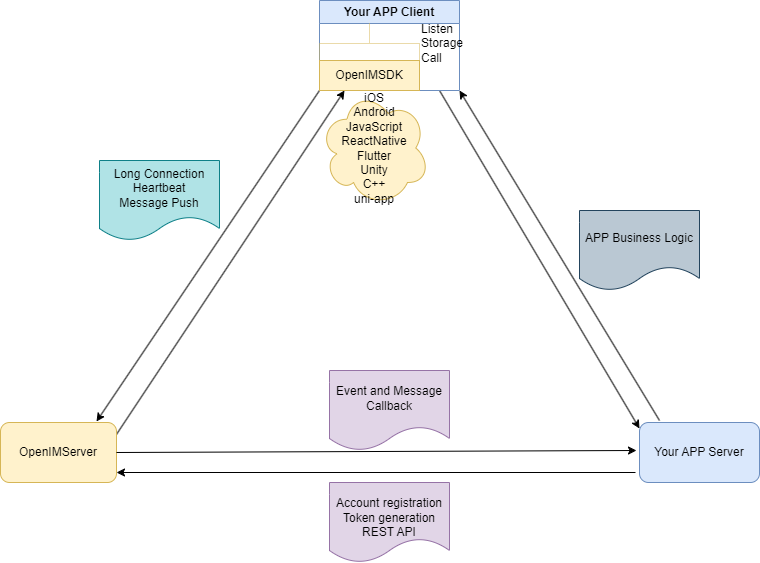

# 🚀 OpenIM: An Open Source Instant Messaging SDK Solution

OpenIM consists of two main components: **OpenIMSDK** and **OpenIMServer**. Its main features are as follows:

📦 OpenIMSDK
- Embedded directly into applications as a library file.

🖥️ OpenIMServer
- Deployed as an independent server-side program.

> 📢 **Note**: OpenIMSDK does not integrate a UI interface, and OpenIMServer does not provide user registration and login functionality. This means it is not a complete IM product.

# 📘 Detailed Explanation of OpenIMSDK

**OpenIMSDK** is an IM SDK designed for **OpenIMServer**, specifically created for embedding in client applications. Its main functions and technical features are as follows:

## 🌟 Key Features:
- 📦 Local Storage
- 🔔 Listener Callbacks
- 🛡️ API Encapsulation
- 🌐 Connection Management

## 📚 Main Modules:
1. 🚀 Initialization and Login
2. 👤 User Management
3. 👫 Friend Management
4. 🤖 Group Functions
5. 💬 Session Handling

## 🔧 Technical Implementation:
- 🏗️ Written in Golang
- 🌉 Cross-platform compilation using Gomobile
- 🕸️ Web SDK implementation using wasm technology
- 🌌 C interface export through cgo
- 🌍 Covers almost all platforms and languages

| Platform/Language | SDK Resource Link | SDK Description | Example Resource Link | Description |
| ----------------- | ----------------- | --------------- | --------------------- | ----------- |
| Golang | [open-im-sdk-core](https://github.com/openimsdk/open-im-sdk-core) | Golang version SDK, implemented using Gomobile/wasm/cgo | | |
| iOS | [open-im-sdk-ios](https://github.com/openimsdk/open-im-sdk-ios) | iOS version SDK | [open-im-ios-demo](https://github.com/openimsdk/open-im-ios-demo) | iOS example |
| Android | [open-im-sdk-android](https://github.com/openimsdk/open-im-sdk-android) | Android version SDK | [open-im-android-demo](https://github.com/openimsdk/open-im-android-demo) | Android example |
| Flutter | [open-im-sdk-flutter](https://github.com/openimsdk/open-im-sdk-flutter) | Flutter version SDK | [open-im-flutter-demo](https://github.com/openimsdk/open-im-flutter-demo) | Flutter example |
| uni-app | [open-im-sdk-uniapp](https://github.com/openimsdk/open-im-sdk-uniapp) | uni-app version SDK | [open-im-uniapp-demo](https://github.com/openimsdk/open-im-uniapp-demo) | uni-app example |
| JS SDK | [open-im-sdk-web-wasm](https://github.com/openimsdk/open-im-sdk-web-wasm) | JS SDK version | [open-im-pc-web-demo](https://github.com/openimsdk/open-im-pc-web-demo) | PC web example |
| React Native | [open-im-sdk-reactnative](https://github.com/openimsdk/open-im-sdk-reactnative) | React Native SDK | [open-im-reactnative-demo](https://github.com/openimsdk/openim-reactnative-demo) | React Native example |

## 🔍 Detailed Explanation of OpenIMServer

**OpenIMServer** has the following features:

- 🧩 Composed of multiple modules, such as gateway and multiple rpc services.
- 🌐 Microservice architecture, supporting cluster mode.
- 🚀 Various deployment methods, such as source code, Kubernetes, or Docker deployment.

[🔗 OpenIMServer Repository Link](https://github.com/openimsdk/open-im-server)

### 🌐 REST API

- OpenIMServer provides REST APIs for business systems, enabling more functionalities like creating groups and sending push messages through backend interfaces.

### 📞 Callback

- OpenIMServer offers callback capabilities to extend more business forms. Callbacks refer to OpenIMServer sending requests to business servers before or after certain events, like before or after sending a message.

---

