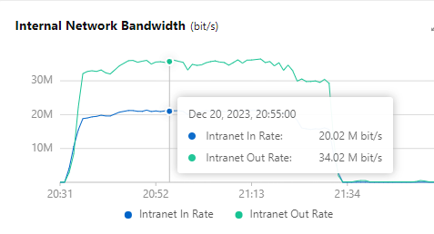

## Test Purpose

- The aim is to thoroughly assess the performance and stability of OpenIM's messaging module under high concurrency conditions. This involves simulating real user message sending to evaluate the system's response to heavy message traffic, closely monitoring key resource consumption like CPU usage, memory occupancy, disk I/O, and network bandwidth. Additionally, metrics like message sending failure rate and latency are collected for an in-depth insight into the system's real-time communication performance.

## Test Plan

- The test plan for OpenIM includes two approaches: API stress testing and message sending via long-connection gateways. This report primarily discusses the latter. For API testing, it's recommended to test with a fixed number of senders and receivers, exchanging a set number of messages. Random sender-receiver tests (like 10,000 users * 10,000 users) are not advised due to the creation of new sessions with each message, which could lead to performance bottlenecks.

- The focus is on sending messages through long-connection gateways. The steps include setting up a test server as OpenIM Server, configuring system's long-connection gateway, establishing a simulated OpenIM Client, executing message sending via stress test programs, and analyzing results to assess system stability and performance.

## Test Resources

- **Server**: Deployed with OpenIM. Specs: Ubuntu 18.04, 16Core, 32GB RAM, 100GB SSD, 2M EBW(bit/s).
- **Client**: Simulating client connections to OpenIM server. Specs: Ubuntu 18.04, 8Core, 16GB RAM, 40GB SSD, 2M EBW(bit/s).

## Test Scenarios

1. **Scenario 1**: Simulating 50,000 clients online simultaneously, monitoring CPU usage, memory consumption, and network bandwidth.
2. **Scenario 2**: 50,000 clients online, with 300 senders and receivers each sending 100 messages (totaling 9 million messages), observing system performance metrics.
3. **Scenario 3**: Simulating 100,000 clients online, similar to Scenario 1 but with double the clients.
4. **Scenario 4**: Like Scenario 2 but with 100,000 clients sending a total of 10.08 million messages.
5. **Scenario 5**: Group chat test plan (details to be added).

*The above is a condensed translation of the key parts of the report. For a detailed translation, especially for technical documents, it is advisable to seek professional translation services.*

The provided text is a detailed section of a report, presenting test results for certain scenarios in a performance and stability evaluation. Here's a summarized translation of the key parts:

---

## Test Results

- **Bandwidth consumption figures are calculated in an internal network environment.**

### Scenario 1
- **Server**: Ubuntu 18.04, 16Core, 32GB RAM, 100GB SSD, 2M EBW(bit/s)

| Sampling Time | Online Users | Upload Bandwidth | Download Bandwidth | Gateway CPU Usage | Gateway Memory Usage |
| ------------- | ------------ | ---------------- | ------------------ | ----------------- | -------------------- |
| 10 min        | 50,000       | 3.03Mb/s         | 2.23Mb/s           | 26.7% core        | 1.378GB              |

### Scenario 2
- **Server**: Same as in Scenario 1

| Sampling Time | Online Users | Avg. Message QPS | Upload Bandwidth | Download Bandwidth | Total CPU Usage | Memory Usage |
| ------------- | ------------ | ---------------- | ---------------- | ------------------ | --------------- | ------------ |
| 50 min        | 50,000       | ~3100/s          | 15.3Mb/s         | 29.44Mb/s          | ~88%            | ~8.5GB       |

import fivewonline from './assets/cpu-usage-5wonline.png'

- **Disk Usage by Components** (for 9 million messages):
  - Kafka: 11GB
  - MongoDB: 1.5GB
  - Redis: 2.7GB

- **Client**: Ubuntu 18.04, 8Core, 16GB RAM, 40GB SSD, 2M EBW(bit/s)

| Sampling Time | Online Users | Messages Sent | Messages Successfully Sent | Failure Rate | Sampled Sent Messages | Sampled Received Messages | Reception Failure Rate | Avg. Message Reception Delay | Max Message Reception Delay | Min Message Reception Delay |
| ------------- | ------------ | ------------- | -------------------------- | ------------ | --------------------- | ------------------------- | ---------------------- | --------------------------- | -------------------------- | -------------------------- |
| 50 min        | 50,000       | 9 million     | 9 million                  | 0.0%         | 88,900                | 88,900                   | 0.0%                   | 369 ms                     | 4650 ms                   | 52 ms                      |

### Scenario 3
- **Server**: Same as in Scenario 1 and 2

| Sampling Time | Online Users | Upload Bandwidth | Download Bandwidth | Gateway CPU Usage | Gateway Memory Usage |
| ------------- | ------------ | ---------------- | ------------------ | ----------------- | -------------------- |
| 10 min        | 100,000      | 6.08Mb/s         | 4.46Mb/s           | 38.5% core        | 2.682GB              |

### Scenario 4
- **Server**: Same as above

| Sampling Time | Online Users | Avg. Message QPS | Upload Bandwidth | Download Bandwidth | Total CPU Usage | Memory Usage |
| ------------- | ------------ | ---------------- | ---------------- | ------------------ | --------------- | ------------ |
| 1 h           | 100,000      | ~3000/s          | 20.02Mb/s        | 34.02Mb/s          | ~93%            | ~11.2GB      |

import tenwonline from './assets/cpu-usage-10wonline.png'

- **Disk Usage by Components** (for 10.08 million messages):
  - Kafka: 12GB
  - MongoDB: 1.8GB
  - Redis: 3.4GB

- **Client A and B**: Ubuntu 18.04, 8Core, 16GB RAM, 40GB SSD, 2M EBW(bit/s)

*Data for Client A and B include metrics similar to Scenario 2.*

## Result Analysis
This stress test aimed to evaluate the performance and stability of OpenIM in high-concurrency scenarios. The test results reveal how the messaging system utilizes resources under extreme conditions and its overall performance.

- **Analysis of Scenarios 1 and 3**: These scenarios demonstrate the server's ability to handle 50,000 and 100,000 simultaneous online clients with reasonable resource usage. Suggestions for future optimizations are provided.
  
- **Analysis of Scenarios 2 and 4**: These scenarios pushed the server to its performance limits, simulating message sending and receiving. Observations include the server's CPU and memory usage, indicating potential performance bottlenecks, and suggestions for improvement.

## Conclusion
The analysis concludes that OpenIM performs well in managing high-concurrency user connections and message transfers, with system stability even under extreme stress tests. Performance metrics like message latency and QPS are within acceptable ranges. The report also highlights potential areas for optimization in future developments.

---

---

## Conclusion
Based on the analysis, the following conclusions can be drawn:

> (Note that the test results only represent the performance limit of the messaging module. The actual online environment involves API calls, data synchronization, etc., so sufficient resources should be reserved to ensure system stability and performance.)

OpenIM performs well in managing high-concurrency user connections and message transfers. The system remains stable, with no service interruptions or significant errors even under extreme stress tests. In high-load conditions, the system can reduce pressure and enhance performance through rational segmentation and expansion, and the architecture is well-suited for scaling.

Performance indicators, such as message latency and QPS, are within acceptable ranges, meeting the expectations of real-time communication systems.

The increased disk usage, CPU usage, and bandwidth consumption point to potential areas for optimization. Future enhancements might include more efficient logging systems, database storage strategies, and compact data communication protocols to handle larger-scale user loads.

## Test Data Display

Below are some key data charts collected during the stress tests, provided for reference.

### Scenario 2

### Scenario 4

