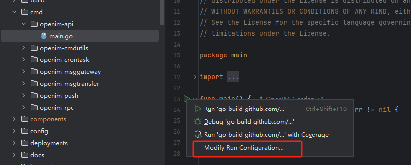
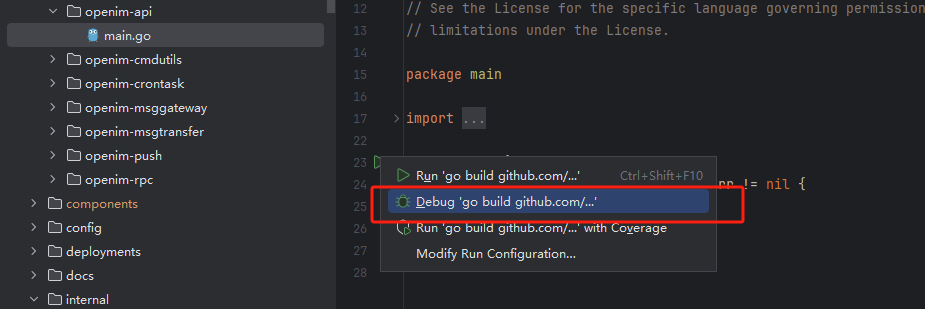

# Step-by-Step Debugging

This section explains how to perform step-by-step debugging in a source code deployment scenario, using the `openim-api` service of IMServer as an example.

1. Run `docker compose up -d` and `mage start` to start all services.

2. Check the console output, as shown below:


Find the service you want to debug, note its `PID`, and stop it using the corresponding command.
From the screenshot, the `openim-api` service has PID `854942`. You can stop it with:

```sh
kill -9 854942  # Unix-like systems
taskkill /PID 854942 /F  # Windows
   ```

3. Find the corresponding service entry point — all entry points are located under the `open-im-server/cmd` directory. Start the service in `Debug` mode in your IDE. The entry point for the `openim-api` service is `open-im-server/cmd/openim-api/main.go`.

4. Set the startup arguments. Using GoLand as an example, click the run arrow and select `Modify Run Configuration`, as shown below:


5. Find the `openim-api` service startup arguments from the console output. Extract the startup command: `/data/open-im-server/_output/bin/platforms/linux/amd64/openim-msggateway -i 0 -c /data/open-im-server/config/`, where `-i 0 -c /data/icey/open-im-server/config/` are the startup arguments. Copy and paste them into `Program arguments` and click `OK`, as shown:


6. Set breakpoints in the code sections you want to test.

7. Start in `debug` mode, as shown:


8. When the code reaches a breakpoint, execution will pause, allowing you to perform step-by-step debugging:

