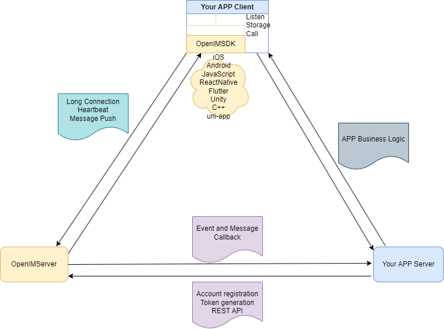

# How to Integrate with Your Existing System

Instant messaging (IM) has become a critical part of internet infrastructure and an essential feature in many applications. If you have developed an application and wish to integrate OpenIMSDK for chat functionality, this document provides a brief overview of the integration steps.

In the system diagram above:

- **Your APP Server** represents your existing application's server-side. The development language is unrestricted. User information (including profiles and password verification) is stored on this server.
- **Your APP Client** represents your existing application's client-side. All mainstream development frameworks are supported.

## Your APP Server Calls REST API to Interface with IM Server

1. **New User Registration**: After a user registers successfully, call the [User Registration API](../../restapi/apis/userManagement/userRegister).
2. **User Info Update**: After a user updates their info (e.g., avatar, nickname, extension fields), call the [Update User Info API](../../restapi/apis/userManagement/updateUserInfo).
3. **Get IM Token**: After password verification, call the [Get User IM Token API](../../restapi/apis/authenticationManagement/getUserToken) and return the IM Token to **Your APP Client**.
4. **Import Existing Users**: Before launch, call the [User Registration API](../../restapi/apis/userManagement/userRegister) to import existing user data.

## Your APP Client Integrates OpenIM SDK

1. **User Login**: After successful login, obtain the IM Token from **Your APP Server** and call the [IM SDK Login API](../../sdks/api/initialization/login).
2. **Embed IMSDK**: Embed the IMSDK into your application to integrate chat functionality.
3. **User Info Management**: Use your existing **Your APP Server** APIs for retrieving and updating user info.
