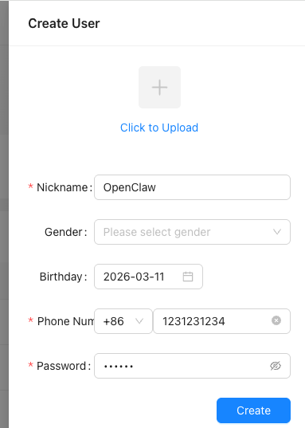
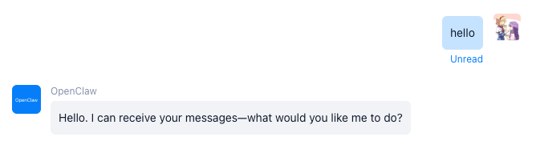

# How to Integrate OpenClaw

This document is intended for OpenIMSDK users. It explains how to connect OpenIMServer through OpenClaw Gateway and verify the integration by sending the first message.

## 1. Prerequisites

- You have already [deployed OpenIMServer and ChatServer](../gettingStarted/dockerCompose), deployed and started OpenClaw Gateway, and can run the `openclaw` command on the machine where Gateway is running.

## 2. Register an OpenClaw User

### 1. Register a user

Log in to the admin console. The default address is `http://server_ip:11002`, where `server_ip` is the IP address where `open-im-server` is deployed.

Select User Management -> User List, then click **Create New User** on the right:


Enter the account information:



### Get an admin token

Refer to the [Get Admin Token](../../restapi/apis/authenticationManagement/getAdminToken) document to obtain an admin token.

### Get a user token

After obtaining an admin token, refer to the [Get User Token](../../restapi/apis/authenticationManagement/getUserToken) document to issue a login token for the specified user. Set `userID` to the `userID` of the user you just registered, and set `platformID` to 12 (which indicates bot).

## 3. Install the OpenIM Channel Plugin

```bash
openclaw plugins install @openim/openclaw-channel
```

Plugin URL: https://www.npmjs.com/package/@openim/openclaw-channel

## 4. Enable the Plugin and Configure OpenIM Channel

### Method A: Interactive setup (recommended)

```bash
openclaw openim setup
```

Follow the prompts to fill in `token`, `wsAddr`, `apiAddr`, and other information.

### Method B: Edit the configuration file directly

Edit: `~/.openclaw/openclaw.json`

Example:

```json
{
  "channels": {
    "openim": {
      "accounts": {
        "default": {
          "enabled": true,
          "token": "your_token",
          "wsAddr": "ws://127.0.0.1:10001",
          "apiAddr": "http://127.0.0.1:10002"
        }
      }
    }
  }
}
```

## 5. Verification: Send the First Message

In OpenIM, search for the corresponding bot account by `userID`, then send a message to verify whether it can auto-reply.

If the other side successfully receives the message, OpenClaw has completed integration with OpenIM.



## 6. FAQ

- **OpenIM is not connected**: This is usually caused by incorrect `token`, `wsAddr`, or `apiAddr` configuration, or by network inaccessibility. First verify the configuration, then troubleshoot based on OpenClaw Gateway logs.
