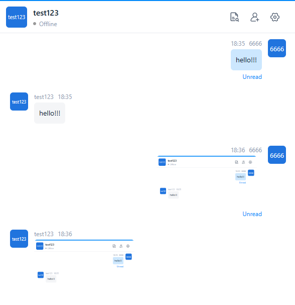

# Implement Chatbot Function Based on OpenIM

### Brief Description

Use the Webhook mechanism in OpenIM to implement chatbot functions. After sending a text message or image message to the chatbot, the bot will return the same message. Developers can replace this logic and call the LLM interface to achieve intelligent question answering features.

## 1. Modify Configuration File

Set `enable` of the callback to `true` to indicate starting this callback. If you need to add a new callback, refer to the `config/webhooks.yml` configuration in open-im-server, and modify accordingly at the code level.

> **Tip**:
>
> - `url` is the callback URL.
> - When `afterSendSingleMsg.enable` is set to `true`, this callback is enabled.

## 2. Create Chatbot Account

1. Log in to the management backend, refer to [this document](../../guides/gettingStarted/quickTestServer).
2. Create a chatbot account in user management and record the **userID** of this account.
3. For convenience of testing, you can set this **userID** as a default friend.

## 3. Write **afterSendSingleMsg** Interface

Refer to the following example code.

> **Tip**:
> 1. Replace **robotics** in the example with the **userID** obtained in step **2**.

```Go
func (m *ChatApi) CallbackExample(c *gin.Context) {
    // 1. Handling callbacks after sending a single chat message
    msgInfo, err := handlingCallbackAfterSendMsg(c)
    if err != nil {
        apiresp.GinError(c, err)
        return
    }

    // 2. If the user receiving the message is a customer service bot, return the message.
    // 2.1 UserID of the robot account
    robotics := "robotics"

    // 2.2 ChatRobot account validation and determining if messages are text and images
    if msgInfo.SendID == robotics || msgInfo.RecvID != robotics {
        return
    }
    if msgInfo.ContentType != constant.Picture && msgInfo.ContentType != constant.Text {
        return
    }

    // 2.3 Get administrator token
    adminToken, err := getAdminToken(c)
    if err != nil {
        apiresp.GinError(c, err)
        return
    }

    // 2.4 Get RobotAccount info
    robUser, err := getRobotAccountInfo(c, adminToken.AdminToken, robotics)
    if err != nil {
        apiresp.GinError(c, err)
        return
    }

    // 2.5 Constructing the contents of the message field or invoking an LLM to implement AI-driven question answering.
    mapStruct, err := contextToMap(c, msgInfo)
    if err != nil {
        apiresp.GinError(c, err)
        return
    }

    // 2.6 Send Message
    err = sendMessage(c, adminToken.ImToken, robotics, msgInfo, robUser, mapStruct)
    if err != nil {
        apiresp.GinError(c, err)
        return
    }
}
```

## 4. Effect Display


