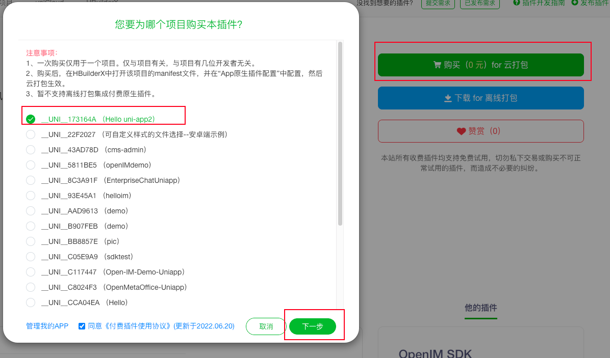
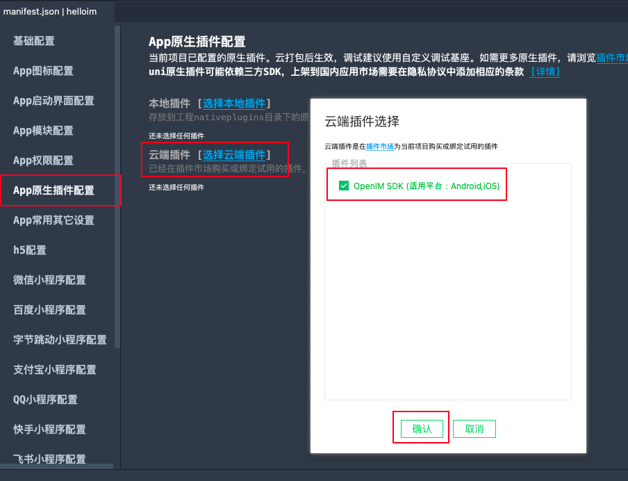
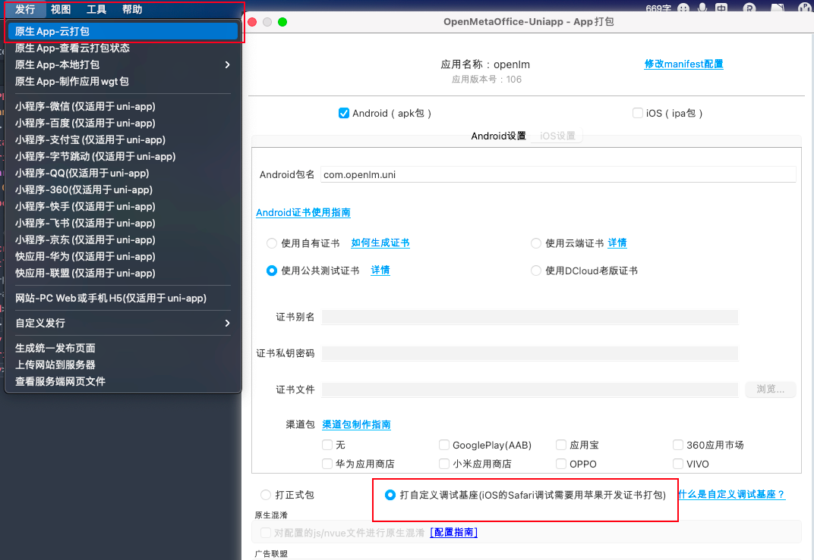
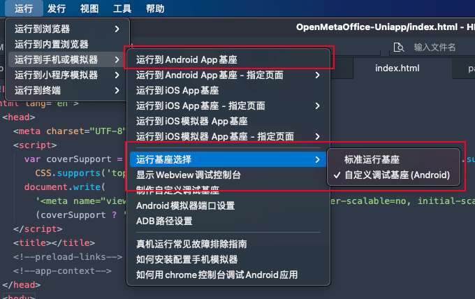

## Using the Demo
> Note: The Demo is only for demonstrating how to import and use the SDK — it is not a complete application.

We strongly recommend running our framework-specific [DEMO](https://github.com/openimsdk/open-im-uniapp-demo) first. This will not only give you a hands-on experience of IMSDK's features, but also help you quickly identify and resolve issues during actual integration.

## ❗️ FAQ

### 1. H5 / Mini Program Only

- If you are not developing for the App platform, use the [JSSDK](/quickstart/miniProgram.md) directly for H5 and Mini Program development. You do ***not need*** to follow the steps below.

### 2. Multi-Platform Development with uni-app (App, H5, Mini Program)

- Running on iOS and Android ***requires*** installing native plugins. The middleware `openim-uniapp-polyfill` combines App native plugin and JSSDK capabilities, enabling a single codebase for App, H5, and Mini Program development (SDK and im-server version >= 3.8.2).

### 3. About Dependencies

- @openim/client-sdk: JSSDK, required for running on H5 and Mini Programs.

- App native language plugin: Required for running on iOS and Android.

- openim-uniapp-polyfill: Must be installed. Provides a unified wrapper over JSSDK and native plugins for multi-platform compatibility with a single codebase.

---

## ⚙️ Integration Steps

### 1. Add Dependencies

- Install via npm:

```bash
npm install openim-uniapp-polyfill @openim/client-sdk
```

- Import the SDK from [DCloud Plugin Market](https://ext.dcloud.net.cn/plugin?id=6577) by selecting the corresponding project and package name.



- Open the `manifest.json` file in the project root, navigate to **App Native Plugin Configuration**, and import the cloud plugin.



### 2. Import in Project (App-Only Projects)

```javascript
import IMSDK from 'openim-uniapp-polyfill';

IMSDK.asyncApi('login', IMSDK.uuid(), {
  userID: '123',
  token: 'token',
});

const onConnectSuccess = () => {
  // Connection successful
};
// Set listener
IMSDK.subscribe(IMSDK.IMEvents.OnConnectSuccess, onConnectSuccess);
// Remove listener
IMSDK.unsubscribe(IMSDK.IMEvents.OnConnectSuccess, onConnectSuccess);
```

### 3. Import in Project (App, H5, Mini Program)

- Note 1: Use uni-app's event system for listeners, passing methods from `IMSDK.IMEvents`, since JSSDK and App listeners have case differences — the npm package handles automatic conversion.
- Note 2: Some APIs may differ across platforms due to platform support. Check the corresponding platform API documentation for differences:
  - Pass the correct `platformID` for each platform
  - Login API parameters differ between platforms
  - App requires [initSDK](/api/initialization/initSDK.md) before use
  - Image and video message creation APIs differ — use ***conditional compilation*** to call different methods
  - Other differences...

#### 3.1 Cross-Platform Usage

> Method 1: When cross-platform parameters and method names are consistent, use uni-app's calling style.

- This is the multi-platform compatible approach. When using cross-platform code, verify that API return structures are consistent.

```javascript
import IMSDK from 'openim-uniapp-polyfill';

IMSDK.asyncApi('createTextMessage', IMSDK.uuid(), 'text')
  .then((data) => {
    // do something
  })
```

> Method 2: When cross-platform parameters and method names differ, use [conditional compilation](https://uniapp.dcloud.net.cn/tutorial/platform.html) to handle methods with significant parameter differences.

```javascript
import IMSDK from 'openim-uniapp-polyfill';

// #ifdef H5 || MP-WEIXIN
IMSDK.asyncApi('login', IMSDK.uuid(), {
  userID : '123',
  token: 'token',
  platformID: 5,
  wsAddr: 'ws://your-server-ip:10001',
  apiAddr: 'http://your-server-ip:10002',
});
// #endif

// #ifdef APP-PLUS
IMSDK.asyncApi('login', IMSDK.uuid(), {
  userID: '123',
  token: 'token',
});
// #endif
```

### 4. 🛠️ Local Development

#### 4.1 Build a Custom Debug Base

> Note: The package name must match the one set when importing the cloud plugin in step 1.



#### 4.2 Run on Custom Debug Base (iOS supports real device debugging only)

> For local App debugging, you must build a custom base and launch it for debugging.



### 5. 🚀 Building for Release

> For App builds, use Release → Native App Cloud Build.
